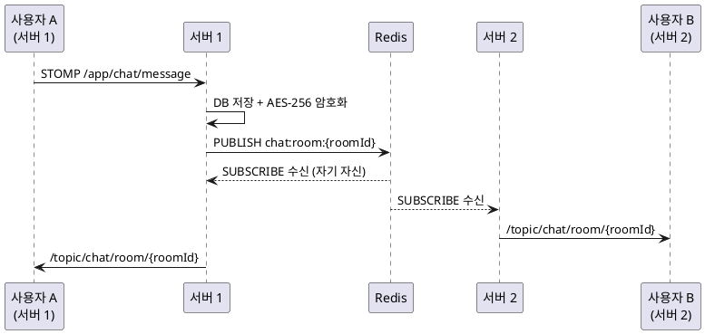
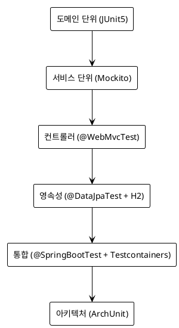

# Co-Talk: 실시간 채팅 백엔드를 처음부터 만들어보며 배운 것들

> CI 트러블슈팅 시리즈를 읽기 전에 — "그래서 이게 뭔 프로젝트야?"

---

## 왜 채팅 앱인가?

백엔드 개발을 공부하다 보면 CRUD 예제는 넘쳐난다. 게시판, 할일 관리, 블로그 API. 이것들이 나쁜 건 아니지만, 어느 순간부터 "진짜 어려운 문제"를 다루고 싶어졌다.

채팅 앱은 그런 면에서 매력적이다. 단순해 보이지만 실제로 구현해보면 생각보다 고려해야 할 게 많다. 메시지는 실시간으로 전달되어야 하고, 여러 서버 인스턴스가 있어도 모든 클라이언트가 동일한 메시지를 받아야 하며, 내용은 암호화되어야 하고, ID는 순서가 보장되어야 한다. 그리고 이 모든 게 동시에 수천 명의 요청을 처리하면서 이루어져야 한다.

카카오톡을 매일 쓰면서 "이게 어떻게 작동하는 거지?"라는 질문을 직접 답해보고 싶었다. 그게 Co-Talk 프로젝트의 시작이다.

---

<!-- IMAGE: Swagger UI 전체 API 목록 스크린샷 (22개 컨트롤러 펼쳐진 화면) — http://localhost:8080/swagger-ui.html 접속 후 전체 스크롤 캡처 -->

## 기술 스택과 선택 이유

### Java 25 + Virtual Threads

Java 21부터 Virtual Threads가 정식 도입됐다. Java 25를 선택한 가장 큰 이유는 여기에 있다.

전통적인 Thread-per-Request 모델은 WebSocket 연결처럼 오래 유지되는 커넥션이 많아지면 OS 스레드 수 제한에 걸린다. Reactive(WebFlux)로 전환하면 이 문제를 해결할 수 있지만, 코드 전체가 `Mono<T>`, `Flux<T>`로 뒤바뀌는 인지 부하가 생긴다.

Virtual Threads는 다르다. Spring MVC 스타일의 동기 코드를 그대로 쓰면서, JVM이 내부적으로 실제 OS 스레드를 효율적으로 스케줄링한다. `Thread.sleep()`을 호출해도 OS 스레드를 점유하지 않는다. 채팅 앱처럼 I/O 대기가 많은 상황에서 효율적이다.

```yaml
# application.yml
spring:
  threads:
    virtual:
      enabled: true
```

딱 한 줄이다. 코드 변경 없이 Tomcat이 Virtual Threads 위에서 동작한다.

### Spring Boot 3.5.6

Spring Boot 3.x는 Jakarta EE 10 기반이다. `javax.*` 대신 `jakarta.*`를 쓴다. 더 중요한 건 Spring Security 6, Spring Data JPA의 성숙도, 그리고 Virtual Threads 지원이 3.2부터 공식 통합됐다는 점이다. 안정성과 최신 기능의 균형점으로 3.5를 골랐다.

### PostgreSQL 16 — NoSQL을 쓰지 않은 이유

채팅 앱이라고 하면 MongoDB를 먼저 떠올리는 경우가 많다. 메시지 스키마가 유연하고, 문서 단위로 저장하기 편리하다는 이유에서다.

그럼에도 PostgreSQL을 선택했다. 이유는 세 가지다.

첫째, 트랜잭션 보장이 필요하다. 메시지 저장 + 읽음 상태 업데이트 + 채팅방 마지막 메시지 갱신이 원자적으로 일어나야 한다. 분산 트랜잭션 없이 이걸 NoSQL에서 구현하면 오히려 복잡해진다.

둘째, 관계형 데이터가 많다. 사용자-친구 관계, 채팅방-멤버십, 메시지-반응은 명확한 외래키 관계가 있다. JOIN이 자연스럽다.

셋째, GIN 인덱스를 활용한 전문 검색(`tsvector`)을 PostgreSQL에서 바로 쓸 수 있다. 메시지 검색 기능에 별도 검색 엔진 없이 PostgreSQL의 Full-Text Search를 활용했다.

### Redis — 캐시와 메시지 브로커의 이중 역할

Redis를 두 가지 용도로 쓴다.

**캐시**: User 엔티티는 거의 모든 API에서 조회된다. `@Cacheable("users")`로 Redis에 캐싱해 DB 부하를 줄인다.

**메시지 브로커**: 멀티 인스턴스 환경에서 실시간 메시지를 모든 서버에 전달하기 위해 Redis Pub/Sub를 사용한다. Kafka보다 가볍고, 채팅 앱 규모에서 Redis의 속도와 단순함이 유리하다.

한 가지 중요한 설계 결정은, Redis를 전략 패턴으로 추상화했다는 점이다. `@ConditionalOnProperty`로 Redis가 없는 환경(테스트, 개발)에서는 InMemory 구현체로 자동 전환된다. Redis 없이도 대부분의 기능이 동작하고, 테스트가 가능하다.

```java
// Redis가 활성화된 경우
@Bean
@ConditionalOnProperty(name = "spring.data.redis.enabled", havingValue = "true")
public ChatMessageBroker redisChatMessageBroker(...) { ... }

// Redis가 없는 경우 (테스트, 개발)
@Bean
@ConditionalOnProperty(name = "spring.data.redis.enabled", havingValue = "false", matchIfMissing = true)
public ChatMessageBroker inMemoryChatMessageBroker() { ... }
```

---

<!-- IMAGE: IntelliJ 프로젝트 트리 스크린샷 — adapter/application/domain/infrastructure 패키지 트리 펼쳐진 화면 캡처 -->

## 아키텍처 — Hexagonal을 선택한 이유

Hexagonal Architecture(Ports and Adapters)를 선택한 건 유행을 따라서가 아니다. 구체적인 문제가 있었다.

**문제**: Spring Data JPA 어노테이션(`@Entity`, `@Table`, `@Column`)이 도메인 객체에 섞이면 테스트하기 어려워진다. JPA 컨텍스트 없이는 도메인 로직을 테스트할 수 없게 된다. 또한 DB 기술을 바꾸거나 Redis/InMemory를 전환할 때 도메인 코드가 함께 바뀌어야 한다.

Hexagonal은 이 결합을 끊는다.

```
┌─────────────────────────────────────────────┐
│                  Domain                      │
│  (순수 Java + Jakarta Validation만)          │
│  외부 의존 없음 — JPA, Redis, HTTP 모두 금지 │
└──────────────┬──────────────────────────────┘
               │ Port(Interface)
┌──────────────┴──────────────────────────────┐
│               Application                    │
│  UseCase 구현 — domain만 의존               │
└──────────────┬──────────────────────────────┘
               │ Port(Interface)
┌──────────────┴──────────────────────────────┐
│               Adapter                        │
│  inbound: REST, WebSocket                   │
│  outbound: JPA, Redis, MinIO, FCM           │
└─────────────────────────────────────────────┘
```

### ArchUnit으로 의존 방향 강제

아키텍처 규칙을 문서에만 써두면 언젠가 깨진다. ArchUnit으로 자동 검증한다.

```java
@Test
void domainShouldNotDependOnExternalFrameworks() {
    noClasses()
        .that().resideInAPackage("..domain..")
        .should().dependOnClassesThat()
        .resideInAnyPackage(
            "org.springframework..",
            "jakarta.persistence..",
            "org.hibernate.."
        )
        .check(importedClasses);
}

@Test
void inboundAdapterShouldNotDependOnOutboundAdapter() {
    noClasses()
        .that().resideInAPackage("..adapter.inbound..")
        .should().dependOnClassesThat()
        .resideInAPackage("..adapter.outbound..")
        .check(importedClasses);
}
```

빌드 시점에 의존 방향 위반을 잡아낸다. "나 그냥 여기서 Repository 직접 쓸게"가 불가능하다.

### 엔티티 이중 계층 — 현실적인 트레이드오프

이상적인 Hexagonal에서는 도메인 엔티티와 JPA 엔티티가 완전히 분리된다.

```
User (도메인) ←→ UserMapper ←→ UserJpaEntity (JPA)
```

`User`는 `@Entity` 하나 없는 순수 Java 객체다. DB에 저장할 때만 `UserJpaEntity`로 변환된다. 덕분에 도메인 로직 테스트는 JPA 컨텍스트 없이 가능하다.

하지만 `Message`, `ChatRoom` 등은 아직 `BaseEntity`(JPA 포함)를 상속한다. 완전 분리를 하려면 각 엔티티마다 Mapper를 만들고, 테스트를 업데이트하고, 조회 로직을 재작성해야 한다. 팀이 작고 기능 개발이 병행되는 상황에서 모든 엔티티를 동시에 분리하는 건 현실적이지 않다.

그래서 User부터 시작해서 하나씩 마이그레이션하는 방향을 택했다. 도메인 순수성 유지와 마이그레이션 비용 사이의 현실적인 타협이다.

---

## 핵심 설계 — 실시간 메시징

채팅 앱의 핵심이다. 단일 서버라면 간단하지만, 수평 확장을 고려하면 복잡해진다.

### 문제: 멀티 인스턴스 브로드캐스트

사용자 A가 서버 1에 연결되어 있고, 사용자 B가 서버 2에 연결되어 있다. A가 메시지를 보내면 B에게도 전달되어야 한다. 서버 1의 메모리에 있는 WebSocket 세션 정보를 서버 2는 모른다.

해결책은 Redis Pub/Sub로 모든 서버 인스턴스를 연결하는 것이다.



<!-- IMAGE: Redis Pub/Sub 메시징 흐름 다이어그램 렌더링 이미지 — 위 PlantUML sequenceDiagram을 PlantUML 렌더러로 렌더링해 캡처 -->

각 서버 인스턴스는 시작 시 Redis 채널을 `PSUBSCRIBE`로 구독한다. 어떤 서버에서 메시지가 들어오든, Redis가 모든 구독자에게 브로드캐스트하고, 각 서버는 자신에게 연결된 클라이언트에게 STOMP로 전달한다.

### WebSocket 인증

HTTP는 요청마다 JWT를 검증하면 된다. WebSocket은 다르다. 한 번 연결되면 커넥션이 유지된다. STOMP CONNECT 시점에 JWT를 검증하는 인터셉터를 구현했다.

```java
@Component
public class WebSocketAuthInterceptor implements ChannelInterceptor {

    @Override
    public Message<?> preSend(Message<?> message, MessageChannel channel) {
        StompHeaderAccessor accessor = StompHeaderAccessor.wrap(message);

        if (StompCommand.CONNECT.equals(accessor.getCommand())) {
            String token = extractToken(accessor);
            Authentication auth = jwtTokenProvider.getAuthentication(token);
            accessor.setUser(auth);
        }

        return message;
    }
}
```

CONNECT 시 인증에 성공하면 이후 모든 메시지에서 `@AuthenticationPrincipal`로 사용자 정보를 얻을 수 있다.

---

## 핵심 설계 — 메시지 암호화와 분산 ID

### AES-256 투명 암호화

채팅 메시지는 DB에 암호화해서 저장한다. 애플리케이션 레벨 암호화다. DB가 탈취되어도 평문이 노출되지 않는다.

JPA `AttributeConverter`를 구현해 암호화/복호화를 투명하게 처리한다. 서비스 레이어는 암호화를 신경 쓸 필요가 없다.

```java
@Converter
public class MessageContentConverter implements AttributeConverter<String, String> {

    @Override
    public String convertToDatabaseColumn(String plaintext) {
        return aesEncryptor.encrypt(plaintext);  // DB 저장 시 암호화
    }

    @Override
    public String convertToEntityAttribute(String ciphertext) {
        return aesEncryptor.decrypt(ciphertext);  // 조회 시 복호화
    }
}
```

엔티티 필드에 `@Convert(converter = MessageContentConverter.class)` 하나만 붙이면 끝이다. 서비스 코드는 항상 평문을 다룬다.

### Snowflake ID — DB 시퀀스의 대안

메시지 ID를 `auto_increment`로 쓰면 두 가지 문제가 생긴다. 첫째, 분산 환경에서 여러 DB 노드가 있으면 충돌한다. 둘째, DB 쓰기가 발생해야 ID를 알 수 있어 배치 처리가 어렵다.

Twitter가 공개한 Snowflake 알고리즘을 직접 구현했다. 64비트 정수 하나에 아래 정보를 담는다.

```
┌─────────────────────────────────────────────────────────────┐
│ 1비트(부호) │ 41비트(타임스탬프) │ 10비트(노드 ID) │ 12비트(시퀀스) │
└─────────────────────────────────────────────────────────────┘
```

- **41비트 타임스탬프**: 밀리초 단위, 2039년까지 사용 가능
- **10비트 노드 ID**: 최대 1,024개 서버 인스턴스 지원
- **12비트 시퀀스**: 같은 밀리초에 최대 4,096개 ID 생성

결과적으로 DB 없이 ID를 생성하고, 시간순 정렬이 가능하며, 분산 환경에서 충돌이 없다. 메시지 타임라인 조회 시 별도 `ORDER BY created_at` 없이 ID 순서로 정렬이 된다.

---

## 인프라와 배포

### 관측 스택

운영 환경에서 어떤 일이 일어나는지 모르면 장애 대응이 불가능하다. Prometheus + Grafana + Loki + Zipkin으로 관측 스택을 구성했다.

- **Prometheus + Grafana**: JVM 메트릭, HTTP 요청 수, 응답 시간, 에러율. Micrometer로 커스텀 메트릭(채팅방별 메시지 전송량 등)도 추가
- **Loki**: 구조화 로그 수집. `traceId`로 요청을 끝까지 추적 가능
- **Zipkin**: 분산 트레이싱. Redis Pub/Sub를 거친 메시지 전달 경로를 시각화

### 배포

Docker 컨테이너로 패키징, GitHub Actions로 자동 배포, 자체 NAS 서버에서 운영한다. Kubernetes 매니페스트도 준비되어 있어 클라우드 전환이 가능한 상태다.

CI 파이프라인은 다음 순서로 실행된다.

```
push to main
  → 테스트 전체 실행 (JUnit + Testcontainers)
  → JaCoCo 커버리지 60% 미만이면 빌드 실패
  → Docker 이미지 빌드
  → NAS 서버에 배포
```

---

## 테스트 전략 — 6계층 구조

테스트를 6가지 유형으로 나눈 이유는 테스트 비용과 신뢰도 사이의 균형 때문이다.



| 계층 | 속도 | 신뢰도 | 용도 |
|------|------|--------|------|
| 도메인 단위 | 빠름 | 낮음 | 비즈니스 로직 검증 |
| 서비스 단위 | 빠름 | 중간 | UseCase 흐름 검증 |
| 컨트롤러 | 중간 | 중간 | HTTP 계약 검증 |
| 영속성 | 중간 | 중간 | 쿼리/매핑 검증 |
| 통합 | 느림 | 높음 | 시스템 전체 동작 검증 |
| 아키텍처 | 빠름 | 높음 | 설계 규칙 강제 |

**인프라 전환 전략의 테스트 활용**

Redis/InMemory 전환 전략은 기능을 위한 설계지만, 테스트에서도 큰 이점이 있다. 단위 테스트와 서비스 테스트는 InMemory 구현체를 사용해 Testcontainers 없이 빠르게 실행된다. Redis가 필요한 동작은 통합 테스트에서만 검증한다.

**JaCoCo 60% 강제**

라인 커버리지 60% 미만이면 빌드가 실패한다. 100%를 목표로 삼지 않은 건 의도적이다. 비즈니스 로직이 없는 DTO, 설정 클래스, 예외 클래스까지 100%를 맞추는 건 낭비다. 60%는 "핵심 로직은 반드시 테스트가 있어야 한다"는 최소 기준이다.

---

<!-- IMAGE: GitHub Actions CI 파이프라인 통과 화면 — 최근 main 브랜치 push 후 Actions 탭에서 초록불 확인 캡처 -->

## 주요 기능 목록

| 기능 | 기술 |
|------|------|
| 실시간 채팅 (1:1, 그룹, Self) | WebSocket STOMP + Redis Pub/Sub |
| 읽음 표시 | REST + WebSocket 동기화 |
| 메시지 암호화 | AES-256 + JPA @Convert |
| 분산 ID | Twitter Snowflake 직접 구현 |
| 친구/차단 | PENDING → ACCEPTED → BLOCKED 상태 머신 |
| 이모지 반응 | 메시지별 리액션 |
| 파일 업로드 | MinIO (S3 호환) |
| 링크 미리보기 | Open Graph 크롤링 (Jsoup) |
| 푸시 알림 | FCM |
| Rate Limiting | Bucket4j + Redis |
| 소셜 로그인 | 카카오, 구글, 애플 OAuth |
| 메시지 검색 | PostgreSQL Full-Text Search (GIN 인덱스) |

22개 REST 컨트롤러, 약 50개 UseCase 인터페이스, 약 65개 서비스 구현체로 구성되어 있다.

---

## 마치며 — 배운 것과 앞으로 할 것

### 직접 만들면서 배운 것들

**실시간 시스템은 상태 관리가 전부다.** 메시지가 전달되었는지, 읽었는지, 누가 온라인인지. 이 상태들이 멀티 인스턴스 환경에서 일관성을 유지해야 한다. Redis가 없으면 채팅 앱이 안 된다는 걸 몸으로 느꼈다.

**아키텍처 규칙은 자동화해야 살아남는다.** ArchUnit 없이 Hexagonal을 유지하는 건 어렵다. 기능 개발에 쫓기다 보면 "그냥 여기서 바로 쓰자"는 유혹이 생긴다. 빌드 시점에 잡아주는 도구가 있어야 규칙이 의미있다.

**CI는 로컬과 다르다.** 이건 이 시리즈의 핵심 주제다. Redis Pub/Sub 구독 완료를 `PUBSUB NUMPAT`으로 확인하는 패턴, `@TestConfiguration`의 자동 스캔 미지원, `@ConditionalOnProperty`로 테스트 빈을 교체하는 패턴들을 1탄, 2탄에서 자세히 다룬다.

### 앞으로 할 것

- `Message`, `ChatRoom` 엔티티 이중 계층 분리 완성
- WebRTC 음성/영상 통화
- 메시지 번역 API 연동
- E2E 암호화 (현재는 서버 레벨 암호화)

---

이 글은 CI 트러블슈팅 시리즈의 0편이다. 실제로 겪은 통합 테스트 20건 CI 실패 수정기는 1탄부터 이어진다.
