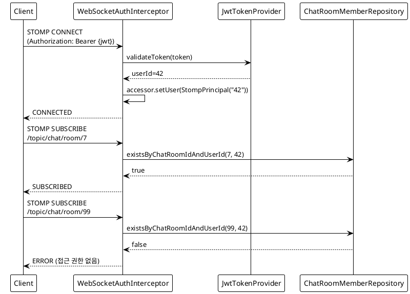
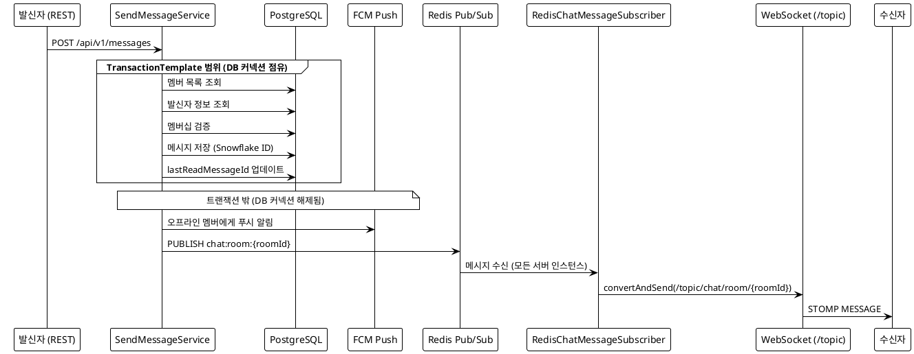
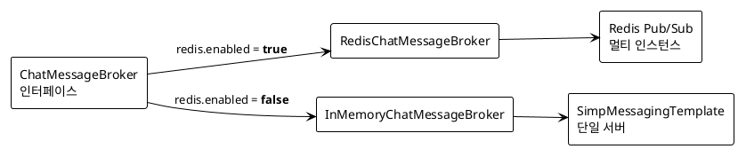

# 실시간 채팅 아키텍처를 밑바닥부터 쌓아올리기

> Co-Talk 개발기 1편 -- 실시간 채팅 아키텍처 구축

> **시리즈 목차**
> - 0편: [프로젝트 소개](blog-00-project-introduction.md)
> - **1편: 실시간 채팅 아키텍처 (현재 글)**
> - 2편: [헥사고날 아키텍처로 리팩토링하기](blog-02-hexagonal-architecture.md)

---

> "카카오톡 메시지 하나가 전달되기까지 몇 개의 시스템을 거치는 걸까?"

이 질문에 답하려고 프로젝트를 시작한 건 아니었다. 처음에는 단순했다. WebSocket 연결하고, 메시지 DB에 저장하고, 상대방한테 보내주면 되지 않나? 그런데 막상 코드를 짜기 시작하면 질문이 끝없이 쏟아진다. 서버가 2대면 어떡하지? 같은 사람이 폰이랑 태블릿으로 동시 접속하면? 메시지가 DB에는 저장됐는데 WebSocket 전송이 실패하면? 서버가 재시작되는 동안 보낸 메시지는 어디로 가지?

이 글은 Co-Talk 채팅 백엔드의 실시간 메시징 아키텍처를 처음 구축한 과정을 다룬다. [이슈 #1](https://github.com/with-co-talk/co-talk/issues/1)부터 [이슈 #17](https://github.com/with-co-talk/co-talk/issues/17)까지, 2026년 1월 17일부터 22일까지 엿새간의 기록이다. 아직 헥사고날 아키텍처 리팩토링 전이라 구조가 완벽하지는 않지만, 실시간 시스템의 핵심 설계 결정들은 이 시기에 거의 다 내려졌다.

---

## 1. STOMP -- WebSocket 위에 프로토콜이 필요한 이유

### 날것의 WebSocket은 불편하다

WebSocket은 양방향 통신 채널이다. 그런데 "채널을 열었다"는 것과 "메시지를 주고받는 체계가 있다"는 건 다른 이야기다. 날것의 WebSocket은 텍스트 프레임 하나를 주고받을 뿐이다. 이 메시지가 채팅인지, 읽음 확인인지, 타이핑 알림인지 구분하려면 직접 프로토콜을 만들어야 한다. 메시지 포맷, 라우팅, 구독/발행 패턴을 전부 직접 구현해야 하는 거다.

STOMP(Simple Text Oriented Messaging Protocol)는 이걸 대신해준다. HTTP와 비슷한 프레임 구조에 CONNECT, SUBSCRIBE, SEND 같은 명령어가 있고, destination 기반 라우팅을 지원한다. Spring이 STOMP를 1등 시민으로 지원하는 점도 선택 이유였다.

### 엔드포인트와 prefix 설계

[이슈 #1](https://github.com/with-co-talk/co-talk/issues/1)에서 WebSocket 설정을 정리하면서 나름의 규칙을 잡았다.

```java
@Override
public void configureMessageBroker(MessageBrokerRegistry config) {
    // 클라이언트가 구독할 prefix
    config.enableSimpleBroker("/topic", "/queue");
    // 클라이언트가 서버로 메시지를 보낼 때 사용하는 prefix
    config.setApplicationDestinationPrefixes("/app");
    // 특정 사용자에게 메시지를 보낼 때 사용하는 prefix
    config.setUserDestinationPrefix("/user");
}
```

- `/topic` -- 1:N 브로드캐스트 (채팅방 메시지, 리액션 이벤트)
- `/queue` -- 1:1 메시지 (개인 알림)
- `/app` -- 클라이언트 -> 서버 전송 (메시지 발송 요청)
- `/user` -- 사용자별 개인 피드 (채팅 목록 업데이트)

이 prefix 설계가 왜 중요하냐면, 나중에 구독 권한 검사를 할 때 destination 패턴으로 분기하기 때문이다. `/topic/chat/room/{roomId}`를 구독하면 해당 방의 멤버인지 확인해야 하고, `/topic/user/{userId}`를 구독하면 본인 피드인지 확인해야 한다. prefix가 깔끔해야 이 분기가 자연스러워진다.

### SockJS 폴백

```java
@Override
public void registerStompEndpoints(StompEndpointRegistry registry) {
    // SockJS 지원 엔드포인트
    registry.addEndpoint("/ws")
            .setAllowedOriginPatterns(allowedOrigins)
            .withSockJS();

    // 순수 WebSocket 엔드포인트
    registry.addEndpoint("/ws")
            .setAllowedOriginPatterns(allowedOrigins);
}
```

같은 `/ws` 엔드포인트에 SockJS 폴백과 순수 WebSocket을 둘 다 등록했다. 모바일 앱은 순수 WebSocket을 쓰고, 웹 브라우저는 SockJS 폴백으로 연결한다. 기업 프록시 뒤에서 WebSocket이 막히는 경우가 있어서 SockJS는 보험이다.

### 전송 제한 -- 느린 클라이언트 대비

[이슈 #8](https://github.com/with-co-talk/co-talk/issues/8)의 코드 리뷰에서 전송 제한 설정을 추가했다.

```java
@Override
public void configureWebSocketTransport(WebSocketTransportRegistration registration) {
    registration
            // 수신 메시지 최대 크기: 128KB (텍스트 + 파일 메타데이터)
            .setMessageSizeLimit(128 * 1024)
            // 클라이언트로 보내는 버퍼 크기: 1MB
            .setSendBufferSizeLimit(1024 * 1024)
            // 전송 시간 제한: 20초
            .setSendTimeLimit(20 * 1000);
}
```

`sendBufferSizeLimit`은 기본값(512KB)보다 넉넉하게 1MB로 잡았다. 그룹 채팅방에서 메시지가 동시에 쏟아질 때 일시적으로 버퍼가 차는 경우가 있다. 부족하면 메시지가 유실된다.

`sendTimeLimit`은 20초다. 이 시간 안에 클라이언트로 전송하지 못하면 연결을 끊는다. 네트워크가 끊겼는데 연결이 살아있는 "좀비 연결"을 방지하기 위해서다.

---

## 2. 2단계 인증 -- CONNECT에서 JWT, SUBSCRIBE에서 멤버십

### STOMP CONNECT = 신원 확인

HTTP API는 매 요청마다 Authorization 헤더를 보내고 JWT를 검증한다. WebSocket은 다르다. 한 번 연결되면 커넥션이 유지된다. 그래서 STOMP CONNECT 시점에 한 번만 JWT를 검증하고, 이후 모든 프레임에서는 이미 인증된 Principal을 사용한다.

```java
if (StompCommand.CONNECT.equals(accessor.getCommand())) {
    authenticateConnection(accessor);
}
```

`authenticateConnection`은 STOMP 헤더에서 `Authorization: Bearer {token}`을 추출하고, `JwtTokenProvider`로 검증한 뒤 `StompPrincipal`을 설정한다.

```java
private void authenticateConnection(StompHeaderAccessor accessor) {
    String token = extractToken(accessor)
            .filter(t -> !t.isBlank())
            .orElseThrow(() -> {
                log.warn("WebSocket connection attempt without token");
                return new IllegalArgumentException("인증 토큰이 필요합니다.");
            });

    if (!jwtTokenProvider.validateToken(token)) {
        log.warn("WebSocket connection attempt with invalid token");
        throw new IllegalArgumentException("유효하지 않은 토큰입니다.");
    }

    Long userId = jwtTokenProvider.getUserIdFromToken(token);
    accessor.setUser(new StompPrincipal(userId.toString()));
}
```

`StompPrincipal`은 `java.security.Principal`을 구현한 record로, userId를 문자열로 저장한다. 이후 모든 STOMP 프레임에서 `accessor.getUser().getName()`으로 사용자 ID를 꺼낼 수 있다.

### STOMP SUBSCRIBE = 권한 확인

JWT 인증만으로는 부족하다. "이 사용자가 이 채팅방의 멤버인가?"는 별도로 확인해야 한다. CONNECT에서 인증된 사용자가 아무 채팅방이나 구독할 수 있으면 안 된다.

[이슈 #10](https://github.com/with-co-talk/co-talk/issues/10)에서 보안을 강화하면서 SUBSCRIBE 단계 인가를 추가했다.

```java
if (StompCommand.SUBSCRIBE.equals(accessor.getCommand())) {
    authorizeSubscription(accessor);
}
```

`authorizeSubscription`은 destination 패턴에 따라 분기한다.

```java
private static final Pattern ROOM_TOPIC_PATTERN =
    Pattern.compile("^/topic/chat/room/(\\d+)(/.*)?$");
private static final Pattern USER_TOPIC_PATTERN =
    Pattern.compile("^/topic/user/(\\d+)(/.*)?$");

private void authorizeSubscription(StompHeaderAccessor accessor) {
    // /topic/chat/room/{roomId} -- 채팅방 멤버인지 확인
    Matcher roomMatcher = ROOM_TOPIC_PATTERN.matcher(destination);
    if (roomMatcher.matches()) {
        Long roomId = Long.parseLong(roomMatcher.group(1));
        if (!chatRoomMemberRepository.existsByChatRoomIdAndUserId(roomId, userId)) {
            throw new IllegalArgumentException("해당 채널에 대한 접근 권한이 없습니다.");
        }
        return;
    }

    // /topic/user/{userId}/* -- 본인 피드인지 확인
    Matcher userMatcher = USER_TOPIC_PATTERN.matcher(destination);
    if (userMatcher.matches()) {
        Long topicUserId = Long.parseLong(userMatcher.group(1));
        if (!userId.equals(topicUserId)) {
            throw new IllegalArgumentException("해당 채널에 대한 접근 권한이 없습니다.");
        }
    }
}
```

이 2단계 인증 설계가 처음부터 있었던 건 아니다. 초기에는 CONNECT 인증만 있었는데, 채팅방 초대 없이 roomId만 알면 구독할 수 있는 취약점이 있었다. [이슈 #10](https://github.com/with-co-talk/co-talk/issues/10)과 [이슈 #12](https://github.com/with-co-talk/co-talk/issues/12)에서 보안 강화를 하면서 SUBSCRIBE 인가를 추가했다.



---

## 3. 메시지 흐름 -- REST에서 WebSocket까지

### 전체 파이프라인

채팅 메시지 하나가 전송되기까지의 전체 흐름이다.



이 흐름에서 가장 중요한 설계 결정이 하나 있다. **TransactionTemplate으로 DB 작업만 트랜잭션으로 감싼 것**이다.

### 왜 @Transactional이 아니라 TransactionTemplate인가

처음에는 당연히 `@Transactional`을 썼다. 서비스 메서드 위에 어노테이션 하나 붙이면 끝이니까. 그런데 문제가 보였다.

`@Transactional`은 메서드 전체를 트랜잭션으로 감싼다. 메시지 저장 후에 FCM 푸시 알림을 보내고, Redis Pub/Sub로 브로드캐스트하는 작업까지 전부 트랜잭션 안에 들어간다. 이게 뭐가 문제냐면:

1. **DB 커넥션 점유 시간이 길어진다.** FCM 호출이 200ms 걸리고, Redis 발행이 10ms 걸리면 DB 커넥션을 210ms 더 잡고 있는 거다. 트래픽이 몰리면 커넥션 풀이 고갈된다.
2. **외부 시스템 장애가 DB 롤백을 유발한다.** Redis가 잠깐 타임아웃되면? 트랜잭션이 롤백되고, 이미 DB에 저장된 메시지도 사라진다. 사용자는 메시지를 보냈다고 생각하는데 실제로는 증발한 거다.

`TransactionTemplate`은 이 문제를 해결한다. DB 작업만 정확히 감싸고, 나머지는 트랜잭션 밖에서 실행한다.

```java
private SendResult doSendMessage(Long chatRoomId, Long senderId,
                                  Message message, String notificationContent) {
    var timerSample = customMetrics.startMessageProcessingTimer();

    // DB 작업만 트랜잭션으로 래핑 (커넥션 점유 최소화)
    SendResult result = transactionTemplate.execute(status -> {
        // Pre-fetch ONCE: 중복 쿼리 방지
        List<ChatRoomMember> members =
            chatRoomMemberRepository.findByChatRoomId(chatRoomId);
        User sender = userRepository.findById(senderId).orElse(null);

        // 멤버십 검증 (사전 조회한 목록에서 확인 -- 별도 쿼리 없음)
        boolean isMember = members.stream()
            .anyMatch(m -> m.getUserId().equals(senderId));
        if (!isMember) {
            throw new ChatRoomAccessDeniedException(chatRoomId, senderId);
        }

        message.validateContent();
        Message savedMessage = messageRepository.save(message);

        // 발신자는 자신이 보낸 메시지를 읽은 것으로 간주
        chatRoomMemberRepository.updateLastReadMessageIdIfNewer(
            chatRoomId, senderId, timeProvider.now(), savedMessage.getId());

        return new SendResult(savedMessage, senderNickname, senderAvatarUrl, members);
    });

    // -- 여기서부터 트랜잭션 밖 --
    // 푸시 알림 전송 (Redis 호출 -- DB 커넥션 미점유)
    sendPushNotificationsToOtherMembers(chatRoomId, senderId,
        notificationContent, result.senderNickname(),
        result.senderAvatarUrl(), result.members());

    customMetrics.stopMessageProcessingTimer(timerSample);
    return result;
}
```

[이슈 #8](https://github.com/with-co-talk/co-talk/issues/8)의 성능 개선 코드 리뷰에서 이 패턴으로 전환했다. `transactionTemplate.execute()` 블록 안에서 DB 조회와 저장을 한꺼번에 처리하고, 블록이 끝나면 트랜잭션이 커밋되며 DB 커넥션이 반환된다. 이후의 FCM, Redis 호출은 DB 커넥션 없이 실행된다.

### Pre-fetch로 중복 쿼리 제거

위 코드에서 또 하나 주목할 점은 `members`와 `sender`를 트랜잭션 안에서 한 번만 조회하고, 이후 단계(브로드캐스트, 푸시 알림)에서 재사용한다는 것이다.

초기 버전에서는 이랬다.

```
sendMessage()     -- members 조회 (1회)
broadcastMessage() -- members 조회 (2회), sender 조회 (1회)
sendPushNotification() -- members 조회 (3회), sender 조회 (2회)
```

같은 데이터를 3번씩 조회하고 있었다. `SendResult` record에 조회 결과를 담아서 내려보내는 것으로 해결했다.

```java
// SendMessageService 내부
record SendResult(Message message, String senderNickname,
                  String senderAvatarUrl, List<ChatRoomMember> members) {}
```

---

## 4. Redis Pub/Sub -- 멀티 인스턴스 브로드캐스트

### 왜 Spring의 SimpleBrokerRelay를 안 쓰나

Spring STOMP에는 `enableStompBrokerRelay()`라는 옵션이 있다. 외부 STOMP 브로커(ActiveMQ, RabbitMQ)에 릴레이하는 방식이다. 써봤다. 그런데 두 가지가 마음에 안 들었다.

첫째, 별도 STOMP 브로커 인프라가 필요하다. 이미 Redis를 캐시와 세션 관리에 쓰고 있는데, STOMP 브로커까지 따로 운영하고 싶지 않았다.

둘째, 메시지 가공이 어렵다. 수신된 Redis 메시지를 WebSocket DTO로 변환하고, HTML 엔티티 언이스케이프를 하고, 스키마 버전을 붙이는 등의 가공이 필요했다. SimpleBrokerRelay는 이런 중간 처리가 쉽지 않다.

결국 직접 Redis Pub/Sub을 쓰기로 했다.

### 3채널 설계

[이슈 #1](https://github.com/with-co-talk/co-talk/issues/1)에서 채팅 메시지 채널만 만들었다가, [이슈 #17](https://github.com/with-co-talk/co-talk/issues/17)에서 채널 체계를 확장했다.

```
chat:room:{roomId}            -- 채팅 메시지 (TEXT, IMAGE, FILE, 시스템 메시지)
chat:room:{roomId}:reaction   -- 리액션 이벤트 (ADDED, REMOVED)
chat:room:{roomId}:event      -- 채팅방 이벤트 (READ, TYPING, MESSAGE_DELETED, MESSAGE_UPDATED)
```

왜 하나의 채널에 전부 넣지 않았나? 처음에는 그랬다. 그런데 리액션과 타이핑 이벤트는 메시지보다 훨씬 빈번하게 발생한다. 타이핑 이벤트는 초당 수십 건이 될 수 있다. 채널을 분리하면 구독자 쪽에서 관심 없는 이벤트를 파싱할 필요가 없고, 나중에 채널별 처리 우선순위를 다르게 줄 수도 있다.

### Publisher -- RedisChatMessageBroker

```java
@Component
@ConditionalOnProperty(name = "spring.data.redis.enabled",
                       havingValue = "true", matchIfMissing = true)
public class RedisChatMessageBroker implements ChatMessageBroker {

    @Override
    public void publish(Long roomId, ChatBroadcastMessage message) {
        String channel = channelPrefix + roomId;
        String jsonMessage = objectMapper.writeValueAsString(message);
        redisTemplate.convertAndSend(channel, jsonMessage);
    }

    @Override
    public void publishReaction(Long roomId, ReactionBroadcastEvent reactionEvent) {
        String channel = channelPrefix + roomId + ":reaction";
        String jsonMessage = objectMapper.writeValueAsString(reactionEvent);
        redisTemplate.convertAndSend(channel, jsonMessage);
    }

    @Override
    public void publishRoomEvent(Long roomId, Object event) {
        String channel = channelPrefix + roomId + ":event";
        String jsonMessage = objectMapper.writeValueAsString(event);
        redisTemplate.convertAndSend(channel, jsonMessage);
    }
}
```

`channelPrefix`는 `AppProperties`에서 주입받는다. 기본값은 `chat:room:`이다. 나중에 테스트 환경에서 채널 충돌을 피하기 위해 prefix를 바꿀 수 있도록 외부화한 것이다.

### Subscriber -- Redis에서 WebSocket으로

```java
@Component
@ConditionalOnProperty(name = "spring.data.redis.enabled",
                       havingValue = "true", matchIfMissing = true)
public class RedisChatMessageSubscriber implements MessageListener {

    @Override
    public void onMessage(Message message, byte[] pattern) {
        String channel = new String(message.getChannel());
        String jsonMessage = new String(message.getBody());

        RoomChannelInfo channelInfo = RoomChannelInfo.parse(channelPrefix, channel);

        // suffix 기반 분기
        if (channelInfo.isReactionChannel()) {
            handleReaction(channelInfo.roomId(), jsonMessage);
            return;
        }
        if (channelInfo.isEventChannel()) {
            handleRoomEvent(channelInfo.roomId(), jsonMessage);
            return;
        }

        // 일반 채팅 메시지
        ChatBroadcastMessage chatMessage =
            objectMapper.readValue(jsonMessage, ChatBroadcastMessage.class);
        WebSocketChatMessage wsMessage = toWebSocketMessage(chatMessage);
        messagingTemplate.convertAndSend(
            "/topic/chat/room/" + chatMessage.roomId(), wsMessage);
    }
}
```

구독은 `RedisMessageListenerContainer`에서 패턴 구독으로 처리한다.

```java
// RedisMessagingConfig.java
String chatChannelPattern = appProperties.redis().channelPrefix() + "*";
container.addMessageListener(chatMessageSubscriber, new PatternTopic(chatChannelPattern));
```

`chat:room:*` 패턴 하나로 모든 채팅방의 메시지, 리액션, 이벤트 채널을 구독한다. 채팅방이 새로 생길 때마다 구독을 추가할 필요가 없다.

### InMemory 폴백 -- Redis 없이도 동작하는 채팅

테스트할 때마다 Redis를 띄워야 한다면 개발이 고통스러워진다. [이슈 #3](https://github.com/with-co-talk/co-talk/issues/3)에서 인터페이스를 도입하면서 `@ConditionalOnProperty`로 전략 전환을 구현했다.

```java
@Component
@ConditionalOnProperty(name = "spring.data.redis.enabled", havingValue = "false")
public class InMemoryChatMessageBroker implements ChatMessageBroker {

    private final SimpMessagingTemplate messagingTemplate;

    @Override
    public void publish(Long roomId, ChatBroadcastMessage message) {
        // Redis 없이 직접 WebSocket으로 브로드캐스트 (단일 서버 환경)
        WebSocketChatMessage wsMessage = toWebSocketMessage(message);
        messagingTemplate.convertAndSend("/topic/chat/room/" + roomId, wsMessage);
    }
}
```

`spring.data.redis.enabled=false`이면 InMemory 구현체가 활성화되고, Redis Pub/Sub 대신 `SimpMessagingTemplate`으로 바로 WebSocket에 전달한다. 단일 서버에서는 완벽하게 동작한다. 단위 테스트와 로컬 개발에서는 이 모드를 쓴다.



이 패턴은 ChatMessageBroker뿐 아니라 ChatRoomPresenceTracker, UserEventBroker, FileStorage, EmailSender에도 동일하게 적용했다. 인프라 의존성을 전략 패턴으로 감싸면 테스트가 편해지고, 기술 전환 비용이 낮아진다.

---

## 5. Presence 시스템 -- "누가 지금 이 방을 보고 있는가"

### 왜 Presence가 필요한가

카카오톡에서 메시지를 보내면 숫자가 뜬다. "1"이면 한 명이 안 읽은 거다. 이 기능을 구현하려면 "누가 지금 이 채팅방을 보고 있는가"를 알아야 한다. 보고 있는 사람에게는 푸시 알림을 보낼 필요가 없고, 읽음 처리도 즉시 해야 한다.

### Redis ZSet + TTL Score

[이슈 #16](https://github.com/with-co-talk/co-talk/issues/16)에서 presence 시스템을 Redis ZSet으로 구현했다.

```
키: presence:chat:room:{roomId}:active:z
타입: ZSet
멤버: userId
스코어: expiresAtMillis (현재 시간 + 60초)
```

ZSet의 score를 만료 시간으로 쓰는 아이디어다. 구독하면 score를 현재 시간 + 60초로 설정하고, 조회할 때 현재 시간보다 score가 작은 엔트리는 만료된 것으로 간주해 제거한다.

```java
@Override
public void markActive(Long chatRoomId, Long userId, String sessionId) {
    long expiresAt = System.currentTimeMillis() + TTL_MILLIS;
    String roomKey = roomKey(chatRoomId);
    redisTemplate.opsForZSet().add(roomKey, String.valueOf(userId), expiresAt);
}

@Override
public boolean isActive(Long chatRoomId, Long userId) {
    cleanupExpired(chatRoomId);
    Double score = redisTemplate.opsForZSet()
        .score(roomKey(chatRoomId), String.valueOf(userId));
    return score != null && score > System.currentTimeMillis();
}

private void cleanupExpired(Long chatRoomId) {
    redisTemplate.opsForZSet().removeRangeByScore(
        roomKey(chatRoomId), Double.NEGATIVE_INFINITY, System.currentTimeMillis());
}
```

왜 Redis의 KEY TTL 대신 ZSet score를 TTL로 쓸까? KEY TTL은 키 전체에 적용된다. 채팅방에 5명이 있으면 5개의 키를 만들어야 한다. ZSet은 하나의 키에 여러 멤버를 넣고, 멤버별로 개별 만료를 score로 관리할 수 있다. 키 수가 줄어들고, 한 번의 조회로 활성 멤버 전체를 볼 수 있다.

### 멀티 세션 카운팅

같은 사용자가 폰과 태블릿에서 동시에 같은 채팅방을 열 수 있다. 하나의 세션이 나갈 때 바로 비활성으로 처리하면 안 된다. 나머지 세션이 아직 보고 있을 수 있으니까.

```java
// 구독 시: 세션 카운트 증가
String countKey = userCountKey(chatRoomId, userId);
redisTemplate.opsForValue().increment(countKey);

// 구독 해제 시: 세션 카운트 감소 -> 0이면 비활성
Long count = redisTemplate.opsForValue().decrement(countKey);
if (count == null || count <= 0) {
    redisTemplate.opsForZSet().remove(roomKey, userKey);
    redisTemplate.delete(countKey);
}
```

키 설계는 이렇다.

```
presence:chat:room:{roomId}:active:z              -- ZSet (활성 사용자)
presence:chat:room:{roomId}:user:count:{userId}   -- String (세션 카운트)
presence:ws:session:{sessionId}:rooms             -- Set (세션이 구독 중인 방 목록)
```

세 번째 키(`session:rooms`)는 연결 해제 시 정리용이다. WebSocket이 끊기면 해당 세션이 구독하고 있던 모든 방에서 비활성 처리를 해야 한다. `WebSocketEventListener`가 `SessionSubscribeEvent`와 `SessionDisconnectEvent`를 리스닝해서 `markActive()`/`markInactive()`를 호출하고, 연결 해제 시에는 세션에 매핑된 모든 방을 순회하며 정리한다.

온라인/오프라인 판정도 비슷한 구조다. Redis Set(`ws:user:{userId}:sessions`)에 세션 ID를 관리하고, 마지막 세션이 끊겨야 오프라인으로 전환한다. 같은 사용자가 폰과 태블릿에서 동시에 접속해도, 하나만 끊기면 온라인 상태가 유지된다.

### Pipeline 배치 최적화

메시지를 보낼 때 채팅방의 멤버 전원이 활성 상태인지 확인해야 한다. 멤버가 10명이면 `isActive()`를 10번 호출해야 하고, Redis 왕복이 20회(cleanup 10회 + score 10회)가 된다.

Redis Pipeline으로 한 번에 묶었다.

```java
@Override
public Set<Long> getActiveUserIds(Long chatRoomId, List<Long> userIds) {
    cleanupExpired(chatRoomId);
    String roomKey = roomKey(chatRoomId);
    long now = System.currentTimeMillis();

    List<Object> results = redisTemplate.executePipelined(
        (RedisCallback<Object>) connection -> {
            byte[] key = roomKey.getBytes(StandardCharsets.UTF_8);
            for (Long userId : userIds) {
                connection.zSetCommands().zScore(key,
                    String.valueOf(userId).getBytes(StandardCharsets.UTF_8));
            }
            return null;
        });

    Set<Long> activeIds = new HashSet<>();
    for (int i = 0; i < userIds.size(); i++) {
        Double score = (Double) results.get(i);
        if (score != null && score > now) {
            activeIds.add(userIds.get(i));
        }
    }
    return activeIds;
}
```

2N회 왕복이 2회(cleanup 1회 + pipeline 1회)로 줄었다. 10명 방이든 100명 방이든 Redis 왕복 횟수가 동일하다.

---

## 6. Snowflake ID -- DB 없이 순서 보장되는 ID

### UUID가 안 되는 이유

UUID v4는 랜덤이다. 정렬이 안 된다. 채팅 앱에서 메시지를 시간순으로 보여주려면 `ORDER BY created_at`이 필요한데, 인덱스가 UUID(PK)와 created_at 두 개 필요해진다. UUID는 128비트라 인덱스 크기도 크다.

Snowflake ID는 64비트 Long이다. 시간 정보가 ID 안에 있어서 ID 순서 = 시간 순서다. PK 인덱스 하나로 정렬과 조회가 모두 된다.

### 64비트 구조

[이슈 #1](https://github.com/with-co-talk/co-talk/issues/1)에서 Twitter Snowflake 알고리즘을 직접 구현했다.

```
┌────────┬──────────────┬───────────┬──────────┬──────────┐
│ 1비트   │ 41비트        │ 5비트      │ 5비트     │ 12비트    │
│ (부호)  │ (타임스탬프)   │ (DC ID)   │ (Worker) │ (시퀀스)  │
└────────┴──────────────┴───────────┴──────────┴──────────┘
```

- **41비트 타임스탬프**: 2024-01-01 에포크 기준, 약 69년간 사용 가능
- **5비트 DC ID**: 최대 32개 데이터센터
- **5비트 Worker ID**: 데이터센터당 최대 32개 워커
- **12비트 시퀀스**: 밀리초당 최대 4,096개 ID

```java
@Override
public synchronized Long nextId() {
    long timestamp = currentTimeMillis();

    if (timestamp < lastTimestamp) {
        throw new IllegalStateException(
            "Clock moved backwards. Refusing to generate ID.");
    }

    if (timestamp == lastTimestamp) {
        sequence = (sequence + 1) & MAX_SEQUENCE;
        if (sequence == 0) {
            // 시퀀스 오버플로우, 다음 밀리초까지 대기
            timestamp = waitNextMillis(lastTimestamp);
        }
    } else {
        sequence = 0L;
    }

    lastTimestamp = timestamp;

    return ((timestamp - EPOCH) << TIMESTAMP_SHIFT)
            | (datacenterId << DATACENTER_ID_SHIFT)
            | (workerId << WORKER_ID_SHIFT)
            | sequence;
}
```

`synchronized`로 스레드 안전성을 보장한다. 같은 밀리초에 여러 스레드가 ID를 요청하면 시퀀스 번호로 구분한다. 시퀀스가 4096을 넘으면 다음 밀리초까지 spin-wait 한다. 현실적으로 밀리초에 4096건을 넘기는 일은 거의 없다.

시계 역행(`timestamp < lastTimestamp`)이면 즉시 예외를 던진다. NTP 동기화 등으로 시계가 뒤로 가면 ID 충돌이 날 수 있어서, 안전하게 거부하는 게 맞다.

### 분산 Worker ID 할당 -- Redis SETNX

서버 인스턴스가 여러 개면 각각 다른 Worker ID를 가져야 한다. 수동으로 환경변수에 넣을 수도 있지만, 오토스케일링 환경에서는 자동 할당이 필요하다.

[이슈 #5](https://github.com/with-co-talk/co-talk/issues/5)에서 Redis 기반 Worker ID 할당기를 구현했다.

```java
private long allocateWorkerId() {
    String sequenceKey = String.format(SEQUENCE_KEY_FORMAT, datacenterId);

    for (int retry = 0; retry < MAX_RETRY_COUNT; retry++) {
        Long sequence = redisTemplate.opsForValue().increment(sequenceKey);
        long candidateWorkerId = (sequence - 1) % (MAX_WORKER_ID + 1);
        String candidateLockKey =
            String.format(LOCK_KEY_FORMAT, datacenterId, candidateWorkerId);

        Boolean acquired = redisTemplate.opsForValue()
                .setIfAbsent(candidateLockKey, getInstanceId(), LOCK_TTL);

        if (Boolean.TRUE.equals(acquired)) {
            return candidateWorkerId;
        }
    }

    throw new IllegalStateException("사용 가능한 Worker ID가 없습니다.");
}
```

동작 방식은 이렇다.

1. Redis INCR로 순차 번호를 받는다
2. 순차 번호를 0-31 범위로 매핑한다
3. SETNX로 해당 Worker ID 잠금을 시도한다
4. 성공하면 그 ID를 사용, 실패하면 다음 ID로 재시도
5. 잠금은 24시간 TTL로 자동 해제된다 (좀비 잠금 방지)

인스턴스 종료 시에는 `@PreDestroy`로 잠금을 즉시 해제한다.

```java
@PreDestroy
public void shutdown() {
    redisTemplate.delete(lockKey);
    log.info("Worker ID lock released: {}", lockKey);
}
```

---

## 7. 메시지 암호화 -- AES-256-GCM

### 왜 서버 레벨 암호화인가

E2E(End-to-End) 암호화가 이상적이지만, 첫 버전에서는 서버 레벨 암호화를 선택했다. 이유는 단순하다. E2E를 하려면 키 교환 프로토콜(Signal Protocol 등)과 클라이언트 키 관리가 필요하다. 백엔드만 만드는 단계에서 클라이언트까지 설계하는 건 범위 초과였다.

서버 레벨 암호화라도 DB가 탈취되면 평문이 노출되지 않는다. 암호화 키는 환경변수로 관리하고, DB에는 암호문만 저장된다.

### GCM 모드를 선택한 이유

AES에는 여러 모드가 있다. CBC, CTR, GCM 등. [이슈 #5](https://github.com/with-co-talk/co-talk/issues/5)에서 GCM을 선택했다.

- **CBC**: 패딩 오라클 공격에 취약하다. 별도 HMAC으로 무결성을 검증해야 한다.
- **CTR**: 암호화는 하지만 무결성을 보장하지 않는다. 누군가 암호문을 조작해도 감지 못한다.
- **GCM**: 암호화 + 무결성 검증(인증 태그)을 동시에 제공한다. Authenticated Encryption이다.

채팅 메시지는 변조 감지가 중요하다. 누군가 DB의 암호문을 직접 수정했을 때 복호화가 성공하면 안 된다. GCM은 인증 태그가 일치하지 않으면 복호화에 실패한다.

### 구현 -- 랜덤 IV + Base64

```java
public String encrypt(String plainText) {
    if (!enabled) return plainText;

    byte[] iv = new byte[GCM_IV_LENGTH];  // 12바이트
    new SecureRandom().nextBytes(iv);

    Cipher cipher = Cipher.getInstance("AES/GCM/NoPadding");
    GCMParameterSpec parameterSpec = new GCMParameterSpec(GCM_TAG_LENGTH, iv);
    cipher.init(Cipher.ENCRYPT_MODE, secretKey, parameterSpec);
    byte[] cipherText = cipher.doFinal(plainText.getBytes(StandardCharsets.UTF_8));

    // IV + 암호문을 합쳐서 Base64 인코딩
    ByteBuffer byteBuffer = ByteBuffer.allocate(iv.length + cipherText.length);
    byteBuffer.put(iv);
    byteBuffer.put(cipherText);
    return Base64.getEncoder().encodeToString(byteBuffer.array());
}
```

매 암호화마다 12바이트 랜덤 IV를 생성한다. 같은 평문이라도 IV가 다르면 암호문이 달라진다. IV는 비밀이 아니라서 암호문 앞에 붙여서 저장한다. 복호화할 때 앞 12바이트를 IV로 쓰고, 나머지를 GCM으로 복호화한다. `enabled` 플래그로 암호화를 끌 수 있어서 테스트 환경에서는 평문 그대로 저장된다.

### JPA AttributeConverter -- 투명 암호화

서비스 코드가 암호화/복호화를 직접 호출하는 건 번거롭고 실수하기 쉽다. JPA의 `AttributeConverter`를 사용하면 DB에 저장될 때 자동으로 암호화되고, 읽을 때 자동으로 복호화된다.

```java
@Converter
public class EncryptedStringConverter implements AttributeConverter<String, String> {

    @Override
    public String convertToDatabaseColumn(String attribute) {
        if (attribute == null) return null;
        return EncryptionServiceHolder.getEncryptionService().encrypt(attribute);
    }

    @Override
    public String convertToEntityAttribute(String dbData) {
        if (dbData == null) return null;
        try {
            return EncryptionServiceHolder.getEncryptionService().decrypt(dbData);
        } catch (EncryptionService.EncryptionException e) {
            // 암호화되지 않은 기존 데이터인 경우 그대로 반환 (마이그레이션 호환)
            return dbData;
        }
    }
}
```

엔티티 필드에 `@Convert(converter = EncryptedStringConverter.class)` 하나만 붙이면 끝이다. 서비스 레이어는 항상 평문을 다루고, 암호화의 존재를 알 필요가 없다.

마이그레이션 호환도 고려했다. `convertToEntityAttribute`에서 복호화 실패 시 평문을 그대로 반환한다. 암호화 도입 전에 저장된 데이터도 읽을 수 있게 하기 위해서다.

한 가지 트레이드오프가 있다. 암호화하면 DB 레벨의 LIKE 검색이 불가능해진다. 메시지 검색 기능은 PostgreSQL Full-Text Search로 별도 구현했다.

---

## 돌아보며 -- 엿새간의 결정들

[이슈 #1](https://github.com/with-co-talk/co-talk/issues/1)부터 [이슈 #17](https://github.com/with-co-talk/co-talk/issues/17)까지 엿새 동안 실시간 채팅 시스템의 기반을 만들었다. 돌아보면 몇 가지가 잘된 결정이었고, 몇 가지는 나중에 고쳐야 했다.

### 잘된 결정

**TransactionTemplate으로 트랜잭션 범위 최소화.** 이건 [이슈 #8](https://github.com/with-co-talk/co-talk/issues/8) 코드 리뷰에서 나온 건데, 초기에 적용해서 좋았다. 나중에 브로드캐스트 실패 격리를 설계할 때 이미 트랜잭션이 분리되어 있어서 작업이 수월했다.

**인프라 전략 패턴(`@ConditionalOnProperty`).** Redis/InMemory 전환을 초기부터 설계한 덕에 테스트 환경 구축이 편했다. CI에서 Redis 없이도 대부분의 테스트가 돌아간다.

**2단계 WebSocket 인증.** CONNECT에서 JWT, SUBSCRIBE에서 멤버십 확인. 보안이 초기부터 설계에 녹아있어서 나중에 덕지덕지 붙이는 상황을 피했다.

### 나중에 고친 것

**패키지 구조.** 이 시기에는 아직 전통적인 레이어드 구조였다. Service가 Repository를 직접 참조하고, 도메인 엔티티에 JPA 어노테이션이 섞여 있었다. [이슈 #19](https://github.com/with-co-talk/co-talk/issues/19)에서 헥사고날 아키텍처로 리팩토링하게 된다. 다음 편에서 다룬다.

**브로드캐스트 실패 처리.** 초기에는 Redis Pub/Sub 실패 시 예외가 그대로 전파됐다. 메시지가 DB에 저장된 후에도 브로드캐스트 실패로 사용자에게 에러가 갈 수 있었다. 실패 격리는 나중에 별도로 설계했다.

**예외 처리 체계.** [이슈 #3](https://github.com/with-co-talk/co-talk/issues/3), [이슈 #12](https://github.com/with-co-talk/co-talk/issues/12), [이슈 #14](https://github.com/with-co-talk/co-talk/issues/14)에서 세 차례에 걸쳐 예외 처리를 개선했다. 처음부터 `DomainException` + `HttpStatusHint` 패턴을 잡았으면 좋았을 텐데, 현실적으로는 기능을 만들면서 패턴이 보이기 시작하는 거라 불가피했다고 생각한다.

### 숫자로 보는 이 시기의 결과물

| 항목 | 수치 |
|------|------|
| 기간 | 6일 (01/17 ~ 01/22) |
| 이슈 | 9개 (#1, #3, #5, #8, #10, #12, #14, #16, #17) |
| WebSocket 인증 | 2단계 (CONNECT + SUBSCRIBE) |
| Redis Pub/Sub 채널 | 3종 (message, reaction, event) |
| ID 생성 처리량 | 밀리초당 4,096개 |
| Presence 조회 최적화 | 2N회 -> 2회 (Pipeline) |
| 암호화 | AES-256-GCM + JPA AttributeConverter |

---

## 다음 편 -- 헥사고날 아키텍처

엿새간 만든 이 코드는 동작했다. 테스트도 통과했다. 하지만 Service가 Repository를 직접 참조하고, 도메인 엔티티에 `@Entity`가 붙어있고, 인프라 코드와 비즈니스 로직의 경계가 모호했다.

"도메인 로직을 테스트하려는데 왜 Redis가 필요하지?" -- 이 질문이 헥사고날 리팩토링의 시작이었다. [이슈 #19](https://github.com/with-co-talk/co-talk/issues/19)에서 시작된 그 이야기는 [2편: 헥사고날 아키텍처로 리팩토링하기](blog-02-hexagonal-architecture.md)에서 이어진다.
