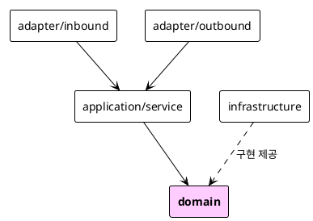
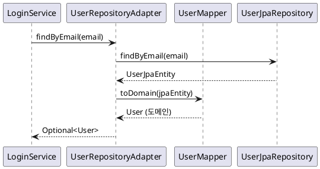

# 헥사고날 아키텍처로 리팩토링하기 — Co-Talk 백엔드 개선기

> "도메인 로직을 테스트하려는데 왜 Redis가 필요하지?"

이 질문에서 모든 게 시작됐다. 처음 Co-Talk을 시작할 때는 흔한 레이어드 아키텍처로 시작했다. Controller → Service → Repository. 빠르게 돌아가고, 익숙하고, 당장은 문제가 없어 보였다. 그러다 테스트를 작성하면서 뭔가 잘못됐다는 걸 깨달았다.

이 글은 Co-Talk 백엔드를 전통적인 레이어드에서 헥사고날 아키텍처(Ports & Adapters)로 리팩토링한 과정을 다룬다. [이슈 #19](https://github.com/with-co-talk/co-talk/issues/19), [#22](https://github.com/with-co-talk/co-talk/issues/22), [#24](https://github.com/with-co-talk/co-talk/issues/24)에 걸쳐 진행된 작업이었고, 패키지 구조 설계부터 ArchUnit으로 의존 방향을 강제하는 것까지, 현실적인 트레이드오프와 함께 정리해봤다.

---

## 1. 왜 리팩토링했나

### 레이어드에서 겪은 문제들

초기 코드를 돌이켜보면 전형적인 증상들이 있었다.

**JPA가 도메인 영역에 침투했다.** `Message`, `User` 같은 엔티티에 `@Entity`, `@Column`, `@ManyToOne`이 붙어있었다. 도메인 로직을 이해하려면 JPA 어노테이션도 같이 읽어야 했다. `@Transient`는 언제 쓰는 거더라, `@Column(insertable = false)`는 왜 있는 거지… 비즈니스 로직과 영속성 관심사가 한 파일 안에서 섞였다.

**단위 테스트에 인프라가 따라왔다.** 회원가입 로직 하나를 테스트하려면 Spring Context가 필요했고, DataSource가 필요했다. 테스트가 느렸고, 특정 인프라 없이는 실행 자체가 안 됐다. `@SpringBootTest`를 달지 않으면 의존성 주입이 안 됐다.

**기술 전환 비용이 눈에 보이기 시작했다.** "Redis를 Kafka로 바꿔야 한다면?" 서비스 코드 여러 곳에 Redis 관련 코드가 직접 참조돼 있으면 그게 불가능에 가깝다. 실제로 테스트 환경에서 Redis 없이 실행하고 싶었는데, 그게 쉽지 않았다.

헥사고날 아키텍처로 바꾸기로 한 이유는 하나였다. **도메인 로직이 인프라에서 독립적이어야 한다.** 비즈니스 규칙은 DB가 MySQL이든 PostgreSQL이든, 메시지 브로커가 Redis든 Kafka든 상관없이 동일하게 동작해야 한다.

---

## 2. 패키지 구조 설계

<!-- IMAGE: 리팩토링 전/후 패키지 구조 비교 — 좌측에 레이어드(controller/service/repository), 우측에 헥사고날(adapter/application/domain/infrastructure) 구조를 IDE에서 나란히 캡처하거나 트리 출력 이미지로 편집 -->

최종적으로 정착한 구조는 이렇다.

```
src/main/java/com/cotalk/
├── adapter/
│   ├── inbound/
│   │   ├── rest/                  # REST 컨트롤러 22개 (/api/v1/**)
│   │   └── websocket/             # WebSocket STOMP 컨트롤러
│   └── outbound/
│       └── persistence/
│           ├── entity/            # JPA 전용 엔티티 (UserJpaEntity 등)
│           └── mapper/            # 도메인 ↔ JPA 변환 매퍼
├── application/
│   └── service/                   # UseCase 구현 서비스 ~65개 (도메인별 하위 패키지)
├── domain/
│   ├── entity/                    # 순수 도메인 엔티티 (JPA 없음)
│   ├── model/                     # 값 객체 (Java record)
│   ├── port/
│   │   ├── inbound/               # UseCase 인터페이스 ~50개
│   │   └── outbound/              # Repository/서비스 포트 ~30개
│   └── exception/                 # DomainException + HttpStatusHint + 34개 구체 예외
└── infrastructure/                # 인프라 설정 (security, messaging, crypto 등)
```

핵심 개념은 **의존 방향이 항상 안쪽을 향한다**는 것이다.

<!-- IMAGE: 의존 방향 다이어그램 렌더링 이미지 — 아래 PlantUML 다이어그램을 렌더러로 렌더링해 캡처. domain을 중심으로 화살표가 안쪽을 향하는 구조가 시각적으로 잘 드러나야 함 -->



`domain`은 아무것도 모른다. JPA도, Redis도, Spring도. 순수 Java + Jakarta Validation만 사용한다. `application/service`는 `domain`의 포트 인터페이스만 의존한다. 실제 구현체(JPA, Redis 등)는 `infrastructure`나 `adapter/outbound`에 있고, Spring이 런타임에 주입해준다.

---

## 3. Port와 Adapter 패턴

헥사고날의 핵심은 Port다. **Inbound Port**는 외부에서 애플리케이션으로 들어오는 진입점이고, **Outbound Port**는 애플리케이션이 외부에 의존하는 계약이다.

### Inbound Port — UseCase 인터페이스

```java
// domain/port/inbound/auth/LoginUseCase.java
public interface LoginUseCase {

    /**
     * 이메일과 비밀번호로 로그인한다.
     *
     * @throws InvalidCredentialsException 인증 실패 시
     */
    LoginResult login(String email, String password);

    Long getUserIdByEmail(String email);
}
```

UseCase 인터페이스는 도메인 패키지에 위치한다. 구현은 `application/service`에 있다.

```java
// application/service/auth/LoginService.java
@Slf4j
@Service
@RequiredArgsConstructor
public class LoginService implements LoginUseCase {

    private final UserRepository userRepository;      // outbound port
    private final PasswordEncoderPort passwordEncoder; // outbound port
    private final AuthTokenPort authTokenPort;         // outbound port
    // ...

    @Override
    @Transactional
    public LoginResult login(String email, String password) {
        User user = userRepository.findByEmail(email)
                .orElseThrow(() -> {
                    metricsPort.incrementLoginFailure();
                    return new InvalidCredentialsException();
                });

        if (!passwordEncoder.matches(password, user.getPasswordHash())) {
            metricsPort.incrementLoginFailure();
            throw new InvalidCredentialsException();
        }
        // ...
    }
}
```

`LoginService`는 `UserRepository`, `PasswordEncoderPort` 같은 인터페이스만 의존한다. 실제로 JPA를 쓰는지, BCrypt를 쓰는지 모른다. 알 필요도 없다.

### Outbound Port — Repository 인터페이스

```java
// domain/port/outbound/UserRepository.java
public interface UserRepository {
    User save(User user);
    Optional<User> findById(Long id);
    Optional<User> findByEmail(String email);
    Optional<User> findByOAuthProviderAndOAuthId(User.OAuthProvider provider, String oauthId);
    List<User> findByNicknameContaining(String nickname);
    boolean existsByEmail(String email);
    // ...
}
```

`UserRepository`는 도메인 패키지에 있다. Spring Data JPA의 `JpaRepository`와 무관하다. 이 인터페이스를 보는 사람은 "어떻게 저장하는지"가 아니라 "무엇을 할 수 있는지"만 본다.

실제 JPA 구현은 `adapter/outbound/persistence` 패키지에 격리된다.

---

## 4. 엔티티 이중 계층

가장 손이 많이 간 부분이다. 도메인 엔티티와 JPA 엔티티를 완전히 분리했다.

### 완전 분리된 User

```java
// domain/entity/User.java
@Getter
@SuperBuilder
@NoArgsConstructor(access = AccessLevel.PROTECTED)
@AllArgsConstructor
public class User extends DomainBaseEntity {  // JPA 없음, 순수 Java

    private Long id;
    private Email email;  // 값 객체
    private String passwordHash;
    private String nickname;
    private UserStatus status;
    private Role role;
    private OnlineStatus onlineStatus;
    // ...

    public void goOnline(LocalDateTime now) {
        this.onlineStatus = OnlineStatus.ONLINE;
        this.lastActiveAt = now;
    }

    public boolean isActive() {
        return this.status == UserStatus.ACTIVE;
    }
}
```

```java
// domain/entity/DomainBaseEntity.java
public abstract class DomainBaseEntity {  // @MappedSuperclass 없음
    private LocalDateTime createdAt;
    private LocalDateTime updatedAt;
}
```

`User`에는 `@Entity`, `@Column` 어노테이션이 하나도 없다. 비즈니스 행동(`goOnline()`, `isActive()`)이 JPA 노이즈 없이 명확하게 보인다.

```java
// adapter/outbound/persistence/entity/UserJpaEntity.java
@Entity
@Table(name = "users")
@Getter
@Builder
@NoArgsConstructor(access = AccessLevel.PROTECTED)
@AllArgsConstructor
public class UserJpaEntity extends BaseJpaEntity {

    @Id
    private Long id;

    @Column(unique = true, nullable = false)
    private String email;

    @Enumerated(EnumType.STRING)
    @Column(name = "oauth_provider")
    private User.OAuthProvider oauthProvider;

    // JPA 관심사만 집중
}
```

그리고 둘을 연결하는 매퍼.

```java
// adapter/outbound/persistence/mapper/UserMapper.java
@Component
public class UserMapper {

    public User toDomain(UserJpaEntity jpa) {
        if (jpa == null) return null;
        return User.builder()
                .id(jpa.getId())
                .email(new Email(jpa.getEmail()))  // String → 값 객체로 복원
                .passwordHash(jpa.getPasswordHash())
                .status(jpa.getStatus())
                // ...
                .build();
    }

    public UserJpaEntity toJpa(User domain) {
        if (domain == null) return null;
        return UserJpaEntity.builder()
                .id(domain.getId())
                .email(domain.getEmail().value())  // 값 객체 → String으로 추출
                .passwordHash(domain.getPasswordHash())
                // ...
                .build();
    }
}
```

흐름을 정리하면 이렇다.



`LoginService`는 `User` 도메인 객체만 본다. `UserJpaEntity`의 존재를 모른다.

### 아직 분리하지 않은 Message, ChatRoom

솔직히 말하면, `Message`와 `ChatRoom`은 아직 분리가 안 됐다. 이 둘은 아직 `BaseEntity`(`@MappedSuperclass` 포함)를 상속하고 있다.

```java
// domain/entity/BaseEntity.java
@MappedSuperclass  // 아직 JPA가 남아있다
@EntityListeners(AuditingEntityListener.class)
@Getter
public abstract class BaseEntity {
    @CreatedDate
    @Column(nullable = false, updatable = false)
    private LocalDateTime createdAt;

    @LastModifiedDate
    @Column(nullable = false)
    private LocalDateTime updatedAt;
}
```

주석에도 적혀있다. "분리 완료 후 제거하고, 순수 도메인용 BaseEntity만 유지할 예정이다." 왜 남겨뒀냐면, **트레이드오프**다. `Message`와 `ChatRoom`은 필드가 많고, JPA 관계 매핑도 복잡하다. 지금 분리하는 비용 대비 얻는 이점을 계산했을 때, 현재 팀 상황에서는 `User`처럼 완전히 분리하는 게 맞지 않았다. 점진적 마이그레이션이 현실적인 선택이었다.

---

## 5. `@ConditionalOnProperty` 전략 패턴

헥사고날의 큰 이점 중 하나가 여기서 드러난다. Outbound Port는 인터페이스이기 때문에, **런타임에 구현체를 바꿀 수 있다**.

```java
// domain/port/outbound/ChatMessageBroker.java
public interface ChatMessageBroker {
    void publish(Long roomId, ChatBroadcastMessage message);
    void publishReaction(Long roomId, ReactionBroadcastEvent reactionEvent);
    void publishRoomEvent(Long roomId, Object event);
}
```

이 인터페이스의 구현체가 두 개다.

```java
// infrastructure/messaging/RedisChatMessageBroker.java
@Component
@ConditionalOnProperty(
    name = "spring.data.redis.enabled",
    havingValue = "true",
    matchIfMissing = true  // 기본값은 Redis 사용
)
public class RedisChatMessageBroker implements ChatMessageBroker {

    @Override
    public void publish(Long roomId, ChatBroadcastMessage message) {
        String channel = channelPrefix + roomId;
        String jsonMessage = objectMapper.writeValueAsString(message);
        redisTemplate.convertAndSend(channel, jsonMessage);
    }
    // ...
}
```

```java
// infrastructure/messaging/InMemoryChatMessageBroker.java
@Component
@ConditionalOnProperty(
    name = "spring.data.redis.enabled",
    havingValue = "false"  // Redis 꺼지면 이쪽이 활성화
)
public class InMemoryChatMessageBroker implements ChatMessageBroker {

    @Override
    public void publish(Long roomId, ChatBroadcastMessage message) {
        // Redis 없이 직접 WebSocket으로 브로드캐스트
        messagingTemplate.convertAndSend(ROOM_TOPIC_PREFIX + roomId, toWebSocketMessage(message));
    }
    // ...
}
```

`application.yml`에서 `spring.data.redis.enabled: false`로 설정하면 Redis 없이 인메모리로 동작한다. 테스트 환경에서 Redis가 없어도 채팅 기능을 테스트할 수 있다. `LoginService`는 `ChatMessageBroker` 인터페이스만 알고, 실제로 뭐가 주입되는지 신경 쓰지 않는다.

같은 패턴이 `ChatRoomPresenceTracker`, `UserEventBroker`, `FileStorage`, `EmailSender`에도 적용됐다.

---

## 6. ArchUnit으로 의존 방향 강제

<!-- IMAGE: ArchUnit 테스트 통과 결과 스크린샷 — ./gradlew test 실행 후 IntelliJ 테스트 탐색기에서 HexagonalArchitectureTest 하위 모든 케이스가 초록불인 화면 캡처 -->

규칙을 정해도 사람이 지키지 않으면 의미가 없다. ArchUnit으로 의존 방향을 자동 검증한다.

```java
// test/java/com/cotalk/architecture/HexagonalArchitectureTest.java
class HexagonalArchitectureTest {

    private static JavaClasses classes;

    @BeforeAll
    static void setUp() {
        classes = new ClassFileImporter()
                .withImportOption(ImportOption.Predefined.DO_NOT_INCLUDE_TESTS)
                .importPackages("com.cotalk");
    }

    @Nested
    @DisplayName("Domain 레이어 규칙")
    class DomainLayerRules {

        @ParameterizedTest(name = "Domain은 {0} 레이어에 의존하지 않는다")
        @CsvSource({
                "Application, ..application..",
                "Adapter,     ..adapter..",
                "Infrastructure, ..infrastructure.."
        })
        void should_notDependOnOtherLayers_when_inDomainLayer(
                String layerName, String forbiddenPackage) {
            ArchRule rule = noClasses()
                    .that().resideInAPackage("..domain..")
                    .should().dependOnClassesThat().resideInAPackage(forbiddenPackage);

            rule.check(classes);
        }
    }

    @Nested
    @DisplayName("Application 레이어 규칙")
    class ApplicationLayerRules {

        @Test
        @DisplayName("Application은 Adapter 레이어에 의존하지 않는다")
        void should_notDependOnAdapter_when_inApplicationLayer() {
            ArchRule rule = noClasses()
                    .that().resideInAPackage("..application..")
                    .should().dependOnClassesThat().resideInAPackage("..adapter..");

            rule.check(classes);
        }

        @Test
        @DisplayName("Application은 Infrastructure 레이어에 의존하지 않는다")
        void should_notDependOnInfrastructure_when_inApplicationLayer() {
            ArchRule rule = noClasses()
                    .that().resideInAPackage("..application..")
                    .should().dependOnClassesThat().resideInAPackage("..infrastructure..");

            rule.check(classes);
        }
    }

    @Nested
    @DisplayName("Adapter 레이어 규칙")
    class AdapterLayerRules {

        @Test
        @DisplayName("Inbound Adapter는 Outbound Adapter에 의존하지 않는다")
        void should_notDependOnOutbound_when_inInboundAdapter() {
            ArchRule rule = noClasses()
                    .that().resideInAPackage("..adapter.inbound..")
                    .should().dependOnClassesThat().resideInAPackage("..adapter.outbound..");

            rule.check(classes);
        }
    }

    @Nested
    @DisplayName("순환 의존 규칙")
    class CyclicDependencyRules {

        @Test
        @DisplayName("최상위 패키지 간 순환 의존이 없다")
        void should_havNoCyclicDependencies_between_topLevelPackages() {
            ArchRule rule = slices()
                    .matching("com.cotalk.(*)..")
                    .should().beFreeOfCycles();

            rule.check(classes);
        }
    }
}
```

검증하는 규칙은 다음과 같다.

| 규칙 | 설명 |
|------|------|
| domain → application 금지 | 도메인이 서비스 계층을 알면 안 된다 |
| domain → adapter 금지 | 도메인이 JPA/REST를 알면 안 된다 |
| domain → infrastructure 금지 | 도메인이 Redis/Security를 알면 안 된다 |
| application → adapter 금지 | 서비스가 컨트롤러/JPA 구현체를 직접 쓰면 안 된다 |
| application → infrastructure 금지 | 서비스가 인프라 설정을 알면 안 된다 |
| inbound → outbound 금지 | REST 컨트롤러가 JPA 어댑터를 직접 쓰면 안 된다 |
| 순환 의존 금지 | 패키지 간 사이클 없음 |

이 테스트가 `./gradlew test`에 포함된다. 누군가 실수로 `domain` 패키지에서 `@Repository` JPA 인터페이스를 import하면 빌드가 터진다. 코드 리뷰 전에 자동으로 잡힌다.

---

## 7. 리팩토링 과정에서 배운 것

### 점진적 마이그레이션의 현실

"전부 다 헥사고날로 바꾸자"라고 시작하면 실패한다. 실제로는 도메인별로 하나씩 분리했다. `User`가 먼저 완전 분리됐고, `Message`와 `ChatRoom`은 아직 진행 중이다. 완벽한 구조보다 **동작하는 코드**가 우선이다.

### UseCase 폭발 문제

`domain/port/inbound` 아래에 UseCase가 약 50개다. `SendFriendRequestUseCase`, `AcceptFriendRequestUseCase`, `RejectFriendRequestUseCase`, `BlockUserUseCase`... 인터페이스 파일 하나가 메서드 하나인 경우도 많다. 이게 맞는 건지 지금도 의견이 갈린다.

장점은 명확하다. 각 UseCase가 무엇을 하는지 이름만 봐도 알고, 테스트할 때 해당 UseCase만 Mock으로 교체하면 된다. 단점은 파일이 폭발적으로 늘어난다는 것이다. 50개 인터페이스, 65개 서비스 구현체. IDE에서 탐색할 때 익숙해지는 데 시간이 걸린다.

현재 선택한 방향은 **유지**다. 단일 책임 원칙을 지키는 게 파일 수 늘어나는 것보다 낫다고 판단했다.

### 예외 처리 전략 — DomainException + HttpStatusHint

도메인에서 예외를 던지는데, HTTP 상태 코드는 어떻게 결정할까? 처음에는 `domain` 패키지에서 `HttpServletResponse`를 직접 쓰는 방법도 고려했는데, 이건 당연히 아니다. 도메인이 HTTP를 알면 안 된다.

채택한 방법은 `HttpStatusHint`다.

```java
// domain/exception/HttpStatusHint.java
public enum HttpStatusHint {
    BAD_REQUEST(400),
    UNAUTHORIZED(401),
    FORBIDDEN(403),
    NOT_FOUND(404),
    CONFLICT(409),
    TOO_MANY_REQUESTS(429),
    INTERNAL_ERROR(500),
    SERVICE_UNAVAILABLE(503);
    // ...
}
```

```java
// domain/exception/DomainException.java
public class DomainException extends RuntimeException {

    private final String errorCode;
    private final HttpStatusHint statusHint;

    public DomainException(String message, String errorCode, HttpStatusHint statusHint) {
        super(message);
        this.errorCode = errorCode;
        this.statusHint = statusHint;
    }
}
```

도메인 예외는 "이 에러는 HTTP 404에 해당한다"는 힌트만 제공한다. 실제 HTTP 응답 변환은 `infrastructure/exception/GlobalExceptionHandler`에서 한다. 도메인은 HTTP를 모르고, 인프라는 도메인 예외를 받아서 HTTP로 변환한다.

구체 예외는 34개다. `UserNotFoundException`, `InvalidCredentialsException`, `ChatRoomNotFoundException`... 각각 적절한 `HttpStatusHint`를 가지고 생성된다. `GlobalExceptionHandler`는 `DomainException`을 받아서 `statusHint`를 꺼내 응답을 만든다.

---

## 마무리

헥사고날 아키텍처가 만능은 아니다. 파일이 많아지고, 초기 설계 비용이 높다. CRUD가 전부인 간단한 서비스에 이 구조를 강요할 필요는 없다.

Co-Talk에 이 구조가 맞는 이유는, **인프라 교체 가능성이 실제로 존재하기 때문이다**. Redis를 Kafka로 바꿀 수 있어야 하고, 테스트 환경에서 외부 서비스 없이 돌아야 한다. `@ConditionalOnProperty`로 Redis/InMemory를 전환하는 구조, 도메인 서비스가 JPA를 전혀 모르는 구조, ArchUnit으로 의존 방향을 자동 검증하는 구조 — 이것들이 실제로 필요했고, 실제로 효과가 있었다.

점진적으로 진행 중이다. `Message`, `ChatRoom` 분리는 다음 이슈에서 계속된다.

---

다음 편: [CI만 터지는 이유 — MinIO 설정 한 줄의 차이](blog-03-ci-minio-connection.md)
