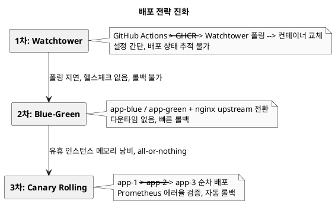

# 사이드 프로젝트를 NAS에 자동 배포하기 — GitHub Actions + GHCR + Canary 롤링

> "push하면 서버에 올라가 있으면 좋겠다."

사이드 프로젝트를 하다 보면 이 단순한 소망이 생긴다. 그런데 막상 구현하려고 하면 장벽이 꽤 높다. AWS EC2, GCP Cloud Run, Railway... 어디든 괜찮아 보이지만, 사이드 프로젝트가 트래픽 없이 조용히 돌아가는 동안에도 과금은 꼬박꼬박 나간다.

Co-Talk을 만들면서 고민 끝에 집에 있는 Synology NAS를 서버로 쓰기로 했다. GitHub Actions로 테스트하고, Docker 이미지를 빌드해 GHCR에 올리고, SSH로 NAS에 접속해 카나리아 롤링 배포를 자동으로 실행한다. 이 글은 그 파이프라인을 만들면서 겪은 삽질의 기록이다.

---

## 왜 NAS인가

클라우드 대비 NAS의 최대 장점은 딱 하나다. **고정비**다.

NAS는 이미 집에서 백업 용도로 쓰고 있었다. 추가 비용은 전기세뿐이다. 사이드 프로젝트는 대부분 트래픽이 거의 없는데, EC2 t3.small도 월 15달러쯤 나온다. 1년이면 18만 원이다. NAS로 옮기면 그 돈이 사라진다.

물론 단점도 있다.

| 항목 | NAS | 클라우드 |
|------|-----|---------|
| 초기 비용 | NAS 장비 구매 (이미 있다면 0원) | 없음 |
| 월 운영비 | 전기세 (약 2,000~5,000원 추산) | EC2 t3.small 기준 ~$15 |
| 가용성 | 홈 인터넷에 의존, ISP 장애 시 다운 | SLA 보장 |
| 확장성 | 메모리/CPU 고정 | 인스턴스 타입 변경 가능 |
| 보안 | 직접 관리, 포트 포워딩 필요 | VPC, IAM 등 인프라 제공 |
| 데이터 주권 | 완전히 내 것 | 클라우드 사업자 약관에 따름 |

사이드 프로젝트 초기 단계, 트래픽이 거의 없는 상황에서는 NAS가 훨씬 합리적이다. 나중에 트래픽이 생기면 클라우드로 옮기면 된다. 그때를 대비해 Kubernetes 매니페스트도 미리 준비해뒀다 — 이건 나중에 다시 이야기한다.

---

## 배포 전략의 진화: Watchtower → Blue-Green → Canary

카나리아 롤링이 처음부터 계획된 건 아니었다. 세 번의 전략을 거쳐 지금에 이르렀다. 지금 코드에 `cotalk-watchtower`와 `co-talk-app-green-1`이라는 이름이 고아 컨테이너 정리 목록에 남아있는 게 그 흔적이다.

### 1차: Watchtower — "이미지 바뀌면 알아서 교체해줘"

처음에는 Watchtower를 썼다. GitHub Actions가 GHCR에 새 이미지를 push하면, NAS에서 돌고 있는 Watchtower가 주기적으로 레지스트리를 폴링하다가 새 이미지를 감지하면 컨테이너를 자동으로 교체하는 방식이다.

```yaml
# docker-compose.yml에 이거 하나 추가하면 끝
  watchtower:
    image: containrrr/watchtower
    container_name: cotalk-watchtower
    volumes:
      - /var/run/docker.sock:/var/run/docker.sock
    command: --interval 300  # 5분마다 폴링
```

설정이 이게 전부다. 애플리케이션 코드나 파이프라인을 거의 건드리지 않고 자동 배포를 달 수 있었다.

**문제점이 쌓이기 시작했다.**

- **폴링 지연**: 기본 5분 폴링이라 push 후 최대 5분 뒤에야 배포가 시작된다.
- **배포 상태 추적 불가**: GitHub Actions가 이미지를 올리고 나면 그 다음 일은 모른다. 배포가 됐는지, 실패했는지 알 수가 없다.
- **헬스체크 없이 바로 교체**: 새 컨테이너가 뜨자마자 교체한다. 앱이 실제로 준비됐는지 확인하지 않는다.
- **롤백 불가**: 배포된 이미지에 문제가 있어도 되돌릴 방법이 없다.

작은 사이드 프로젝트에서는 버텼지만, 배포 중 다운타임이 눈에 보이기 시작하면서 다음 단계로 넘어갔다.

### 2차: Blue-Green — "안전하게 전환하자"

app-blue와 app-green, 두 인스턴스를 준비한다. nginx upstream에는 하나만 활성화해두고, 새 이미지를 비활성 인스턴스에 먼저 올린다. 준비가 완료되면 nginx upstream을 스위칭한다.

```nginx
# upstream.conf
upstream cotalk_backend {
    server app-green:8080;
    # server app-blue:8080;  # 비활성
}
```

배포 스크립트는 어느 쪽이 현재 활성인지 확인하고, 반대편에 새 이미지를 올린 뒤 `nginx -s reload`로 전환했다.

**개선된 점:**
- 전환 시 다운타임이 거의 없다.
- 문제가 생기면 upstream만 다시 바꾸면 되니 롤백이 빠르다.

**남은 문제:**
- 유휴 인스턴스(현재 비활성인 blue 또는 green)가 항상 메모리를 차지한다. NAS 8GB에서 이건 아깝다.
- **All-or-nothing**: 전환은 한 번에 전체다. 새 버전에 문제가 있을 때 일부 트래픽만 먼저 보내볼 수 없다.

### 3차: 카나리아 롤링 — "한 대씩 조심스럽게"

현재 방식이다. app-1, app-2, app-3 세 인스턴스가 항상 살아있고, 하나씩 순차적으로 교체한다.

app-1을 카나리아로 먼저 교체하고, Prometheus에서 5xx 에러율이 5%를 넘는지 확인한다. 이상이 없으면 app-2, app-3을 순서대로 교체한다. 에러율이 치솟으면 자동으로 `:previous` 이미지로 전체 롤백한다.

Blue-Green의 "유휴 인스턴스 낭비" 문제가 없다. 세 인스턴스 모두 트래픽을 받으면서 순서대로 교체된다. Watchtower의 "배포 상태 추적 불가" 문제도 없다. 각 단계마다 헬스체크와 메트릭 검증이 들어간다.

NAS처럼 메모리가 제한된 환경에서 세 인스턴스를 유지하는 게 부담이 아닌가 싶을 수 있다. 실제로 측정해보니 Blue-Green의 두 인스턴스 총량(2 × 1GB = 2GB)보다, 카나리아의 세 인스턴스(3 × 768MB = 2.3GB)가 비슷하거나 오히려 나았다. 트래픽이 분산되니 인스턴스당 메모리 여유가 생겼다.

### 세 전략 비교

| 항목 | Watchtower | Blue-Green | Canary Rolling |
|------|-----------|------------|----------------|
| 설정 복잡도 | 매우 낮음 | 중간 | 높음 |
| 배포 지연 | 폴링 간격 (최대 5분) | 즉시 (push 후) | 즉시 (push 후) |
| 다운타임 | 컨테이너 교체 중 순간 발생 | 거의 없음 | 없음 (순차 교체) |
| 롤백 | 불가 | 빠름 (upstream 전환) | 자동 (`:previous` 이미지) |
| 배포 상태 가시성 | 없음 | 있음 | 있음 + 메트릭 기반 |
| 메모리 효율 | 최고 (인스턴스 1개) | 낮음 (유휴 1개 낭비) | 좋음 (모든 인스턴스 활성) |
| 점진적 롤아웃 | 불가 | 불가 | 가능 (카나리아 검증 후) |



---

<!-- IMAGE: GitHub Actions 워크플로우 실행 성공 화면 — Actions 탭에서 build-and-push → deploy 두 Job이 모두 초록 체크인 파이프라인 캡처 -->

## 파이프라인 전체 그림

```
┌─────────────────────────────────────────────────────────────────┐
│                        GitHub Actions                           │
│                                                                 │
│  push to main                                                   │
│       │                                                         │
│       ▼                                                         │
│  ┌─────────────────────────────────────────────────────┐       │
│  │  Job 1: build-and-push                              │       │
│  │                                                     │       │
│  │  1. Checkout                                        │       │
│  │  2. JDK 25 설정 (temurin)                           │       │
│  │  3. ./gradlew test  ← 실패 시 중단                  │       │
│  │  4. Docker Buildx 설정 (멀티플랫폼)                 │       │
│  │  5. GHCR 로그인                                     │       │
│  │  6. 이미지 빌드 + 푸시 (캐시 활용)                  │       │
│  │     ghcr.io/org/co-talk:main                        │       │
│  │     ghcr.io/org/co-talk:<sha>                       │       │
│  │     ghcr.io/org/co-talk:latest                      │       │
│  └────────────────────────┬────────────────────────────┘       │
│                           │ needs: build-and-push              │
│                           ▼                                     │
│  ┌─────────────────────────────────────────────────────┐       │
│  │  Job 2: deploy (environment: production)            │       │
│  │                                                     │       │
│  │  appleboy/ssh-action → NAS SSH                      │       │
│  │  └─ mkdir -p <deploy_path>                          │       │
│  │  └─ git clone / git pull                            │       │
│  │  └─ 고아 컨테이너 정리                              │       │
│  │  └─ GHCR 로그인                                     │       │
│  │  └─ ./scripts/deploy.sh --pull                      │       │
│  └─────────────────────────────────────────────────────┘       │
└─────────────────────────────────────────────────────────────────┘
                                │
                                ▼ SSH
┌─────────────────────────────────────────────────────────────────┐
│                          Synology NAS                           │
│                                                                 │
│  deploy.sh 카나리아 롤링 배포                                   │
│                                                                 │
│  Phase 1: :latest 이미지 → :previous 백업                       │
│  Phase 2: app-1만 새 이미지로 교체 (카나리아)                   │
│           └─ health check: /actuator/health/liveness            │
│  Phase 3: Prometheus 에러율 확인 (5xx < 5%)                     │
│           └─ 실패 시 자동 롤백                                  │
│  Phase 4: app-2, app-3 순차 배포                                │
│  Phase 5: nginx 기동 확인                                       │
│                                                                 │
│  ┌──────────┐  ┌──────────┐  ┌──────────┐                      │
│  │  app-1   │  │  app-2   │  │  app-3   │                      │
│  │ :8080    │  │ :8080    │  │ :8080    │                      │
│  └──────────┘  └──────────┘  └──────────┘                      │
│        │             │             │                            │
│        └─────────────┴─────────────┘                           │
│                       │                                        │
│               ┌───────┴───────┐                                │
│               │  nginx        │ ← 로드밸런싱                   │
│               │ :18080        │                                │
│               └───────────────┘                                │
│                                                                 │
│  postgres │ redis │ minio │ prometheus │ grafana │ zipkin       │
└─────────────────────────────────────────────────────────────────┘
```

---

## GitHub Actions 워크플로우

`.github/workflows/deploy.yml` 의 핵심 구조다.

### 트리거 조건

```yaml
on:
  push:
    branches:
      - main
    paths-ignore:
      - '**.md'
      - 'docs/**'
  workflow_dispatch:  # 수동 실행 가능
```

`paths-ignore` 설정이 중요하다. 블로그 포스트를 수정하거나 README를 고칠 때마다 배포가 돌면 곤란하다. 문서 변경은 배포를 건너뛴다. `workflow_dispatch`는 긴급 재배포가 필요할 때 GitHub UI에서 직접 트리거할 수 있게 해준다.

### Job 1: 테스트 + 이미지 빌드 + 푸시

```yaml
jobs:
  build-and-push:
    runs-on: ubuntu-latest
    permissions:
      contents: read
      packages: write

    steps:
      - name: Set up JDK 25
        uses: actions/setup-java@v4
        with:
          java-version: '25'
          distribution: 'temurin'

      - name: Run tests
        run: ./gradlew test

      - name: Set up Docker Buildx
        uses: docker/setup-buildx-action@v3

      - name: Log in to Container Registry
        uses: docker/login-action@v3
        with:
          registry: ghcr.io
          username: ${{ github.actor }}
          password: ${{ secrets.GITHUB_TOKEN }}

      - name: Extract metadata (tags, labels)
        id: meta
        uses: docker/metadata-action@v5
        with:
          images: ghcr.io/${{ github.repository }}
          tags: |
            type=ref,event=branch
            type=sha,prefix=
            type=raw,value=latest,enable={{is_default_branch}}

      - name: Build and push Docker image
        uses: docker/build-push-action@v5
        with:
          context: .
          push: true
          tags: ${{ steps.meta.outputs.tags }}
          cache-from: |
            type=gha
            type=registry,ref=ghcr.io/${{ github.repository }}:buildcache
          cache-to: |
            type=gha,mode=max
            type=registry,ref=ghcr.io/${{ github.repository }}:buildcache,mode=max
```

몇 가지 포인트를 짚어두자.

<!-- IMAGE: GHCR 이미지 레지스트리 — GitHub Packages 페이지에서 co-talk 이미지 태그(main, SHA, latest) 목록 스크린샷 -->

**GHCR을 선택한 이유.** Docker Hub는 무료 플랜에서 Rate Limit이 있다. GHCR(GitHub Container Registry)은 GitHub 저장소와 같은 권한 체계를 쓰고, `GITHUB_TOKEN`으로 바로 로그인된다. 별도 토큰 관리가 필요 없다.

**이미지 태그 전략.** `metadata-action`이 세 가지 태그를 붙인다.
- `main` — 브랜치명
- `abc1234` — 커밋 SHA (롤백 시 특정 버전 지정 가능)
- `latest` — 기본 브랜치 push 시

**빌드 캐시 이중화.** `type=gha`(GitHub Actions 캐시)를 주 캐시로, `type=registry`(레지스트리 캐시)를 보조로 쓴다. GHA 캐시는 7일 후 만료되는데, 레지스트리 캐시가 있으면 캐시 미스 시에도 이전 빌드 레이어를 재사용할 수 있다. Java 프로젝트는 의존성 레이어가 크기 때문에 캐시 효과가 크다.

### Job 2: NAS 배포

```yaml
  deploy:
    needs: build-and-push
    runs-on: ubuntu-latest
    if: github.ref == 'refs/heads/main'
    environment: production

    steps:
      - name: Deploy to NAS via SSH
        uses: appleboy/ssh-action@v1
        with:
          host: ${{ secrets.NAS_HOST }}
          port: ${{ secrets.NAS_SSH_PORT }}
          username: ${{ secrets.NAS_USER }}
          key: ${{ secrets.NAS_SSH_KEY }}
          command_timeout: 10m
          script: |
            set -e
            export PATH="/usr/bin:/usr/local/bin:$PATH"
            [ -f "$HOME/.profile" ] && . "$HOME/.profile" || true
            [ -f "/etc/profile" ] && . "/etc/profile" || true

            mkdir -p ${{ secrets.NAS_DEPLOY_PATH }}
            cd ${{ secrets.NAS_DEPLOY_PATH }}

            if [ ! -d .git ]; then
              echo "Repository not found. Cloning..."
              git clone https://${{ secrets.GHCR_USER }}:${{ secrets.GHCR_TOKEN }}@github.com/${{ github.repository }}.git .
            else
              git pull --ff-only
            fi

            for c in co-talk-app-green-1 cotalk-app cotalk-watchtower; do
              docker rm -f "$c" 2>/dev/null || true
            done

            echo ${{ secrets.GHCR_TOKEN }} | docker login ghcr.io -u ${{ secrets.GHCR_USER }} --password-stdin

            ./scripts/deploy.sh -f docker-compose.nas.yml --pull
```

`environment: production`을 설정하면 GitHub 저장소 Settings에서 Deployment 환경을 분리 관리할 수 있다. 필요하다면 여기서 Reviewer 승인 요구도 추가할 수 있다.

**GitHub Secrets 목록.** 워크플로우에서 사용하는 시크릿은 다음과 같다.

| Secret | 설명 |
|--------|------|
| `NAS_HOST` | NAS 외부 IP 또는 DDNS 도메인 |
| `NAS_SSH_PORT` | SSH 포트 (기본 22, 변경 권장) |
| `NAS_USER` | SSH 사용자명 |
| `NAS_SSH_KEY` | SSH 개인키 (PEM 형식) |
| `NAS_DEPLOY_PATH` | 배포 디렉터리 경로 |
| `GHCR_USER` | GHCR 로그인 사용자명 |
| `GHCR_TOKEN` | Personal Access Token (read:packages) |

---

<!-- IMAGE: NAS Docker 컨테이너 목록 — `docker ps` 결과 또는 Synology Container Manager UI에서 app-1/2/3, nginx, postgres, redis 등이 running 상태인 화면 -->

## 배포 스크립트: 카나리아 롤링

`scripts/deploy.sh`는 단순한 `docker-compose up -d`가 아니다. 3개 인스턴스(app-1, app-2, app-3)에 카나리아 배포를 구현했다.

### 전체 흐름

```
Phase 1: 현재 :latest 이미지를 :previous로 백업
          └─ docker tag ...:latest ...:previous

Phase 2: app-1만 새 이미지로 교체 (카나리아)
          └─ dc stop -t 35 app-1
          └─ dc up -d --no-deps app-1
          └─ health check (최대 120초 대기)
          └─ 실패 시 → :previous로 자동 롤백

Phase 3: Prometheus 에러율 확인 (30초 대기 후 쿼리)
          └─ 5xx 에러율 5% 초과 시 → 카나리아 롤백
          └─ Prometheus 없으면 스킵

Phase 4: app-2, app-3 순차 롤링
          └─ 각 인스턴스마다 stop → up → health check

Phase 5: nginx 기동 확인
```

### 인프라 기동 확인

`ensure_infrastructure()` 함수는 배포 전 필수 서비스가 살아있는지 확인한다.

```bash
ensure_infrastructure() {
    local critical_services=("postgres" "redis" "minio")
    local monitoring_services=("zipkin" "loki" "prometheus" "alertmanager" "promtail" "grafana")

    # postgres, redis, minio가 내려가 있으면 기동
    for svc in "${critical_services[@]}"; do
        if ! dc ps "$svc" 2>/dev/null | grep -q "Up\|running"; then
            log_warn "${svc} is not running. Starting..."
            dc up -d "$svc"
        fi
    done

    # postgres와 redis가 healthy 상태가 될 때까지 최대 60초 대기
    local infra_wait=0
    while [ $infra_wait -lt 60 ]; do
        if dc ps postgres 2>/dev/null | grep -q "healthy" && \
           dc ps redis 2>/dev/null | grep -q "healthy"; then
            log_success "Critical infrastructure services are healthy"
            break
        fi
        sleep 3
        infra_wait=$((infra_wait + 3))
    done

    # 모니터링은 non-blocking으로 기동 시도
    dc up -d "${monitoring_services[@]}" 2>/dev/null || \
        log_warn "Some monitoring services failed to start (non-critical)"
}
```

NAS를 재부팅하거나 배포 디렉터리가 처음 생성된 직후라면, 데이터베이스가 아직 healthy 상태가 아닐 수 있다. 앱 컨테이너가 DB 없이 뜨면 시작부터 실패한다. 이 함수가 그 타이밍 문제를 막아준다.

postgres와 redis는 `critical_services`라 헬스체크 통과를 기다리지만, Prometheus나 Grafana 같은 모니터링은 `non-blocking`으로 처리한다. 모니터링이 안 떠도 배포는 계속된다.

### 롤백

배포 실패 시 수동으로 전체 롤백도 가능하다.

```bash
./scripts/deploy.sh --rollback
```

`rollback()` 함수는 `:previous` 태그 이미지를 `:latest`로 복구한 뒤 app-1, app-2, app-3을 순차적으로 재기동한다. `:previous` 백업이 없으면 (첫 배포라면) 에러를 내고 종료한다.

---

## docker-compose.nas.yml 설계

운영 환경 compose 파일에서 눈여겨볼 부분이 있다.

### 외부 포트 노출 제거

```yaml
  postgres:
    image: postgres:16-alpine
    # 외부 포트 노출 없음 - 도커 내부 네트워크에서 postgres:5432로 접근
    networks:
      - cotalk-network

  redis:
    image: redis:7-alpine
    # 외부 포트 노출 없음 - 도커 내부 네트워크에서 redis:6379로 접근
    networks:
      - cotalk-network
```

postgres, redis, prometheus, zipkin, loki는 외부 포트를 전혀 열지 않는다. 도커 내부 네트워크(`cotalk-network`)에서만 서비스명으로 접근한다. NAS를 인터넷에 노출할 때 불필요한 포트를 막는 것은 기본 보안이다.

반면 nginx만 외부 포트를 연다.

```yaml
  nginx:
    ports:
      - "${APP_PORT:-18080}:80"
```

기본 80/443 대신 18080 같은 커스텀 포트를 쓰는 것은 NAS의 DSM 웹 인터페이스와 포트 충돌을 피하기 위해서다.

### stop_grace_period

```yaml
  app-1:
    stop_grace_period: 35s
```

Spring Boot Graceful Shutdown의 기본 대기 시간은 30초다. `stop_grace_period: 35s`는 Docker가 컨테이너를 강제 종료하기 전 35초를 기다린다는 뜻이다. 처리 중인 HTTP 요청이 완료될 시간을 준다. 배포 중에도 진행 중인 요청을 끊지 않는다.

### 메모리 제한

```yaml
  app-1:
    deploy:
      resources:
        limits:
          memory: 1024M
```

NAS는 클라우드와 달리 총 메모리가 고정이다. 앱 인스턴스 3개 + PostgreSQL + Redis + MinIO + 모니터링 스택이 함께 돌아가야 한다. 각 서비스에 메모리 상한을 걸어두지 않으면, 한 컨테이너가 메모리를 폭식했을 때 전체가 OOM으로 죽을 수 있다.

---

## 삽질 기록 ([PR #61](https://github.com/with-co-talk/co-talk/pull/61), [#95](https://github.com/with-co-talk/co-talk/pull/95), [#97](https://github.com/with-co-talk/co-talk/pull/97))

### 배포 디렉터리 없으면 실패 ([PR #61](https://github.com/with-co-talk/co-talk/pull/61))

첫 배포 시 NAS에 배포 디렉터리가 없어서 `cd`에서 실패했다.

```bash
# 실패했던 코드
cd ${{ secrets.NAS_DEPLOY_PATH }}

# 수정 후
mkdir -p ${{ secrets.NAS_DEPLOY_PATH }}
cd ${{ secrets.NAS_DEPLOY_PATH }}
```

단순하지만 첫 배포 때 한 번씩 겪는 실수다. `mkdir -p`는 이미 있어도 에러가 없으니 항상 붙여두는 게 낫다.

### 저장소 없으면 clone, 있으면 pull ([PR #61](https://github.com/with-co-talk/co-talk/pull/61))

배포 디렉터리 문제와 같은 맥락이다. 처음 배포할 때 저장소가 없는 상태에서 `git pull`을 하면 실패한다.

```bash
if [ ! -d .git ]; then
  echo "Repository not found. Cloning..."
  git clone https://${{ secrets.GHCR_USER }}:${{ secrets.GHCR_TOKEN }}@github.com/${{ github.repository }}.git .
else
  git pull --ff-only
fi
```

`--ff-only`는 Fast-Forward만 허용한다. NAS에서 누군가 직접 파일을 수정했다면 충돌이 나야 알 수 있도록 의도적으로 강제했다.

### NAS 비로그인 셸의 PATH 문제 ([PR #95](https://github.com/with-co-talk/co-talk/pull/95))

SSH 원격 실행은 비로그인 셸(non-login shell)로 동작하는 경우가 있다. 이때 `~/.profile`이나 `/etc/profile`이 로드되지 않아서 `docker` 명령어를 못 찾을 수 있다.

```bash
export PATH="/usr/bin:/usr/local/bin:$PATH"
[ -f "$HOME/.profile" ] && . "$HOME/.profile" || true
[ -f "/etc/profile" ] && . "/etc/profile" || true
```

NAS마다 Docker 설치 경로가 다를 수 있어서 두 경로를 모두 profile 소스로 시도한다. 실패해도 `|| true`로 무시하고 진행한다.

### 고아 컨테이너 정리 ([PR #97](https://github.com/with-co-talk/co-talk/pull/97))

이전에 다른 compose 파일이나 수동 배포로 만들어진 컨테이너가 이름 충돌을 일으킬 수 있다. 배포 전에 알려진 고아 컨테이너를 정리한다.

```bash
for c in co-talk-app-green-1 cotalk-app cotalk-watchtower; do
  docker rm -f "$c" 2>/dev/null || true
done
```

`2>/dev/null || true`는 컨테이너가 없을 때 에러를 무시한다. 있으면 제거, 없으면 그냥 지나간다.

목록에 있는 `co-talk-app-green-1`과 `cotalk-watchtower`는 앞서 이야기한 배포 전략 변천사의 흔적이다. `co-talk-app-green-1`은 Blue-Green 시절 app-green 인스턴스의 컨테이너 이름이고, `cotalk-watchtower`는 1차 Watchtower 시절에 남은 컨테이너다. 카나리아 롤링으로 전환하면서 이 컨테이너들이 고아가 됐고, 새 배포와 이름이 충돌하지 않도록 정리 목록에 박아뒀다.

---

## 클라우드 전환 대비: Kubernetes 매니페스트 준비

NAS에서 잘 돌아가고 있지만, 미래를 위해 K8s 매니페스트도 미리 작성해뒀다.

```
k8s/
├── base/
│   ├── deployment.yaml      # Deployment + 3 replicas
│   ├── service.yaml         # ClusterIP Service
│   ├── ingress.yaml         # Ingress 설정
│   ├── hpa.yaml             # HPA (auto-scaling)
│   ├── pdb.yaml             # PodDisruptionBudget
│   ├── configmap.yaml       # 환경 설정
│   ├── secret.yaml          # Secret 템플릿
│   ├── networkpolicy.yaml   # 네트워크 정책
│   └── servicemonitor.yaml  # Prometheus ServiceMonitor
└── overlays/
    ├── dev/                 # 개발 환경 패치
    └── prod/                # 운영 환경 패치 (ingress 도메인 등)
```

Kustomize 구조로 base 매니페스트를 공유하고, 환경별 차이는 overlay 패치로 관리한다. NAS → 클라우드 K8s 전환 시 `docker-compose.nas.yml` 대신 `k8s/overlays/prod`를 쓰는 것으로 전환이 끝난다. 애플리케이션 코드는 변경이 없다.

---

## 현재 파이프라인 요약

main 브랜치에 push가 발생하면 이런 일이 일어난다.

1. GitHub Actions가 JDK 25로 전체 테스트를 돌린다. 실패하면 여기서 멈춘다.
2. Docker Buildx가 이미지를 빌드하고 GHCR에 올린다. 빌드 캐시 덕분에 의존성 레이어는 재사용된다.
3. SSH로 NAS에 접속해 배포 스크립트를 실행한다.
4. 배포 스크립트는 app-1부터 카나리아로 배포하고, 헬스체크와 에러율을 확인한 뒤 나머지 인스턴스로 롤아웃한다.
5. 문제가 생기면 자동으로 이전 이미지로 롤백한다.

문서만 수정하는 push는 `paths-ignore`로 배포를 건너뛴다. push가 되면 10~15분 내로 NAS에 반영된다. 완전 자동이다.

---

## 마치며

사이드 프로젝트에 과금 부담 없이 배포 자동화를 붙이고 싶다면 NAS는 꽤 괜찮은 선택이다. GitHub Actions, GHCR, `appleboy/ssh-action` 조합은 복잡한 설정 없이 빠르게 파이프라인을 구성할 수 있다.

삽질했던 포인트들 — 디렉터리 없을 때 `mkdir -p`, 첫 배포 시 clone 분기, 비로그인 셸 PATH, 고아 컨테이너 정리 — 은 모두 "이미 있으면 괜찮지만 처음이면 터진다"는 패턴이었다. 이런 경우 항상 `|| true`와 멱등성(idempotency)을 염두에 두면 삽질을 줄일 수 있다.

나중에 트래픽이 늘어나면 K8s 매니페스트를 꺼내 클라우드로 옮기면 된다. 지금 당장은 NAS로 충분하다.

---

*[Co-Talk 시리즈 전체 목차](blog-index.md)*

다음 편: [WebSocket 브로드캐스트가 실패해도 메시지는 살려야 한다](blog-08-websocket-broadcast-resilience.md)
