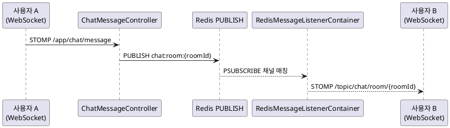

# 로컬 올 그린, CI 올 레드 — Spring Boot 통합 테스트 20건 수정기

> "로컬에서는 다 통과하는데 CI만 터져요."

개발자라면 한 번쯤은 겪어본 그 상황이다. 무언가 잘못되고 있는 건 분명한데, 내 맥북에서는 아무 문제가 없다. 로그를 다시 읽고, 같은 명령어를 실행하고, 또 읽고. 결국 커피 한 잔을 더 내리고 GitHub Actions 로그와 씨름을 시작한다.

이 글은 Co-Talk 프로젝트에서 실제로 겪은 그 씨름의 기록이다. Java 25 + Spring Boot 3.5 + Hexagonal Architecture로 구성된 백엔드에서 통합 테스트 20건이 CI에서만 줄줄이 실패하는 문제를 4개 PR에 걸쳐 해결했다. 각 문제는 독립적으로 보였지만, 하나씩 파고들다 보면 Spring Boot 테스트 생태계의 숨겨진 동작 방식을 배우게 된다.

---

<!-- IMAGE: GitHub Actions 테스트 실패 화면 — CI 로그에서 RateLimitIntegrationTest, WebSocketChatIntegrationTest 등 20건이 빨간색으로 FAILED 표시된 화면 캡처 -->

## 프로젝트 개요

- **스택**: Java 25, Spring Boot 3.5.6, PostgreSQL 16, Redis 7, Testcontainers
- **아키텍처**: Hexagonal (Ports & Adapters)
- **CI**: GitHub Actions (`deploy.yml`)
- **테스트**: JUnit 5 + Mockito + Testcontainers + Awaitility

실패한 테스트는 크게 두 부류였다.

1. `RateLimitIntegrationTest` — Rate Limit 동작 검증 (Testcontainers Redis)
2. `WebSocketChatIntegrationTest` — WebSocket STOMP + Redis Pub/Sub 검증

두 테스트 모두 `@SpringBootTest(webEnvironment = RANDOM_PORT)` + Testcontainers를 사용한다. 로컬에서는 Docker Desktop이 떠 있어서 잘 돌지만, CI 환경에서는 각기 다른 이유로 실패했다.

---

## 문제 #1 — Flyway + H2 비호환

### 증상

```
FlywayException: Validate failed:
Migration checksum mismatch for migration version V1
```

혹은 더 직접적으로:

```
org.h2.jdbc.JdbcSQLSyntaxErrorException:
Syntax error in SQL statement "CREATE INDEX ... USING gin(to_tsvector(...))"
```

### 원인

프로젝트에는 PostgreSQL 전용 GIN 인덱스를 사용하는 Flyway 마이그레이션 스크립트가 있다.

```sql
-- V3__add_full_text_search.sql
CREATE INDEX idx_messages_content_fts
    ON messages USING gin(to_tsvector('simple', content));
```

이 SQL은 PostgreSQL에서만 유효하다. H2는 `USING gin(...)` 문법을 모른다.

`application-test.yml`에는 이미 `flyway.enabled: false`가 있었다. 하지만 Rate Limit 테스트를 위해 새로 추가한 `application-ratelimit-test.yml`에는 이 설정이 누락되어 있었다.

```yaml
# application-ratelimit-test.yml (수정 전 — flyway 설정 없음)
spring:
  datasource:
    url: jdbc:h2:mem:testdb;DB_CLOSE_DELAY=-1
    driver-class-name: org.h2.Driver
  jpa:
    hibernate:
      ddl-auto: create-drop
```

### 해결

```yaml
# application-ratelimit-test.yml (수정 후)
spring:
  flyway:
    enabled: false  # H2는 PostgreSQL 전용 문법(GIN 인덱스 등)을 지원하지 않음
  jpa:
    hibernate:
      ddl-auto: create-drop
```

### 교훈

**새 테스트 프로파일을 추가할 때는 반드시 `application-test.yml`과 설정을 비교하라.**

특히 아래 항목은 모든 테스트 프로파일에 동일하게 있어야 한다.

```yaml
spring:
  flyway:
    enabled: false
```

---

## 문제 #2 — SecurityFilterChain 빈 충돌

### 증상

```
BeanDefinitionOverrideException: Invalid bean definition with name 'securityFilterChain'
defined in class path resource [...IntegrationTestSecurityConfig.class]:
Cannot register bean definition [...] as there is already [...SecurityConfig.class]
```

### 원인

Rate Limit 통합 테스트는 `IntegrationTestSecurityConfig`라는 테스트 전용 Security 설정을 사용한다. 이 설정은 모든 요청을 허용하고 테스트용 인증 필터만 적용한다.

```java
@TestConfiguration
public class IntegrationTestSecurityConfig {

    @Bean("securityFilterChain")
    public SecurityFilterChain testSecurityFilterChain(HttpSecurity http) throws Exception {
        return http
                .csrf(AbstractHttpConfigurer::disable)
                .authorizeHttpRequests(auth -> auth.anyRequest().permitAll())
                .addFilterBefore(new TestAuthenticationFilter(), UsernamePasswordAuthenticationFilter.class)
                .build();
    }
}
```

문제는 `@SpringBootTest`가 전체 애플리케이션 컨텍스트를 로드하면서 프로덕션 `SecurityConfig`의 `securityFilterChain` 빈도 함께 등록된다는 점이다. 같은 이름의 빈이 두 개가 되니 충돌이 발생한다.

### 1차 임시 해결 (우회)

```yaml
spring:
  main:
    allow-bean-definition-overriding: true
```

이 설정은 빈 오버라이딩을 허용한다. `@Bean("securityFilterChain")`이 동일한 이름이면 나중에 등록된 빈이 앞의 빈을 덮어쓴다. 동작은 하지만 빈 등록 순서에 의존하는 취약한 방식이다.

### 최종 해결 — `@ConditionalOnProperty` 패턴

프로덕션 `SecurityConfig`에 조건부 활성화를 추가했다.

```java
@Bean
// 테스트 프로파일에서 IntegrationTestSecurityConfig만 사용하도록 비활성화 가능
@ConditionalOnProperty(name = "app.security.default-chain.enabled", matchIfMissing = true)
public SecurityFilterChain securityFilterChain(HttpSecurity http) throws Exception {
    // ... 프로덕션 보안 설정
}
```

`matchIfMissing = true`가 핵심이다. 프로덕션 환경에서는 이 속성이 존재하지 않으므로 기본값인 `true`로 동작해 체인이 등록된다. 테스트 프로파일에서만 명시적으로 `false`로 설정한다.

```yaml
# application-ratelimit-test.yml
app:
  security:
    default-chain:
      enabled: false  # 프로덕션 체인 비활성화 → 테스트 체인만 등록
```

```java
// WebSocketChatIntegrationTest.java
@SpringBootTest(
    properties = {
        "app.security.default-chain.enabled=false",
        // ...
    }
)
@Import(IntegrationTestSecurityConfig.class)
class WebSocketChatIntegrationTest { ... }
```

### 교훈

`@ConditionalOnProperty(matchIfMissing = true)` 패턴은 프로덕션 동작을 바꾸지 않으면서 테스트에서만 빈을 교체할 수 있는 깔끔한 방법이다. `allow-bean-definition-overriding`보다 명시적이고 안전하다.

---

## 문제 #3 — `@TestConfiguration` + `@Import` 누락

### 증상

```
org.springframework.security.access.AccessDeniedException: Access Denied
HTTP Status 401 Unauthorized
```

Rate Limit 테스트에서 `IntegrationTestSecurityConfig`를 등록했음에도 여전히 401이 발생했다.

### 원인

`@TestConfiguration`은 `@SpringBootTest` 컨텍스트에서 **자동으로 스캔되지 않는다.**

Spring 공식 문서에도 나와 있지만 놓치기 쉬운 함정이다. `@Configuration`은 컴포넌트 스캔으로 자동 등록되지만, `@TestConfiguration`은 명시적으로 `@Import`해야 한다.

```java
// 잘못된 예 — @TestConfiguration이 자동 감지되지 않음
@SpringBootTest
@ActiveProfiles("ratelimit-test")
class RateLimitIntegrationTest { ... }

// 올바른 예 — @Import로 명시 등록
@SpringBootTest
@Import(IntegrationTestSecurityConfig.class)
@ActiveProfiles("ratelimit-test")
class RateLimitIntegrationTest { ... }
```

`@Import` 없이 실행하면 `IntegrationTestSecurityConfig`의 `securityFilterChain` 빈이 등록되지 않는다. 그런데 앞서 `@ConditionalOnProperty`로 프로덕션 체인도 비활성화했다면? SecurityFilterChain 자체가 없어지므로 Spring Security는 기본 폼 로그인으로 fallback하고, API 요청은 401을 받는다.

### 해결

```java
@SpringBootTest(
    webEnvironment = SpringBootTest.WebEnvironment.RANDOM_PORT,
    properties = { "app.security.default-chain.enabled=false" }
)
@Import({IntegrationTestSecurityConfig.class, RateLimitWebConfig.class})
@ActiveProfiles("ratelimit-test")
class RateLimitIntegrationTest { ... }
```

단 한 줄의 `@Import`지만 효과는 크다.

### 교훈

`@TestConfiguration`은 `@Import` 없이는 절대 자동 등록되지 않는다. 테스트 Security 설정을 교체할 때는 반드시 `@Import`를 명시하라.

---

## 문제 #4 — IP 헤더 불일치

### 증상

Rate Limit 테스트에서 429 응답이 예상되는 시점에 200이 계속 반환됨.

### 원인

`RateLimitInterceptor`는 클라이언트 IP를 `X-Real-IP` 헤더에서 읽는다.

```java
// RateLimitInterceptor.java
private String extractClientIp(HttpServletRequest request) {
    String realIp = request.getHeader("X-Real-IP");
    if (realIp != null && !realIp.isBlank()) {
        return realIp;
    }
    return request.getRemoteAddr();
}
```

`X-Forwarded-For`는 사용하지 않는다. 클라이언트가 임의 값을 넣어 Rate Limit을 우회할 수 있는 스푸핑 벡터이기 때문이다. Nginx가 신뢰할 수 있는 `X-Real-IP`만 사용한다는 것이 이 프로젝트의 정책이다.

그런데 테스트는 이렇게 작성되어 있었다.

```java
// 수정 전 — 구현과 다른 헤더 사용
mockMvc.perform(get("/api/v1/users")
    .header("X-Forwarded-For", "192.168.1.1")  // 인터셉터가 무시함
    .header("Authorization", "Bearer " + token))
    .andExpect(status().isOk());
```

인터셉터는 `X-Forwarded-For`를 읽지 않으므로 모든 요청이 동일한 IP(`remoteAddr`)로 집계된다. 테스트마다 새 IP를 설정하려는 의도가 전혀 반영되지 않은 것이다.

### 해결

29곳을 수정했다.

```java
// 수정 후 — 실제 구현 정책과 일치
mockMvc.perform(get("/api/v1/users")
    .header("X-Real-IP", "192.168.1.1")  // 인터셉터가 실제로 읽는 헤더
    .header("Authorization", "Bearer " + token))
    .andExpect(status().isOk());
```

### 교훈

**테스트는 구현의 실제 동작을 반영해야 한다.** IP 헤더 하나가 달라도 Rate Limit 동작 검증이 완전히 무의미해진다.

---

## 문제 #5 — Redis Pub/Sub 레이스 컨디션 (가장 까다로운 문제)

### 증상

WebSocket 테스트에서 메시지를 보냈는데 상대방이 수신하지 못하고 타임아웃.

```
java.util.concurrent.TimeoutException:
CompletableFuture.get timed out after 15 seconds
```

로컬에서는 가끔 실패하다가 재실행하면 통과한다. CI에서는 항상 실패한다.

### 메시지 전달 경로



### 원인

`RedisMessageListenerContainer.start()`는 **비동기**로 동작한다. 내부적으로 별도 스레드를 띄워서 Redis에 `PSUBSCRIBE`를 등록하는데, `start()` 메서드가 반환된 시점에 구독이 완료되어 있다는 보장이 없다.

```
Spring Context 시작 → RedisMessageListenerContainer.start() 호출 → (return) → 테스트 시작
                                                                          ↓ (비동기)
                                                                   Redis PSUBSCRIBE 등록 중...
```

로컬에서는 컨테이너 시작과 구독 등록이 빠르게 완료되어 레이스 컨디션이 드물게 발생한다. CI 환경에서는 리소스 제약으로 인해 구독 등록이 느려지고, 테스트가 메시지를 보내는 시점에 아직 `PSUBSCRIBE`가 Redis에 등록되어 있지 않다.

결과적으로 메시지는 Redis에 `PUBLISH`되지만, 아무도 구독하지 않은 상태라 메시지가 사라진다.

### 잘못된 접근 — `Thread.sleep`

```java
// 나쁜 예 — 시간 기반 대기
@BeforeEach
void setUp() throws InterruptedException {
    Thread.sleep(2000);  // "2초면 충분하겠지..."
}
```

이 방식은 CI 서버 성능에 따라 충분하지 않을 수도 있고, 로컬에서는 불필요하게 테스트를 느리게 만든다.

### 올바른 접근 — 상태 기반 검증

```java
@BeforeEach
void waitForRedisPubSubReady() {
    // 1단계: 컨테이너 running 상태 확인
    await()
            .atMost(10, TimeUnit.SECONDS)
            .pollInterval(100, TimeUnit.MILLISECONDS)
            .until(redisMessageListenerContainer::isRunning);

    // 2단계: Redis 서버에 PSUBSCRIBE가 실제 등록될 때까지 확인
    //        PUBSUB NUMPAT: 서버에 등록된 패턴 구독 수 반환
    await()
            .atMost(5, TimeUnit.SECONDS)
            .pollInterval(100, TimeUnit.MILLISECONDS)
            .until(() -> {
                try {
                    Long numpat = redisTemplate.execute((RedisCallback<Long>) connection -> {
                        Object result = connection.execute("PUBSUB", "NUMPAT".getBytes());
                        if (result instanceof Long l) return l;
                        return 0L;
                    });
                    return numpat != null && numpat > 0;
                } catch (Exception e) {
                    return false;
                }
            });
}
```

핵심은 `PUBSUB NUMPAT` 명령이다. Redis 서버에 현재 등록된 패턴 구독(`PSUBSCRIBE`) 수를 반환한다. 이 값이 0보다 크면 구독이 실제로 완료된 것이다.

Awaitility의 폴링 방식(`pollInterval`)을 사용하므로 구독이 빠르게 완료되면 100ms 간격으로 바로 확인하고 넘어간다. 불필요한 대기 시간이 없다.

### 교훈

**비동기 인프라 초기화는 시간 기반 대기(`Thread.sleep`)가 아닌 상태 기반 검증으로 처리하라.**

Awaitility + Redis 명령의 조합이 강력하다. 어떤 상태가 되어야 테스트를 시작할 수 있는지를 코드로 명확하게 표현할 수 있다.

---

<!-- IMAGE: 수정 후 GitHub Actions 성공 화면 — 5개 문제를 모두 수정한 뒤 CI에서 테스트가 모두 통과된 초록 화면 캡처 -->

## 전체 수정 요약

| 문제 | 수정 파일 | 핵심 변경 |
|------|----------|---------|
| Flyway + H2 비호환 | `application-ratelimit-test.yml` | `flyway.enabled: false` 추가 |
| SecurityFilterChain 빈 충돌 | `SecurityConfig.java` | `@ConditionalOnProperty(matchIfMissing=true)` 추가 |
| @TestConfiguration 자동 스캔 안 됨 | 각 통합 테스트 | `@Import(IntegrationTestSecurityConfig.class)` 추가 |
| IP 헤더 불일치 | `RateLimitIntegrationTest.java` | `X-Forwarded-For` → `X-Real-IP` (29곳) |
| Redis Pub/Sub 레이스 컨디션 | `WebSocketChatIntegrationTest.java` | `PUBSUB NUMPAT` 기반 `@BeforeEach` 추가 |

### PR 타임라인

```
PR #127  →  PR #130  →  PR #132  →  fix/ci-websocket-auth-import 브랜치
(1차 수정)  (2차 수정)  (주석 보강)  (Pub/Sub 레이스 컨디션 최종 수정)
```

---

## 테스트 프로파일 체크리스트

새 테스트 프로파일(`application-{name}-test.yml`)을 추가할 때 반드시 포함해야 할 설정이다.

```yaml
spring:
  flyway:
    enabled: false        # H2는 PostgreSQL 전용 마이그레이션 SQL 파싱 불가

jwt:
  secret: test-secret-key-for-testing-purposes-only-1234567890

firebase:
  enabled: false

minio:
  enabled: false

app:
  encryption:
    key: dGhpc2lzYXRlc3RrZXlmb3JkZXZlbG9wbWVudG9ubHk=
    enabled: false
```

`app.encryption.key`처럼 기본값 없는 환경변수(`${ENCRYPTION_KEY}`)를 참조하는 설정이 있다면, CI 환경에서 해당 환경변수가 없어 컨텍스트 로드 자체가 실패한다. 테스트 프로파일에서는 반드시 더미 값으로 채워줘야 한다.

---

## 핵심 교훈 5가지

| # | 교훈 |
|---|------|
| 1 | 새 테스트 프로파일 추가 시 기존 프로파일(`application-test.yml`)과 설정 비교 필수 |
| 2 | `@ConditionalOnProperty(matchIfMissing=true)` 패턴으로 프로덕션 빈을 테스트에서 조건부 비활성화 |
| 3 | `@TestConfiguration`은 `@SpringBootTest`에서 자동 감지 안 됨 — `@Import` 필수 |
| 4 | 테스트 헤더/파라미터는 실제 구현 정책과 완전히 일치해야 함 |
| 5 | 비동기 인프라 초기화는 `Thread.sleep` 대신 Awaitility + 상태 기반 검증으로 처리 |

---

## 마치며

이번 작업에서 배운 것은 단순히 "설정 하나 빠뜨리지 말자"가 아니다. **CI 환경은 로컬과 다르다**는 사실을 코드로 방어해야 한다.

로컬에서는 Docker Desktop이 빠르고, 메모리가 넉넉하고, 이미 실행 중인 Redis가 있을 수 있다. CI에서는 매번 컨테이너를 새로 띄우고, CPU 할당량이 제한되어 있으며, 모든 것이 느리다. 그 차이를 가정하고 테스트를 설계해야 한다.

`PUBSUB NUMPAT`으로 구독 완료를 확인하는 패턴은 그 방어의 좋은 예다. "2초면 충분하겠지"라는 생각이 아니라, "구독이 완료되었는지 직접 확인하자"는 태도다.

통합 테스트는 시스템 전체가 협력하는 방식을 검증한다. 그 협력이 올바르게 일어나는지 확인하는 것 또한 테스트의 책임이다.
