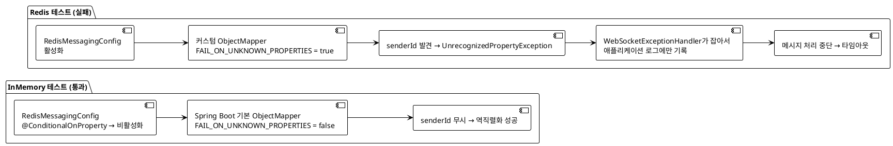
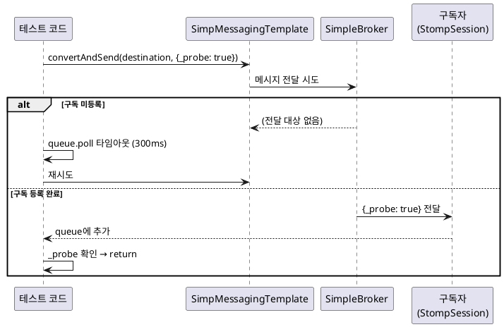

# 로컬 올 그린, CI 올 레드 — WebSocket 통합 테스트 수정기 2탄

> "이번엔 진짜 고쳤어요." — 10번 반복하다 지친 나.

1탄에서 5가지 문제를 해결했고, 이번에는 진짜로 끝났다고 생각했다. Flyway 비호환, SecurityFilterChain 충돌, `@TestConfiguration` 스캔 누락, IP 헤더 불일치, Redis Pub/Sub 레이스 컨디션. 하나씩 파고들어 고쳤고, CI에 올렸다.

WebSocket 테스트 4건이 또 실패했다.

```
Should receive chat message when user sends message — FAIL
Should broadcast when second user joins — FAIL
Should receive announcement when user leaves room — FAIL
Should not receive messages from other rooms — FAIL
```

같은 타임아웃, 같은 오류 메시지. 10번이 넘는 배포를 거쳐도 이 4건은 꿈쩍도 하지 않았다. 결국 1탄의 수정들이 증상을 건드리는 동안, 진짜 원인은 다른 곳에 있었다는 사실을 인정해야 했다.

이 글은 그 진짜 원인과 최종 해결의 기록이다 (PR #137, 2026-02-26).

---

## 프로젝트 맥락

- **스택**: Java 25, Spring Boot 3.5.6, Redis 7, WebSocket STOMP, Testcontainers
- **실패한 테스트**: `WebSocketChatIntegrationTest` 4건
- **테스트 환경**: `@SpringBootTest(webEnvironment = RANDOM_PORT)` + Testcontainers Redis
- **특이점**: `InMemoryMessagingConfig`를 사용하는 테스트(Redis 없음)는 로컬/CI 모두 통과. Redis를 사용하는 테스트만 CI에서 실패.

바로 이 "InMemory는 통과, Redis는 실패" 패턴이 핵심 단서였다.

---

## 문제 #1 — 진짜 원인: Jackson ObjectMapper 빈 오버라이드

### 증상

<!-- IMAGE: HTML 테스트 리포트 스크린샷 — `./gradlew test` 후 생성된 HTML 리포트에서 WebSocketChatIntegrationTest의 실패 상세. "AssertionError: Room message not received" 메시지와 함께 실제 원인인 "MessageConversionException: Unrecognized field senderId"가 보이는 화면 -->

테스트 실패 메시지는 한결같이 이것이었다.

```
AssertionError: Room message not received for content=hi (timed out after 15s)
```

하지만 애플리케이션 로그 깊은 곳에 실제 오류가 숨어 있었다.

```
MessageConversionException: Could not read JSON: Unrecognized field "senderId"
(class ChatMessageRequest), not marked as ignorable (2 known properties: "content", "roomId")
```

### 배경

`ChatMessageRequest` DTO는 `roomId`와 `content` 두 필드만 가진다. `senderId`는 서버가 JWT에서 추출한다. 클라이언트는 `senderId`를 보낼 필요가 없다.

```java
// ChatMessageRequest.java
public record ChatMessageRequest(
    String roomId,
    String content
) {}
```

그런데 테스트 코드는 처음부터 `senderId`를 페이로드에 담아 보내고 있었다.

```java
// 잘못된 예 — senderId는 ChatMessageRequest에 없는 필드
sessionA.send("/app/chat/message", Map.of(
    "senderId", 1L, "roomId", roomId, "content", "hi"
));

// 올바른 예
sessionA.send("/app/chat/message", Map.of(
    "roomId", roomId, "content", "hi"
));
```

### 왜 InMemory 테스트는 통과하고 Redis 테스트만 실패했나

Jackson의 기본 설정은 `FAIL_ON_UNKNOWN_PROPERTIES = true`다. 알 수 없는 필드가 있으면 역직렬화를 실패시킨다. 그런데 Spring Boot의 자동 구성은 이 설정을 비활성화한다. 즉, Spring Boot 기본 `ObjectMapper`는 모르는 필드를 조용히 무시한다.

문제는 `RedisMessagingConfig`에 있었다.

```java
// RedisMessagingConfig.java (spring.data.redis.enabled=true 일 때만 로드)
@Bean
public ObjectMapper objectMapper() {
    ObjectMapper mapper = new ObjectMapper();
    mapper.registerModule(new JavaTimeModule());
    mapper.disable(SerializationFeature.WRITE_DATES_AS_TIMESTAMPS);
    return mapper;   // FAIL_ON_UNKNOWN_PROPERTIES 기본값(true) 그대로
}
```

이 `@Bean`이 Spring Boot 자동 구성의 `ObjectMapper`를 **오버라이드**한다. `JavaTimeModule` 등록과 날짜 포맷 설정에 집중하다 보니 `FAIL_ON_UNKNOWN_PROPERTIES` 설정이 빠진 것이다.

두 경로를 나란히 놓으면 차이가 명확하다.



이 버그가 특히 악질인 이유가 세 가지다.

1. `WebSocketExceptionHandler`가 예외를 잡아서 처리하므로 테스트 출력에 예외가 보이지 않는다
2. 실패 메시지는 "메시지 수신 타임아웃"이라는 증상만 알려줄 뿐 원인을 알 수 없다
3. InMemory 테스트가 통과하므로 "테스트 로직은 맞다"는 잘못된 확신을 준다

### 해결

두 가지를 동시에 고쳤다.

**첫째, `RedisMessagingConfig`의 `ObjectMapper`에 `FAIL_ON_UNKNOWN_PROPERTIES = false` 추가.**

```java
@Bean
public ObjectMapper objectMapper() {
    ObjectMapper mapper = new ObjectMapper();
    mapper.registerModule(new JavaTimeModule());
    mapper.disable(SerializationFeature.WRITE_DATES_AS_TIMESTAMPS);
    mapper.disable(DeserializationFeature.FAIL_ON_UNKNOWN_PROPERTIES); // 추가
    return mapper;
}
```

**둘째, 테스트 페이로드에서 존재하지 않는 `senderId` 제거.**

```java
// 수정 후
sessionA.send("/app/chat/message", Map.of(
    "roomId", roomId, "content", "hi"
));
```

두 수정이 모두 필요하다. 첫째만 고치면 테스트의 잘못된 페이로드가 계속 남는다. 둘째만 고치면 다른 곳에서 동일한 `ObjectMapper`를 사용하는 코드가 영향을 받을 수 있다.

### 교훈

**Spring Boot `ObjectMapper`를 커스텀 빈으로 오버라이드할 때는 자동 구성이 설정하는 항목을 모두 명시적으로 적용하라.**

`ObjectMapperBuilder`나 `Jackson2ObjectMapperBuilderCustomizer`를 사용하면 Spring Boot 기본값을 유지하면서 원하는 설정만 추가할 수 있어 더 안전하다.

```java
// 더 안전한 방법 — Spring Boot 기본값 유지
@Bean
public Jackson2ObjectMapperBuilderCustomizer customizer() {
    return builder -> builder
        .featuresToDisable(DeserializationFeature.FAIL_ON_UNKNOWN_PROPERTIES)
        .modulesToInstall(new JavaTimeModule());
}
```

---

## 문제 #2 — STOMP 구독 준비 확인의 허점

### 증상

메시지를 보내도 가끔 수신 측에서 받지 못하는 타이밍 문제가 남아 있었다.

### 원인

1탄에서 작성한 `awaitSubscriptionReady()` 메서드가 실제로는 아무것도 하지 않는 코드였다.

```java
// 이전 코드 — 항상 true를 반환하는 조건
public static void awaitSubscriptionReady(StompSession session) {
    await().atMost(500, TimeUnit.MILLISECONDS)
        .until(session::isConnected);  // 연결 직후이므로 항상 true
}
```

`session.isConnected()`는 STOMP 연결이 수립된 직후부터 `true`를 반환한다. STOMP 연결이 되어 있다고 해서 구독(`SUBSCRIBE` 프레임)이 서버 측 SimpleBroker에 등록된 것은 아니다. 이 두 가지는 다른 이벤트다.

### 해결 — 프로브 메시지 기반 검증

서버에서 직접 메시지를 주입해 구독이 실제로 동작하는지 확인하는 방식으로 교체했다.

```java
/**
 * 서버 측 SimpMessagingTemplate으로 프로브 메시지를 발송하여
 * SimpleBroker에 구독이 실제 등록되었음을 확인한다.
 *
 * @param template    메시지 발송에 사용할 SimpMessagingTemplate
 * @param destination 구독 준비를 확인할 STOMP 목적지
 * @param queue       해당 목적지의 수신 큐
 */
public static void awaitSubscriptionReady(SimpMessagingTemplate template,
                                          String destination,
                                          BlockingQueue<Map<String, Object>> queue)
        throws InterruptedException {
    long deadline = System.currentTimeMillis() + 10_000;
    while (System.currentTimeMillis() < deadline) {
        template.convertAndSend(destination, Map.of("_probe", true));
        Map<String, Object> received = queue.poll(300, TimeUnit.MILLISECONDS);
        if (received != null && Boolean.TRUE.equals(received.get("_probe"))) {
            // 프로브가 수신됨 = 구독 파이프라인 활성 확인
            queue.removeIf(m -> Boolean.TRUE.equals(m.get("_probe")));
            return;
        }
        if (received != null) {
            // 프로브가 아닌 메시지는 다시 큐에 넣음
            queue.add(received);
        }
    }
    throw new AssertionError(
        "STOMP 구독이 10초 안에 준비되지 않음: " + destination
    );
}
```

이 방식이 동작하는 이유를 단계별로 설명하면 이렇다.



`SimpMessagingTemplate`으로 보내는 메시지는 HTTP 요청이나 STOMP 프레임을 거치지 않고 서버 내부에서 직접 SimpleBroker로 전달된다. 즉, 이 방식은 "클라이언트가 구독 프레임을 보냈는가"가 아니라 "SimpleBroker가 해당 구독자에게 실제로 메시지를 전달할 수 있는가"를 직접 검증한다.

### 교훈

**연결(connection)과 구독(subscription)은 다른 상태다.** `session.isConnected()`는 WebSocket/STOMP 연결만 확인한다. 실제 메시지 전달 경로가 열렸는지 확인하려면 서버에서 직접 메시지를 주입해보는 것이 가장 확실하다.

---

## 문제 #3 — Docker Desktop 4.62+ + Testcontainers 호환성

### 증상

CI가 아닌 로컬에서 Testcontainers를 사용하는 테스트를 실행하면 다음 오류가 발생했다.

```
DockerClientException: Could not initialize Docker client
org.apache.http.client.HttpResponseException: status code: 400, reason phrase: Bad Request

또는

NoSuchFileException: /var/run/docker.sock
```

### 원인

Docker Desktop 4.62.0부터 Docker API 최소 버전이 1.44로 상향되었다 (API version 1.53 사용, minimum 1.44 요구). Testcontainers가 내부적으로 사용하는 docker-java 라이브러리는 기본적으로 API version 1.32로 요청을 보낸다. 이 버전은 Docker Desktop이 요구하는 최솟값보다 낮으므로 400 Bad Request로 거부된다.

환경 변수 `DOCKER_API_VERSION`을 설정해도 해결되지 않는다. docker-java는 이 환경 변수를 읽지 않는다.

### 해결

docker-java가 읽는 설정 파일을 직접 제공한다.

```properties
# src/test/resources/docker-java.properties
api.version=1.44
```

이 파일을 `src/test/resources/`에 두면 테스트 클래스패스에 포함되어 docker-java가 시작 시 자동으로 읽는다. 전역 설정(`~/.docker-java.properties`)으로 설정할 수도 있지만, 프로젝트 저장소에 포함시키는 편이 팀 전체에 동일하게 적용된다는 장점이 있다.

### 교훈

Docker Desktop 버전이 올라가면 하위 호환이 끊길 수 있다. **docker-java 기반 라이브러리(Testcontainers 포함)는 `docker-java.properties`로 API 버전을 명시적으로 고정하라.** `DOCKER_API_VERSION` 환경 변수는 효과가 없다.

---

## 전체 수정 요약

<!-- IMAGE: GitHub Actions 최종 성공 화면 — PR #137 머지 후 CI 로그에서 "BUILD SUCCESSFUL in 3m 18s"와 함께 모든 테스트가 통과된 화면. WebSocketChatIntegrationTest 4건이 PASSED로 표시된 부분 포함 -->

1탄의 수정이 "인프라 초기화 타이밍"과 "빈 등록 순서"를 다뤘다면, 2탄의 수정은 더 깊은 곳에 있었다.

| 문제 | 수정 내용 | 핵심 파일 |
|------|----------|---------|
| ObjectMapper 빈 오버라이드 | `FAIL_ON_UNKNOWN_PROPERTIES = false` 추가 + 테스트 페이로드에서 `senderId` 제거 | `RedisMessagingConfig.java`, `WebSocketChatIntegrationTest.java` |
| STOMP 구독 준비 확인 허점 | 프로브 메시지 기반 `awaitSubscriptionReady()` 교체 | `WebSocketTestHelper.java` |
| Docker Desktop 4.62+ 호환성 | `docker-java.properties`에 `api.version=1.44` 명시 | `src/test/resources/docker-java.properties` |

### PR 타임라인 (전체)

```
PR #127  →  PR #130  →  fix/ci-websocket-auth-import  →  PR #137
(1차 수정)  (2차 수정)  (Pub/Sub 레이스 컨디션)        (진짜 원인 해결)
```

---

## 핵심 교훈

| # | 교훈 |
|---|------|
| 1 | Spring Boot `ObjectMapper`를 커스텀 빈으로 교체할 때는 `FAIL_ON_UNKNOWN_PROPERTIES = false`를 명시하라 — 자동 구성의 기본값은 유지되지 않는다 |
| 2 | `session.isConnected()`는 구독 준비를 보장하지 않는다 — `SimpMessagingTemplate` 프로브로 실제 전달 경로를 확인하라 |
| 3 | docker-java는 `DOCKER_API_VERSION` 환경 변수를 무시한다 — `docker-java.properties`로 API 버전을 고정하라 |
| 4 | 테스트가 "타임아웃"으로 실패할 때는 예외 핸들러에 잡힌 로그를 먼저 찾아라 — 진짜 원인이 숨어 있을 수 있다 |
| 5 | InMemory와 Redis 경로가 다르게 동작한다면 조건부 빈 로딩(`@ConditionalOnProperty`)의 차이를 추적하라 |

---

<!-- IMAGE: PR #137 머지 화면 — GitHub PR 페이지에서 "Merged" 보라색 배지와 함께 커밋 목록, 관련 CI 체크가 모두 통과된 상태 스크린샷 -->

## 마치며

돌이켜보면 1탄의 수정들은 모두 증상에 대응하는 것들이었다. SecurityFilterChain 충돌, Pub/Sub 레이스 컨디션, IP 헤더 불일치 — 이것들은 실제로 존재하는 문제들이고 고쳐야 했다. 하지만 4개의 WebSocket 테스트가 계속 실패한 진짜 이유는 한 줄의 설정 누락이었다.

```java
mapper.disable(DeserializationFeature.FAIL_ON_UNKNOWN_PROPERTIES);
```

이 한 줄이 없어서 10번이 넘는 배포가 실패했다. 그리고 그 오류는 `WebSocketExceptionHandler`에 조용히 잡혀서 테스트 실패 메시지 어디에도 보이지 않았다.

두 가지 교훈이 남는다.

첫째, **예외 핸들러는 디버깅의 블랙홀이 될 수 있다.** 프로덕션 코드에서 예외를 잡아 처리하는 것은 좋은 습관이지만, 그 예외를 테스트 환경에서도 추적하기 어렵게 만든다. 테스트용 예외 로깅 레벨을 올리거나, 테스트에서 예외 발생 자체를 검증하는 방법을 고려할 필요가 있다.

둘째, **"InMemory는 되는데 Redis는 안 된다"는 단서를 더 빨리 파고들었어야 했다.** 두 경로의 차이는 결국 `@ConditionalOnProperty`로 로드되는 빈의 차이였고, 그 안에 ObjectMapper 오버라이드가 있었다. 조건부 빈 로딩이 있다면 로드되는 빈이 Spring Boot 자동 구성과 얼마나 다른지 항상 의심해야 한다.

CI는 거짓말을 하지 않는다. 다만 진실을 로그 깊은 곳에 숨겨두는 경향이 있다.
