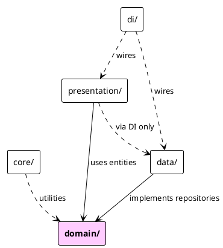

# Flutter에서도 Clean Architecture가 필요할까 — Co-Talk 프론트엔드 설계기

> "백엔드는 헥사고날로 깔끔한데, 프론트는 왜 이렇게 스파게티지?"

백엔드에 헥사고날 아키텍처를 적용하고 나서 프론트엔드 코드를 다시 봤을 때 느낌이 묘했다. 도메인 로직과 HTTP 호출이 위젯 안에 뒤섞여 있고, 상태 관리는 `setState`와 전역 변수가 혼재했다. 백엔드에서 그토록 강조한 "관심사 분리"가 프론트엔드에서는 적용되지 않고 있었다.

그래서 Co-Talk Flutter 앱에도 같은 원칙을 적용하기로 했다. 4레이어 Clean Architecture, GetIt + Injectable 기반 DI, GoRouter와 AuthBloc 통합 라우팅, Cubit과 BLoC의 의식적인 선택. 이 글은 그 설계 과정의 기록이다. 시리즈 14편.

---

## 1. 왜 Flutter에서도 Clean Architecture인가

### 프레임워크 독립성

백엔드 헥사고날의 핵심 철학은 "도메인 로직이 프레임워크에 독립적이어야 한다"는 것이다. Flutter에서도 같은 문제가 발생한다. 위젯 트리 안에 HTTP 호출이 들어가면 다음 세 가지가 동시에 불가능해진다.

첫째, 유닛 테스트. HTTP 클라이언트 없이 비즈니스 로직만 검증할 수가 없다.

둘째, 상태 관리 라이브러리 교체. `setState`에서 BLoC으로, 또는 Riverpod으로 전환할 때 UI 코드 전체를 수정해야 한다.

셋째, datasource 변경. REST API를 GraphQL로 교체하거나, 원격 호출을 로컬 캐시로 대체할 때 위젯까지 영향이 전파된다.

### 4레이어 구조

Co-Talk Flutter 앱의 `lib/` 디렉토리는 네 개 레이어와 두 개 횡단 관심사로 구성된다.

```
lib/
  core/                    — 네트워크, 테마, 라우터, 설정 (cross-cutting)
  data/                    — models, datasources (remote/local), repository 구현체
  domain/                  — entities, repository 인터페이스 (Flutter 의존 없음)
  presentation/            — pages, BLoC/Cubits, widgets
  di/                      — injection.dart + injection.config.dart (코드 생성)
```

각 레이어를 좀 더 펼치면 이런 모습이다.

```
lib/
  core/
    network/               — Dio 클라이언트, 인터셉터
    router/                — GoRouter 설정
    theme/                 — ThemeData, 색상 팔레트
    constants/             — API URL, 타임아웃 상수
  data/
    models/                — JSON ↔ Dart 변환용 DTO (freezed)
    datasources/
      remote/              — REST API 호출
      local/               — SQLite (drift), SecureStorage
    repositories/          — Repository 인터페이스 구현체
  domain/
    entities/              — 순수 Dart 클래스 (Flutter import 없음)
    repositories/          — Repository 인터페이스
    usecases/              — (간단한 프로젝트라 service로 통합)
  presentation/
    blocs/                 — BLoC, Cubit 클래스
    pages/                 — 전체 화면 위젯
    widgets/               — 재사용 위젯 컴포넌트
  di/
    injection.dart         — GetIt 초기화
    injection.config.dart  — Injectable이 생성하는 코드
```

레이어 간 의존 방향은 항상 안쪽(domain)을 향한다.



`presentation/`은 `data/`를 직접 import하지 않는다. DI 컨테이너(GetIt)를 통해서만 의존한다. `domain/`은 Flutter SDK조차 import하지 않는다. 순수 Dart 패키지만 의존하므로 Dart 환경이면 어디서든 테스트할 수 있다.

<!-- IMAGE: Flutter 프로젝트 폴더 구조 — lib/ 디렉토리를 펼친 IDE 스크린샷. core/, data/, domain/, presentation/, di/ 다섯 폴더가 보이고 각 하위 디렉토리가 펼쳐진 상태 -->

---

## 2. DI — GetIt + Injectable로 의존성 주입

### 왜 GetIt + Injectable인가

Flutter의 DI 옵션은 여러 가지다. `provider`의 `MultiProvider`, `riverpod`, 그리고 `get_it + injectable`. Co-Talk에서 GetIt + Injectable을 선택한 이유는 두 가지다.

첫째, 컴파일 타임 코드 생성. `@injectable` 어노테이션을 붙이면 `build_runner`가 `injection.config.dart`를 생성한다. 런타임 리플렉션 없이 타입 안전한 DI가 가능하다.

둘째, 플랫폼 조건부 등록. 모바일과 데스크톱에서 다른 구현체를 등록해야 할 때 `environment` 파라미터로 깔끔하게 분기할 수 있다.

### injection.dart — 플랫폼별 환경 분기

```dart
// lib/di/injection.dart
final getIt = GetIt.instance;

const mobileEnv = 'mobile';
const desktopEnv = 'desktop';

@InjectableInit(
  initializerName: 'init',
  preferRelativeImports: true,
  asExtension: true,
)
Future<void> configureDependencies() async {
  final environment = _determineEnvironment();
  if (environment == mobileEnv) {
    getIt.registerLazySingleton<FirebaseMessaging>(
      () => FirebaseMessaging.instance,
    );
  }
  getIt.init(environment: environment);
}

String _determineEnvironment() {
  if (kIsWeb) return desktopEnv;
  if (Platform.isAndroid || Platform.isIOS) return mobileEnv;
  return desktopEnv;
}
```

`FirebaseMessaging`은 모바일에서만 등록한다. 데스크톱 빌드에서 `firebase_messaging` 패키지를 import만 해도 크래시가 나기 때문에, 등록 자체를 조건부로 처리해야 한다. `_determineEnvironment()`가 이 분기를 담당한다.

### RegisterModule — 플랫폼별 옵션 차이

`@module`로 선언한 `RegisterModule`은 `FlutterSecureStorage`와 `AppDatabase`를 등록한다. `FlutterSecureStorage`의 각 플랫폼 옵션이 조금씩 다르다.

```dart
// lib/di/injection.dart
@module
abstract class RegisterModule {
  @lazySingleton
  FlutterSecureStorage get secureStorage => const FlutterSecureStorage(
    aOptions: AndroidOptions(encryptedSharedPreferences: true),
    iOptions: IOSOptions(accessibility: KeychainAccessibility.first_unlock),
    mOptions: MacOsOptions(
      accountName: 'co_talk_flutter',
      accessibility: KeychainAccessibility.unlocked,
    ),
  );

  @lazySingleton
  AppDatabase get appDatabase => AppDatabase();
}
```

Android는 `EncryptedSharedPreferences`, iOS는 키체인 접근성 설정, macOS는 계정명까지 지정한다. 이 차이가 `RegisterModule` 안에 모여 있어서 플랫폼별 저장소 설정이 한 곳에서 관리된다.

---

## 3. 라우팅 — GoRouter와 인증 가드

### AppRouter — BLoC 상태 기반 리다이렉트

GoRouter의 `redirect` 콜백은 라우트 변경마다 실행된다. `AuthBloc`의 현재 상태를 읽어서 미인증 사용자를 로그인 페이지로 보내거나, 이미 로그인한 사용자가 로그인 페이지에 접근할 때 되돌려 보낸다.

```dart
// lib/core/router/app_router.dart
@lazySingleton
class AppRouter {
  final AuthBloc _authBloc;
  AppRouter(this._authBloc);

  late final GoRouter router = GoRouter(
    initialLocation: AppRoutes.splash,
    redirect: (context, state) {
      final authState = _authBloc.state;
      final isLoggedIn = authState.status == AuthStatus.authenticated;
      final isInitialOrLoading = authState.status == AuthStatus.initial ||
          authState.status == AuthStatus.loading;
      final isAuthRoute = state.matchedLocation == AppRoutes.login;

      if (!isLoggedIn && !isAuthRoute && !isInitialOrLoading) {
        return AppRoutes.login;
      }
      if (isLoggedIn && isAuthRoute) return AppRoutes.friends;
      return null;
    },
    refreshListenable: GoRouterRefreshStream(_authBloc.stream),
    routes: [
      ShellRoute(
        builder: (context, state, child) => BlocProvider.value(
          value: getIt<ChatListBloc>(),
          child: MainPage(child: child),
        ),
        routes: [
          GoRoute(path: AppRoutes.chatList, ...),
          GoRoute(path: AppRoutes.friends, ...),
        ],
      ),
      GoRoute(
        path: AppRoutes.chatRoom,
        pageBuilder: (context, state) {
          final roomId = int.parse(state.pathParameters['roomId']!);
          return MaterialPage(
            key: ValueKey('chat-room-$roomId'),
            child: MultiBlocProvider(
              providers: [
                BlocProvider(create: (_) => getIt<ChatRoomBloc>()),
                BlocProvider(create: (_) => getIt<MessageSearchBloc>()),
              ],
              child: ChatRoomPage(roomId: roomId),
            ),
          );
        },
      ),
    ],
  );
}
```

`ShellRoute`는 탭 네비게이션 구조에서 `ChatListBloc`을 공유하기 위해 사용한다. 탭을 이동해도 채팅 목록 상태가 유지되어야 하기 때문이다. 반면 채팅방 라우트(`AppRoutes.chatRoom`)는 `getIt<ChatRoomBloc>()`으로 라우트마다 새 인스턴스를 생성한다. 채팅방별로 독립적인 상태가 필요하기 때문이다.

### GoRouterRefreshStream — BLoC을 ChangeNotifier로 변환

GoRouter의 `refreshListenable`은 `ChangeNotifier`만 받는다. BLoC의 `Stream<AuthState>`를 그대로 넘길 수 없다. 어댑터 클래스가 필요하다.

```dart
// lib/core/router/app_router.dart
class GoRouterRefreshStream extends ChangeNotifier {
  late final StreamSubscription<AuthState> _subscription;
  AuthStatus? _lastStatus;

  GoRouterRefreshStream(Stream<AuthState> stream) {
    _subscription = stream.listen((state) {
      if (_lastStatus != state.status) {
        _lastStatus = state.status;
        notifyListeners();
      }
    });
  }

  @override
  void dispose() {
    _subscription.cancel();
    super.dispose();
  }
}
```

`_lastStatus`와 비교해서 실제로 `AuthStatus`가 바뀔 때만 `notifyListeners()`를 호출한다. `AuthState`의 다른 필드(예: `user` 프로필 정보)가 바뀌어도 라우터 리다이렉트가 불필요하게 트리거되지 않는다.

<!-- IMAGE: 로그인 → 채팅방 라우팅 흐름 — Flutter DevTools의 Widget Inspector에서 ShellRoute와 GoRoute 구조, 그리고 BLoC Provider 트리가 보이는 스크린샷 -->

---

## 4. 상태 관리 — Cubit vs BLoC 선택 기준

Co-Talk 앱에는 Cubit과 BLoC이 섞여 있다. 섞인 게 아니라 의도적으로 선택한 것이다. 어떤 기준으로 나뉘는지 먼저 표로 정리한다.

| 기준 | Cubit 선택 | BLoC 선택 |
|------|-----------|----------|
| 이벤트 종류 | 3~5개 메서드 | 10개+ 이벤트 클래스 |
| 상태 흐름 | 단방향, 단순 | 복잡한 이벤트 체인 |
| 내부 위임 | 불필요 | Manager 클래스 위임 |
| DI 스코프 | `@lazySingleton` (앱 전역) | `@injectable` (라우트별) |
| 예시 | ThemeCubit, ChatSettingsCubit | ChatRoomBloc, AuthBloc |

### 단순한 Cubit — ThemeCubit

ThemeCubit은 메서드가 3개다. 상태는 `ThemeMode` enum 하나다. 앱 전역에서 하나의 인스턴스를 공유한다.

```dart
// lib/presentation/blocs/theme/theme_cubit.dart
@lazySingleton
class ThemeCubit extends Cubit<ThemeMode> {
  final ThemeLocalDataSource _dataSource;
  ThemeCubit(this._dataSource) : super(ThemeMode.system);

  Future<void> loadTheme() async {
    final savedMode = await _dataSource.getThemeMode();
    emit(savedMode ?? ThemeMode.system);
  }

  Future<void> setTheme(ThemeMode mode) async {
    await _dataSource.saveThemeMode(mode);
    emit(mode);
  }

  bool isDarkMode(BuildContext context) {
    if (state == ThemeMode.system) {
      return MediaQuery.platformBrightnessOf(context) == Brightness.dark;
    }
    return state == ThemeMode.dark;
  }
}
```

이벤트 클래스를 따로 만들 이유가 없다. `loadTheme()`과 `setTheme()`을 직접 호출하는 편이 더 명확하다. `@lazySingleton`이므로 앱 생명주기 동안 하나의 인스턴스만 존재한다.

### 복잡한 BLoC — ChatRoomBloc

ChatRoomBloc은 다르다. 이벤트 핸들러만 25개가 넘고, 내부적으로 네 개의 Manager 클래스에 위임한다. 타이머도 여러 개 관리한다.

```dart
// lib/presentation/blocs/chat/chat_room_bloc.dart
@injectable
class ChatRoomBloc extends Bloc<ChatRoomEvent, ChatRoomState> {
  late final WebSocketSubscriptionManager _subscriptionManager;
  late final PresenceManager _presenceManager;
  late final MessageCacheManager _cacheManager;
  late final MessageHandler _messageHandler;

  final Map<int, Timer> _typingTimeoutTimers = {};
  Timer? _pendingTimeoutTimer;
  Timer? _markAsReadDebounceTimer;
  static const _pendingMessageTimeout = Duration(seconds: 15);

  ChatRoomBloc(
    this._subscriptionManager,
    this._presenceManager,
    this._cacheManager,
    this._messageHandler,
  ) : super(const ChatRoomState()) {
    on<ChatRoomOpened>(_onOpened);
    on<ChatRoomClosed>(_onClosed);
    on<MessageSent>(_onMessageSent);
    on<MessageReceived>(_onMessageReceived);
    on<MessageDeleted>(_onMessageDeleted);
    on<TypingStatusChanged>(_onTypingStatusChanged);
    on<UserStartedTyping>(_onUserStartedTyping);
    on<ReactionAddRequested>(_onReactionAddRequested);
    // ... 25개 이상의 이벤트 핸들러
  }
}
```

`@injectable`이므로 `getIt<ChatRoomBloc>()`을 호출할 때마다 새 인스턴스가 생성된다. 채팅방 A에서 채팅방 B로 이동하면 완전히 독립된 상태를 가진 새 BLoC이 만들어진다. 이전 채팅방의 WebSocket 구독, 타이머, 캐시가 섞이지 않는다.

Cubit이었다면 25개의 이벤트를 25개의 메서드로 처리했을 텐데, 그렇게 하면 "이 메서드가 어떤 순서로 호출되는가"를 추적하기 어렵다. BLoC의 이벤트 스트림은 이벤트 흐름을 로그로 남기기 좋고, 이벤트 클래스 자체가 "무슨 일이 일어났는가"를 명확하게 표현한다.

---

## 5. copyWith 함정 — 설정 상태 리셋 버그

### 증상

`ChatSettingsPage`에서 알림 설정을 켠 뒤 메뉴를 나갔다가 돌아오면, 방금 켠 설정이 초기값으로 되돌아가 있었다. `NotificationSettingsPage`도 같은 증상이었다.

### 원인

Dart의 named constructor가 `this()`로 위임할 때 지정하지 않은 필드는 기본값으로 리셋된다는 사실을 놓쳤다.

```dart
// 잘못된 패턴 — named constructor가 this()로 위임
class ChatSettingsState {
  final ChatSettingsStatus status;
  final ChatSettings settings;

  const ChatSettingsState({
    this.status = ChatSettingsStatus.initial,
    this.settings = const ChatSettings(),
  });

  // ↓ 이 두 named constructor가 문제
  // settings를 명시하지 않으면 const ChatSettings() 기본값으로 리셋됨
  const ChatSettingsState.loading() : this(status: ChatSettingsStatus.loading);
  const ChatSettingsState.clearing() : this(status: ChatSettingsStatus.clearing);
}
```

`ChatSettingsCubit`에서 로딩 상태로 전환할 때 `ChatSettingsState.loading()`을 emit했다. 이 시점에 사용자가 이미 설정을 로드한 상태라면, `settings` 필드가 `const ChatSettings()` 기본값으로 되돌아간다. 로드 완료 후 다시 설정을 emit하지만, 그 사이에 UI가 기본값을 잠깐 렌더링하고, 상태 관리 흐름에 따라서는 기본값이 저장되는 경우도 생겼다.

```dart
// 문제가 발생하는 흐름
Future<void> clearCache() async {
  emit(ChatSettingsState.clearing()); // settings가 기본값으로 리셋!
  try {
    await _repository.clearCache();
    emit(ChatSettingsState.loaded(state.settings)); // state.settings는 이미 기본값
  } catch (e) { ... }
}
```

### 해결 — state.copyWith()로 상태 보존

```dart
// lib/presentation/blocs/settings/chat_settings_cubit.dart
@lazySingleton
class ChatSettingsCubit extends Cubit<ChatSettingsState> {
  final ChatSettingsRepository _repository;
  ChatSettingsCubit(this._repository) : super(const ChatSettingsState());

  Future<void> loadSettings() async {
    if (state.status != ChatSettingsStatus.initial) return; // 초기 상태일 때만
    emit(state.copyWith(status: ChatSettingsStatus.loading)); // 기존 settings 보존
    try {
      final settings = await _repository.getChatSettings();
      emit(ChatSettingsState.loaded(settings));
    } catch (e) {
      emit(ChatSettingsState.loaded(const ChatSettings()));
    }
  }

  Future<void> updateNotificationEnabled(bool enabled) async {
    final updated = state.settings.copyWith(notificationEnabled: enabled);
    await _repository.saveChatSettings(updated);
    emit(state.copyWith(settings: updated)); // status는 그대로, settings만 교체
  }

  Future<void> clearCache() async {
    emit(state.copyWith(status: ChatSettingsStatus.clearing)); // 기존 settings 보존!
    try {
      await _repository.clearCache();
      emit(state.copyWith(status: ChatSettingsStatus.loaded)); // settings 여전히 보존
    } catch (e) {
      emit(state.copyWith(status: ChatSettingsStatus.error));
    }
  }
}
```

`state.copyWith(status: ChatSettingsStatus.clearing)`는 현재 `state`의 `settings`를 그대로 두고 `status`만 바꾼다. named constructor의 `this()` 위임과 달리, 기존 상태에서 원하는 필드만 바꾼다.

`NotificationSettingsCubit`도 동일한 패턴으로 수정했다.

### 추가 수정 — @lazySingleton Cubit의 loadSettings 중복 호출 방지

`ChatSettingsCubit`은 `@lazySingleton`이다. 앱 생명주기 동안 하나만 존재한다. `ChatSettingsPage`를 여러 번 방문하면 `loadSettings()`가 여러 번 호출될 수 있다. 두 번째 호출부터는 이미 로드된 설정을 덮어쓰는 불필요한 API 요청이 발생한다.

```dart
Future<void> loadSettings() async {
  if (state.status != ChatSettingsStatus.initial) return; // 초기 상태일 때만 로드
  // ...
}
```

첫 번째 호출이 완료되면 `status`가 `loaded`로 바뀐다. 두 번째 호출부터는 가드 조건에 걸려서 즉시 반환된다. 싱글턴 Cubit에서 반복 초기화를 막는 간단한 패턴이다.

<!-- IMAGE: Flutter DevTools Timeline — ChatSettingsCubit 상태 전환 로그. loading → loaded 순서가 보이고, settings 필드가 유지되는 것을 확인할 수 있는 화면 -->

---

## 6. 교훈

| # | 교훈 |
|---|------|
| 1 | **Cubit과 BLoC의 선택 기준**: 이벤트 종류 5개 이하, 단방향 흐름, 전역 공유라면 Cubit. 복잡한 이벤트 체인, 내부 Manager 위임, 라우트 스코프 상태라면 BLoC |
| 2 | **copyWith 함정**: Dart named constructor의 `this()` 위임은 지정하지 않은 모든 필드를 기본값으로 리셋한다. 상태 전환 시 반드시 `state.copyWith()`를 사용할 것 |
| 3 | **Platform-aware DI**: `_determineEnvironment()`로 모바일/데스크톱 환경을 구분하고 조건부로 의존성을 등록하면 하나의 코드베이스로 Android, iOS, macOS 3플랫폼 대응이 가능하다 |
| 4 | **GoRouter + BLoC 통합**: BLoC의 `Stream`을 `ChangeNotifier`로 변환하는 어댑터(`GoRouterRefreshStream`)가 핵심. `_lastStatus` 비교로 불필요한 리다이렉트를 방지한다 |
| 5 | **@lazySingleton vs @injectable**: 전역 상태(테마, 설정)는 싱글턴, 라우트 스코프 상태(채팅방)는 매번 새로 생성. DI 스코프를 잘못 설정하면 상태 오염이나 메모리 누수로 이어진다 |
| 6 | **싱글턴 Cubit의 반복 초기화 방지**: `@lazySingleton` Cubit의 `loadSettings()`는 `initial` 상태일 때만 실행하도록 가드 조건을 추가할 것. 페이지를 여러 번 방문해도 API 요청이 한 번만 발생한다 |

---

다음 편에서는 Co-Talk의 실시간 채팅 구현 — WebSocket Facade 패턴과 Optimistic UI를 다룬다.

[다음 편: Flutter 실시간 채팅 — WebSocket Facade 패턴과 Optimistic UI](blog-15-flutter-realtime-websocket.md)
