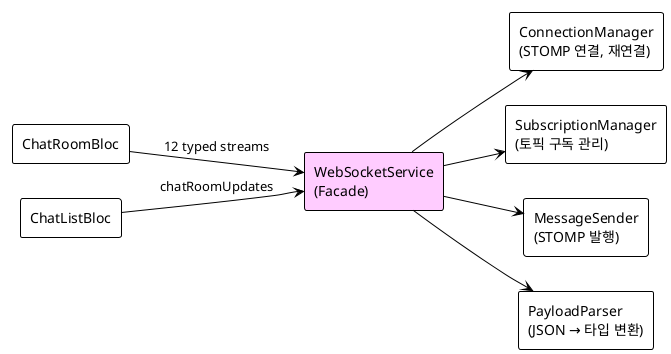
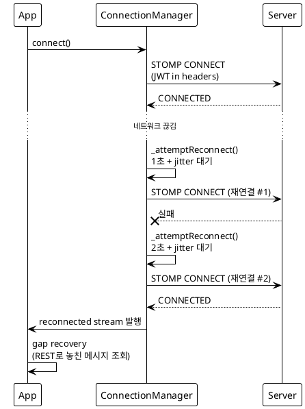
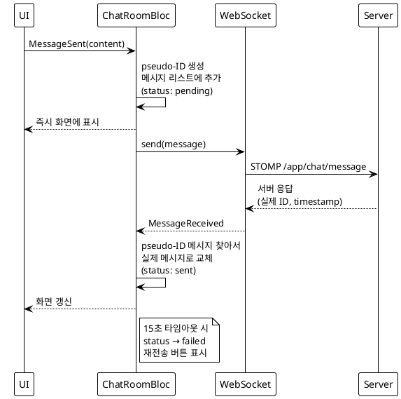

# Flutter 실시간 채팅 — WebSocket Facade 패턴과 Optimistic UI

> "메시지를 보냈는데 화면에 안 뜬다. 서버 응답을 기다리는 동안 사용자는 뭘 보고 있어야 하지?"

실시간 채팅을 구현할 때 가장 먼저 부딪히는 문제가 이거다. 서버 응답 전까지 메시지가 안 뜨면 사용자는 "전송됐나?" 하고 불안해한다. 반면 즉시 화면에 뜨면 앱이 빠르다고 느낀다. 그 차이가 UX의 전부인 셈이다.

Co-Talk Flutter 앱의 실시간 채팅은 STOMP over WebSocket으로 동작한다. 연결 관리, 재연결, 메시지 중복 제거, Optimistic UI까지 — 구현하다 보니 단순한 WebSocket 클라이언트가 아니라 꽤 복잡한 시스템이 됐다. 이번 15편에서는 그 전체 구조를 정리한다.

---

## 1. WebSocket 아키텍처 — Facade + 4 Manager

처음엔 `WebSocketService` 하나에 다 때려넣었다. 연결, 구독, 발행, 파싱이 한 파일에 뒤섞이니 800줄을 넘어섰다. 수정할 때마다 어디를 건드려야 할지 감이 안 잡혔다. 그래서 Facade 패턴으로 분리했다.



`WebSocketService`는 외부에서 보이는 인터페이스만 담당한다. 실제 연결 로직은 `ConnectionManager`, 구독 관리는 `SubscriptionManager`, STOMP 발행은 `MessageSender`, JSON 파싱은 `PayloadParser`가 각각 맡는다.

외부에 노출하는 건 12개의 타입 안전한 broadcast stream이다:

```dart
// lib/core/network/websocket_service.dart
@lazySingleton
class WebSocketService {
  Stream<WebSocketChatMessage> get messages => _messageController.stream;
  Stream<WebSocketReactionEvent> get reactions => _reactionController.stream;
  Stream<WebSocketReadEvent> get readEvents => _readEventController.stream;
  Stream<WebSocketChatRoomUpdateEvent> get chatRoomUpdates => _chatRoomUpdateController.stream;
  Stream<WebSocketTypingEvent> get typingEvents => _typingController.stream;
  Stream<WebSocketOnlineStatusEvent> get onlineStatusEvents => _onlineStatusController.stream;
  Stream<WebSocketMessageDeletedEvent> get messageDeletedEvents => _messageDeletedController.stream;
  Stream<WebSocketMessageUpdatedEvent> get messageUpdatedEvents => _messageUpdatedController.stream;
  Stream<WebSocketLinkPreviewUpdatedEvent> get linkPreviewUpdatedEvents => _linkPreviewController.stream;
  Stream<WebSocketProfileUpdateEvent> get profileUpdateEvents => _profileUpdateController.stream;
  Stream<WebSocketErrorEvent> get errors => _errorController.stream;
  Stream<void> get reconnected => _reconnectedController.stream;
}
```

BLoC은 이 stream만 보면 된다. 내부가 어떻게 굴러가는지 알 필요가 없다. `ChatRoomBloc`은 `messages`, `reactions`, `readEvents`를 구독하고, `ChatListBloc`은 `chatRoomUpdates`를 구독한다. 이게 Facade의 핵심이다 — 복잡성을 뒤로 숨기고 깔끔한 인터페이스만 앞에 내놓는 것.

<!-- IMAGE: WebSocketService가 4개 Manager를 조합하는 구조 다이어그램 — 클래스 다이어그램 스크린샷 -->

---

## 2. STOMP 토픽 설계

STOMP 토픽은 크게 두 레벨로 나뉜다. 채팅방 레벨과 사용자 레벨.

```dart
// lib/core/network/websocket/websocket_config.dart
class WebSocketConfig {
  static const int maxReconnectAttempts = 20;
  static const Duration initialReconnectDelay = Duration(seconds: 1);
  static const Duration maxReconnectDelay = Duration(seconds: 30);

  // STOMP 발행 목적지
  static const String sendMessageDestination = '/app/chat/message';
  static const String sendTypingDestination = '/app/chat/typing';
  static const String sendPresenceDestination = '/app/chat/presence';

  // STOMP 구독 토픽
  static String chatRoomTopic(int roomId) => '/topic/chat/room/$roomId';
  static String userChatListTopic(int userId) => '/topic/user/$userId/chat-list';
  static String userReadReceiptTopic(int userId) => '/topic/user/$userId/read-receipt';
  static String userOnlineStatusTopic(int userId) => '/topic/user/$userId/online-status';
  static String userProfileUpdateTopic(int userId) => '/topic/user/$userId/profile-update';
  static const String userErrorQueue = '/user/queue/errors';

  static const Duration dedupeCacheTtl = Duration(seconds: 15);
  static const int dedupeCacheMaxSize = 500;
}
```

채팅방에 입장하면 `/topic/chat/room/{roomId}`를 구독한다. 이 토픽으로 메시지, 반응(이모지), 읽음 처리, 타이핑 상태가 모두 흘러온다. 이벤트 타입 필드로 구분하는 방식이다.

사용자 레벨 토픽은 개인 알림용이다. `/topic/user/{userId}/chat-list`는 채팅 목록 업데이트(새 메시지 미리보기, 안 읽은 수), `/topic/user/{userId}/read-receipt`는 상대방이 내 메시지를 읽었을 때, `/topic/user/{userId}/online-status`는 온라인 상태 변경이다.

`/user/queue/errors`는 STOMP 세션 전용 에러 큐다. 서버에서 메시지 처리 실패 시 이 큐로 에러를 보낸다. 브로드캐스트 토픽이 아니라 개인 큐라서 해당 사용자에게만 전달된다.

채팅방 토픽과 사용자 토픽을 분리한 이유가 있다. 채팅방 메시지는 방에 있는 모든 사람이 받아야 하고, 읽음 확인이나 온라인 상태는 나만 알면 되는 정보다. 한 토픽에 몰아넣으면 불필요한 메시지를 너무 많이 받게 된다.

---

## 3. Exponential Backoff 재연결

네트워크가 끊겼다가 다시 연결될 때 모든 클라이언트가 동시에 재연결을 시도하면 서버가 죽는다. 그래서 재연결 간격을 지수적으로 늘리고, 거기다 랜덤 지터(jitter)를 더한다.

```dart
// lib/core/network/websocket/websocket_connection_manager.dart
void _attemptReconnect() {
  if (_isIntentionalDisconnect) return;
  if (_reconnectAttempts >= WebSocketConfig.maxReconnectAttempts) {
    _updateConnectionState(WebSocketConnectionState.failed);
    return;
  }

  final baseMs = WebSocketConfig.initialReconnectDelay.inMilliseconds;
  final maxMs = WebSocketConfig.maxReconnectDelay.inMilliseconds;
  final exponentialMs = min(baseMs * (1 << _reconnectAttempts), maxMs);
  final jitterMs = _random.nextInt(1000);
  final delay = Duration(milliseconds: exponentialMs + jitterMs);

  _reconnectTimer = Timer(delay, () {
    _reconnectAttempts++;
    _updateConnectionState(WebSocketConnectionState.reconnecting);
    _doReconnect();
  });
}

Future<void> _doReconnect() async {
  if (_needsTokenRefresh && onTokenRefreshNeeded != null) {
    await onTokenRefreshNeeded!();
    _needsTokenRefresh = false;
  }
  connect();
}
```

`1 << _reconnectAttempts`는 비트 시프트다. 0번째 시도는 1초, 1번째는 2초, 2번째는 4초, 3번째는 8초, 4번째는 16초, 5번째부터는 30초(max)로 고정된다. `min()`으로 상한을 걸어놨다.

재연결 흐름을 시퀀스로 보면 이렇다:



몇 가지 세부 사항을 짚고 넘어간다.

**jitter(0~1000ms)**: 수백 명이 동시에 네트워크가 끊겼다 복구됐을 때, 지수 증가만으로는 부족하다. 모든 클라이언트가 정확히 같은 시간에 재연결을 시도하면 그 순간만 스파이크가 생긴다. 지터로 재연결 시점을 흩뜨려야 서버 부하가 분산된다.

**토큰 갱신**: STOMP 헤더에 JWT를 실어 보내는데, 연결이 끊긴 사이에 토큰이 만료됐을 수 있다. `_needsTokenRefresh` 플래그를 보고 재연결 전에 토큰 갱신을 먼저 한다. 이걸 빠뜨리면 재연결 → 401 → 재연결 → 401 무한루프가 생긴다.

**`_isIntentionalDisconnect`**: 사용자가 로그아웃하거나 앱을 끄는 경우 연결을 의도적으로 끊는다. 이 플래그가 true이면 재연결을 시도하지 않는다. 없으면 로그아웃 후에도 계속 재연결을 시도하는 촌극이 벌어진다.

**최대 재연결 횟수 20회**: 지수 증가 + 30초 상한이면 20번째 시도는 연결 끊김 후 몇 분 뒤다. 그래도 안 되면 `failed` 상태로 전환하고 UI에 "연결 실패, 다시 시도" 버튼을 보여준다.

<!-- IMAGE: 재연결 간격을 보여주는 그래프 — 1초, 2초, 4초, 8초, 16초, 30초(max) -->

---

## 4. Event Deduplication

재연결할 때 서버가 최근 메시지를 다시 보내는 경우가 있다. 혹은 네트워크 문제로 같은 STOMP 프레임이 두 번 도달하기도 한다. 이걸 방치하면 채팅 목록에 똑같은 메시지가 두 개 뜬다.

```dart
// lib/core/network/websocket_service.dart
void _handleRoomMessage(StompFrame frame, int roomId) {
  final parsed = _payloadParser.parseRoomPayload(body: frame.body!, roomId: roomId);
  switch (parsed) {
    case ParsedChatMessagePayload(:final message):
      if (_dedupeCache.isDuplicate(message.eventId)) return;  // 중복 제거!
      _messageController.add(message);
    case ParsedReadPayload(:final event):
      _readEventController.add(event);
    case ParsedReactionPayload(:final event):
      if (_dedupeCache.isDuplicate(event.eventId)) return;
      _reactionController.add(event);
    case ParsedTypingPayload(:final event):
      _typingController.add(event);
    case ParsedMessageDeletedPayload(:final event):
      if (_dedupeCache.isDuplicate(event.eventId)) return;
      _messageDeletedController.add(event);
    case ParsedMessageUpdatedPayload(:final event):
      if (_dedupeCache.isDuplicate(event.eventId)) return;
      _messageUpdatedController.add(event);
    case ParsedUnknownPayload():
      break;
  }
}
```

서버는 모든 이벤트에 `eventId`를 붙여 보낸다. `EventDedupeCache`는 이 `eventId`를 TTL 15초 동안 기억한다. 같은 `eventId`가 15초 내에 다시 오면 `isDuplicate()`가 true를 반환하고, 그냥 버린다.

읽음 이벤트(`ParsedReadPayload`)는 중복 제거를 안 한다. 읽음 이벤트는 상태 업데이트라 중복으로 와도 결과가 같기 때문이다. 중복 메시지와 달리 중복 읽음은 UI 버그를 일으키지 않는다.

`EventDedupeCache`의 설계 포인트:
- **TTL 15초**: 너무 짧으면 중복을 못 잡고, 너무 길면 메모리를 많이 쓴다. 재연결 후 서버가 보내는 재전송 윈도우가 보통 10초 이내라 15초면 충분하다.
- **최대 500개**: 무제한으로 쌓으면 메모리 누수다. 500개를 초과하면 오래된 항목부터 제거한다.
- **타이머 기반 만료**: 각 eventId에 Timer를 달아 TTL이 지나면 자동으로 캐시에서 삭제한다.

타이핑 이벤트는 중복 제거 대상이 아니다. 타이핑은 eventId 자체가 없고, 같은 사용자의 타이핑 이벤트가 연속으로 와도 "아직 입력 중"이라는 의미라 버리면 안 된다.

<!-- IMAGE: EventDedupeCache 동작 — eventId 저장, TTL 만료, 중복 감지 흐름 -->

---

## 5. Optimistic UI — 보내는 즉시 화면에 표시

카카오톡이나 Slack처럼 메시지가 "즉시" 뜨는 것처럼 느껴지는 이유가 Optimistic UI다. 사실 서버 응답을 기다리지 않고 로컬에서 먼저 메시지를 화면에 추가한다. 서버가 응답하면 그때 실제 데이터로 교체한다.

흐름을 보면 이렇다:



pseudo-ID는 로컬에서 생성하는 임시 ID다. 서버가 채번하는 실제 ID와 겹치지 않도록 음수 값이나 UUID를 쓴다. Co-Talk에서는 `_pendingIdCounter`를 음수로 시작해서 하나씩 줄여나간다.

```dart
// lib/presentation/blocs/chat/chat_room_bloc.dart
int _pendingIdCounter = -1;
Timer? _pendingTimeoutTimer;
static const _pendingMessageTimeout = Duration(seconds: 15);

Future<void> _onMessageSent(MessageSent event, Emitter<ChatRoomState> emit) async {
  final pseudoId = _pendingIdCounter--;
  final optimisticMessage = ChatMessage(
    id: pseudoId,
    content: event.content,
    senderId: _currentUserId,
    status: MessageStatus.pending,
    createdAt: DateTime.now(),
  );

  // 즉시 UI에 추가
  final updatedMessages = [optimisticMessage, ...state.messages];
  emit(state.copyWith(messages: updatedMessages));

  // STOMP 발행
  _webSocketService.sendMessage(
    roomId: event.roomId,
    content: event.content,
    pseudoId: pseudoId,
  );

  // 15초 타임아웃 설정
  _pendingTimeoutTimer?.cancel();
  _pendingTimeoutTimer = Timer(_pendingMessageTimeout, () {
    _markMessageFailed(pseudoId);
  });
}

void _onMessageReceived(WebSocketChatMessage message, Emitter<ChatRoomState> emit) {
  // pseudo-ID 메시지가 있으면 실제 메시지로 교체
  if (message.pseudoId != null) {
    final updatedMessages = state.messages.map((m) {
      if (m.id == message.pseudoId) {
        return message.toModel();
      }
      return m;
    }).toList();
    emit(state.copyWith(messages: updatedMessages));
    _pendingTimeoutTimer?.cancel();
  } else {
    // 다른 사람의 메시지
    emit(state.copyWith(messages: [message.toModel(), ...state.messages]));
  }
}

void _markMessageFailed(int pseudoId) {
  final updatedMessages = state.messages.map((m) {
    if (m.id == pseudoId) {
      return m.copyWith(status: MessageStatus.failed);
    }
    return m;
  }).toList();
  // emit은 BLoC 내부에서만 가능하므로 add()로 이벤트 발행
  add(MessageFailed(pseudoId: pseudoId));
}
```

서버는 응답 메시지에 `pseudoId`를 그대로 포함시켜 보낸다. 클라이언트가 어떤 pending 메시지와 매핑해야 하는지 알 수 있게. 서버가 `pseudoId`를 에코해주지 않으면 클라이언트는 "어떤 메시지가 전송됐나"를 알 수가 없다.

**`MessageStatus.failed` 처리**: 15초 내에 서버 응답이 없으면 pending 메시지를 failed로 표시하고 재전송 버튼을 노출한다. 실제 전송 실패인지 응답만 늦은 건지 알 수 없지만, 사용자에게 선택권을 주는 게 맞다. 재전송 버튼을 누르면 새 pseudo-ID로 다시 시도한다.

**낙관적 업데이트의 순서 문제**: pending 메시지를 목록 맨 위에 놓고, 서버 응답으로 실제 메시지가 오면 교체한다. 이 사이에 다른 사람의 메시지가 오면 순서가 뒤바뀔 수 있다. `createdAt`으로 정렬하면 해결되지만, pending 메시지의 `createdAt`은 로컬 시간이라 서버 시간과 살짝 다를 수 있다. Co-Talk에서는 pending 메시지를 항상 목록 맨 아래(최신)에 고정하고, 서버 응답 후 `createdAt` 기준으로 재정렬한다.

<!-- IMAGE: 메시지 전송 → pending 표시 → sent 전환 화면 캡처 -->

---

## 6. Gap Recovery — 재연결 후 놓친 메시지 복구

재연결에 성공하면 `reconnected` stream이 발행된다. 이때 WebSocket이 끊겨 있던 동안 못 받은 메시지들을 REST API로 조회해야 한다.

```dart
// lib/presentation/blocs/chat/chat_room_bloc.dart
void _setupReconnectHandler() {
  _webSocketService.reconnected.listen((_) {
    add(const GapRecoveryRequested());
  });
}

Future<void> _onGapRecoveryRequested(
  GapRecoveryRequested event,
  Emitter<ChatRoomState> emit,
) async {
  final lastMessageId = state.messages.isNotEmpty ? state.messages.first.id : null;
  if (lastMessageId == null || lastMessageId < 0) return; // pending 메시지는 제외

  final result = await _chatRepository.getMessagesSince(
    roomId: _roomId,
    afterId: lastMessageId,
  );

  result.fold(
    onSuccess: (newMessages) {
      if (newMessages.isEmpty) return;
      // 중복 제거 후 병합
      final existingIds = state.messages.map((m) => m.id).toSet();
      final uniqueNew = newMessages.where((m) => !existingIds.contains(m.id)).toList();
      if (uniqueNew.isEmpty) return;
      emit(state.copyWith(
        messages: [...uniqueNew, ...state.messages],
      ));
    },
    onFailure: (_) {
      // Gap recovery 실패는 치명적이지 않음 — 조용히 무시
    },
  );
}
```

`lastMessageId`가 음수면 pending 메시지다. pending 메시지의 ID를 기준으로 `getMessagesSince`를 호출하면 안 된다. 서버에 없는 ID라 이상한 결과가 나온다. 그래서 `lastMessageId < 0` 체크를 먼저 한다.

Gap recovery 실패는 조용히 넘긴다. 재연결 직후 추가로 REST 요청까지 실패하면 사용자를 혼란스럽게 만들 뿐이다. 어차피 스크롤을 올리면 페이지네이션으로 이전 메시지를 로드할 수 있다.

`ChatListBloc`도 비슷한 패턴이다. 재연결 시 REST로 채팅 목록을 다시 가져와 안 읽은 수와 마지막 메시지 미리보기를 갱신한다.

<!-- IMAGE: 재연결 후 Gap recovery 흐름 — 로그 또는 디버그 화면 캡처 -->

---

## 7. SubscriptionManager — 토픽 생명주기 관리

채팅방을 오갈 때 구독을 제대로 정리하지 않으면 메모리 누수가 생기고, 나간 방의 메시지가 계속 수신된다.

```dart
// lib/core/network/websocket/websocket_subscription_manager.dart
class WebSocketSubscriptionManager {
  final Map<String, StompUnsubscribe> _subscriptions = {};

  void subscribe({
    required StompClient client,
    required String destination,
    required void Function(StompFrame) callback,
  }) {
    // 이미 구독 중이면 스킵
    if (_subscriptions.containsKey(destination)) return;

    final unsubscribe = client.subscribe(
      destination: destination,
      callback: callback,
    );
    _subscriptions[destination] = unsubscribe;
  }

  void unsubscribe(String destination) {
    final unsubscribe = _subscriptions.remove(destination);
    unsubscribe?.call();
  }

  void unsubscribeAll() {
    for (final unsubscribe in _subscriptions.values) {
      unsubscribe();
    }
    _subscriptions.clear();
  }

  bool isSubscribed(String destination) => _subscriptions.containsKey(destination);
}
```

채팅방에 입장하면 해당 방의 토픽을 구독하고, 나가면 `unsubscribe(destination)`으로 정리한다. 앱 전체 종료나 로그아웃 시에는 `unsubscribeAll()`로 다 정리한다.

재연결 후에는 기존 구독이 모두 무효화된다. STOMP 세션이 새로 시작되기 때문이다. `ConnectionManager`가 CONNECTED 프레임을 받으면 `SubscriptionManager.unsubscribeAll()`을 호출하고, `SubscriptionManager`가 필요한 토픽들을 다시 구독한다. 이 재구독 목록은 어딘가에 저장해둬야 한다. Co-Talk에서는 `_activeRoomId`와 `_currentUserId`를 기억해두고 재연결 시 자동으로 재구독한다.

---

## 8. PayloadParser — 타입 안전한 디스패치

STOMP 프레임의 body는 JSON 문자열이다. 이걸 파싱해서 올바른 타입으로 변환하는 책임이 `PayloadParser`에 있다. sealed class로 파싱 결과를 표현한다.

```dart
// lib/core/network/websocket/websocket_payload_parser.dart
sealed class ParsedRoomPayload {}

final class ParsedChatMessagePayload extends ParsedRoomPayload {
  final WebSocketChatMessage message;
  const ParsedChatMessagePayload(this.message);
}

final class ParsedReadPayload extends ParsedRoomPayload {
  final WebSocketReadEvent event;
  const ParsedReadPayload(this.event);
}

final class ParsedReactionPayload extends ParsedRoomPayload {
  final WebSocketReactionEvent event;
  const ParsedReactionPayload(this.event);
}

final class ParsedTypingPayload extends ParsedRoomPayload {
  final WebSocketTypingEvent event;
  const ParsedTypingPayload(this.event);
}

final class ParsedMessageDeletedPayload extends ParsedRoomPayload {
  final WebSocketMessageDeletedEvent event;
  const ParsedMessageDeletedPayload(this.event);
}

final class ParsedMessageUpdatedPayload extends ParsedRoomPayload {
  final WebSocketMessageUpdatedEvent event;
  const ParsedMessageUpdatedPayload(this.event);
}

final class ParsedUnknownPayload extends ParsedRoomPayload {
  const ParsedUnknownPayload();
}
```

`parseRoomPayload()`는 JSON의 `type` 필드를 읽어 적절한 sealed class 인스턴스를 반환한다. 호출부에서는 `switch`로 exhaustive 패턴 매칭을 하면 된다. 컴파일러가 모든 케이스를 처리했는지 검증해준다.

`ParsedUnknownPayload`는 모르는 이벤트 타입에 대한 fallback이다. 서버 측에서 새 이벤트 타입을 추가했는데 클라이언트가 아직 모를 때, 조용히 무시하는 대신 타입 시스템으로 명시적으로 다룬다.

---

## 9. 교훈

**1. Facade 패턴의 힘**: 800줄짜리 God Object를 4개 Manager로 분리하면 각각이 단일 책임을 갖게 된다. `ConnectionManager`는 연결만, `SubscriptionManager`는 구독만, `MessageSender`는 발행만, `PayloadParser`는 파싱만. 수정할 때 어느 파일을 열어야 할지 명확해진다.

**2. Exponential Backoff + Jitter**: 재연결 시 지수 증가만으론 부족하다. 랜덤 지터가 없으면 클라이언트들이 동일한 간격으로 동시에 재연결을 시도해 서버에 주기적인 스파이크가 생긴다. `_random.nextInt(1000)` 한 줄이 그 문제를 해결한다.

**3. Event Deduplication은 필수**: 재연결 후 중복 메시지가 반드시 온다. "설마 중복이 오겠어"하고 넘기면 반드시 사용자가 같은 메시지가 두 번 뜬다고 신고한다. TTL 기반 캐시로 미리 방어하는 게 맞다.

**4. Optimistic UI가 체감 속도를 결정**: 서버 응답 대기 없이 즉시 표시하면 사용자는 "빠르다"고 느낀다. 실제 RTT가 200ms든 500ms든 사용자 입장에서는 "보낸 즉시 뜬다"는 경험을 하게 된다. pseudo-ID와 timeout 처리가 조금 복잡하지만 그 가치가 있다.

**5. 재연결 전 토큰 갱신**: JWT를 STOMP 헤더로 보내는 구조라면, 재연결 전에 반드시 토큰 유효성을 확인해야 한다. `_needsTokenRefresh` 플래그와 `onTokenRefreshNeeded` 콜백으로 처리했다. 없으면 401 → 재연결 무한루프가 생긴다.

**6. `_isIntentionalDisconnect` 플래그**: 로그아웃, 앱 종료, 방 퇴장 등 의도적인 연결 해제 시 재연결을 막는 플래그가 없으면 엉뚱한 타이밍에 재연결이 일어난다. 연결 해제 의도를 명시적으로 표현하는 플래그 하나가 버그를 여러 개 막는다.

**7. sealed class로 파싱 결과 표현**: `dynamic`이나 `Map<String, dynamic>`을 들고 다니면 런타임 에러가 잠복한다. sealed class + switch 패턴 매칭으로 컴파일 타임에 모든 케이스를 강제로 처리하게 만들면 새 이벤트 타입이 추가돼도 빠짐없이 대응하게 된다.

---

다음 편에서는 Co-Talk Flutter 앱의 UX 기능 — 테마 시스템, 생체인증, 오프라인 캐시를 다룬다.

[다음 편: Flutter UX — 테마, 생체인증, 오프라인 캐시](blog-16-flutter-ux-features.md)
