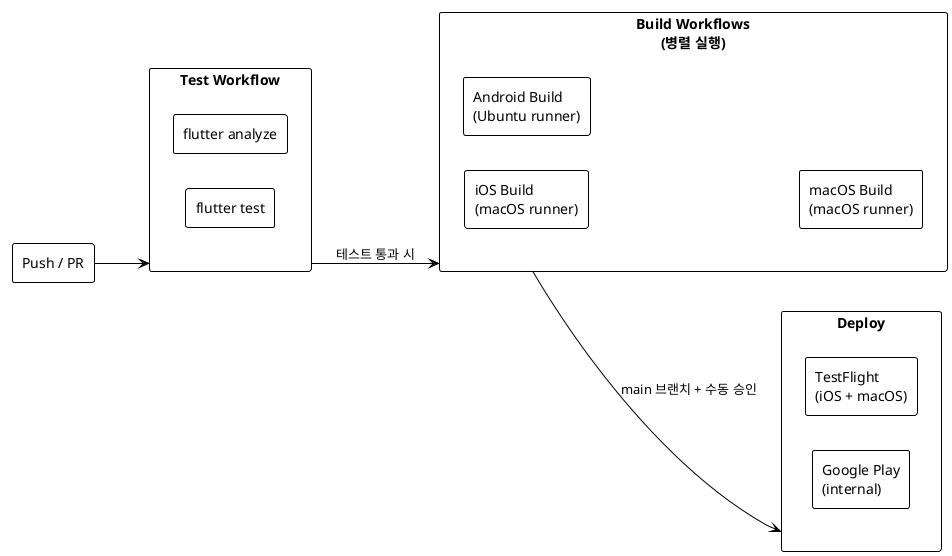

# Flutter CI/CD 설계하기 — GitHub Actions로 테스트부터 스토어 배포까지

> "로컬에서 fastlane deploy_all_platforms 치면 되긴 한다. 근데 내 맥북이 2시간 동안 먹통이 되는 건?"

백엔드는 이미 GitHub Actions + GHCR + 카나리아 배포 파이프라인이 완성돼 있다(blog-07). 코드 푸시 → 자동 빌드 → 자동 배포, 다 된다. 근데 Flutter 앱은 아직도 내 맥북에서 `fastlane deploy_all_platforms` 를 직접 치고 있다. 이 명령 한 번이면 iOS, Android, macOS 세 플랫폼이 빌드되고 TestFlight + Google Play로 올라가는데, 그 2시간 동안 맥북으로 다른 일을 못 한다.

Fastlane은 이미 준비돼 있다(blog-17). lane도 다 짜놨다. 이제 할 일은 GitHub Actions에서 그 Fastlane을 호출하는 구조를 설계하는 것. 그게 이번 편의 전부다. Co-Talk 시리즈 18편이자 마지막 편.

---

## 1. CI/CD 파이프라인 전체 설계

먼저 뭘 만들 건지부터 그려봤다.



<!-- IMAGE: Flutter CI/CD 전체 파이프라인 흐름도 -->

크게 두 단계로 나눴다.

**Phase 1: 테스트 (PR마다 자동 실행)**
PR을 열거나 main에 푸시할 때마다 자동으로 `flutter analyze` + `flutter test` 를 돌린다. Ubuntu runner에서 돌리니까 빠르고 저렴하다. 이 단계가 실패하면 머지 못 한다.

**Phase 2: 빌드 + 배포 (main 머지 후, 수동 또는 태그)**
실제 빌드는 무거우니까 매 PR마다 돌리지 않는다. `v*` 태그를 푸시하거나 GitHub Actions UI에서 수동으로 트리거했을 때만 실행된다. iOS와 macOS는 macOS runner, Android는 Ubuntu runner에서 병렬로 실행한다.

이 설계의 핵심은 **테스트와 빌드를 분리**한 것이다. 테스트는 싸고 빠른 Ubuntu runner로, 비싼 macOS runner는 실제 배포할 때만 쓴다.

---

## 2. 재사용 가능한 테스트 워크플로우

```yaml
# .github/workflows/flutter-test.yml
name: Flutter Test

on:
  pull_request:
    paths:
      - 'co-talk-flutter/**'
      - '.github/workflows/flutter-test.yml'
  push:
    branches: [main]
    paths:
      - 'co-talk-flutter/**'

defaults:
  run:
    working-directory: co-talk-flutter

jobs:
  test:
    runs-on: ubuntu-latest
    steps:
      - uses: actions/checkout@v4

      - uses: subosito/flutter-action@v2
        with:
          flutter-version: '3.8.0'
          channel: 'stable'
          cache: true

      - name: Install dependencies
        run: flutter pub get

      - name: Analyze
        run: flutter analyze --no-fatal-infos

      - name: Run tests
        run: flutter test --coverage

      - name: Check coverage
        uses: VeryGoodOpenSource/very_good_coverage@v3
        with:
          path: co-talk-flutter/coverage/lcov.info
          min_coverage: 60
```

몇 가지 포인트를 짚자면:

**`paths` 필터**: Flutter 관련 파일이 변경됐을 때만 이 워크플로우가 실행된다. 백엔드 Java 코드만 수정한 PR에서 Flutter CI가 돌 필요가 없다. 모노레포 구조에서 이 필터가 없으면 CI 비용이 두 배가 된다.

**`subosito/flutter-action`**: Flutter SDK를 캐싱해주는 공식(에 준하는) 액션이다. `cache: true` 한 줄로 Flutter SDK 다운로드 시간 2분을 10초로 줄인다.

**`--no-fatal-infos`**: `flutter analyze` 는 기본적으로 info 레벨 경고도 exit code 1을 반환한다. info는 스타일 제안 같은 거라 PR을 블락하기엔 너무 가혹하다. `--no-fatal-infos` 로 warning 이상만 실패 처리한다.

**커버리지 60%**: 처음부터 80%, 90% 잡으려 하면 테스트 작성이 너무 부담스러워진다. 60%로 시작해서 팀이 익숙해지면 올리는 게 현실적이다.

---

## 3. iOS 빌드 워크플로우

```yaml
# .github/workflows/flutter-build-ios.yml
name: Flutter iOS Build

on:
  workflow_dispatch:
    inputs:
      upload_to_testflight:
        description: 'Upload to TestFlight'
        type: boolean
        default: false
  push:
    tags:
      - 'v*'

defaults:
  run:
    working-directory: co-talk-flutter

jobs:
  build-ios:
    runs-on: macos-latest
    timeout-minutes: 60
    steps:
      - uses: actions/checkout@v4

      - uses: subosito/flutter-action@v2
        with:
          flutter-version: '3.8.0'
          channel: 'stable'
          cache: true

      - uses: ruby/setup-ruby@v1
        with:
          ruby-version: '3.2'
          bundler-cache: true
          working-directory: co-talk-flutter

      - name: Install dependencies
        run: flutter pub get

      - name: Decode App Store Connect API Key
        env:
          API_KEY_BASE64: ${{ secrets.APP_STORE_CONNECT_API_KEY_BASE64 }}
        run: |
          mkdir -p fastlane/keys
          echo "$API_KEY_BASE64" | base64 --decode > fastlane/keys/AuthKey.p8

      - name: Build iOS
        run: |
          cd fastlane
          bundle exec fastlane build_ios

      - name: Upload to TestFlight
        if: inputs.upload_to_testflight || startsWith(github.ref, 'refs/tags/v')
        env:
          APP_STORE_CONNECT_API_KEY_KEY_ID: ${{ secrets.ASC_KEY_ID }}
          APP_STORE_CONNECT_API_KEY_ISSUER_ID: ${{ secrets.ASC_ISSUER_ID }}
          APP_STORE_CONNECT_API_KEY_KEY_FILEPATH: ./fastlane/keys/AuthKey.p8
        run: |
          cd fastlane
          bundle exec fastlane upload_ios

      - name: Upload IPA artifact
        uses: actions/upload-artifact@v4
        with:
          name: ios-ipa
          path: co-talk-flutter/build/ios/ipa/*.ipa
          retention-days: 14
```

설계할 때 고민한 것들:

**`macos-latest` runner**: iOS 빌드는 macOS에서만 가능하다. Xcode가 macOS에만 있으니까. 비용은 분당 $0.08로, Linux runner($0.008)의 10배다. iOS 빌드 한 번에 40분 걸린다면 $3.20. 이게 쌓이면 무시 못 할 금액이 된다.

**시크릿 관리 - `.p8` 파일**: App Store Connect API Key는 `.p8` 확장자의 바이너리 파일이다. GitHub Secrets는 텍스트만 저장할 수 있어서 바이너리 파일을 직접 넣을 수 없다. base64로 인코딩해서 저장하고, 런타임에 디코딩해서 파일로 복원하는 게 표준 패턴이다.

```bash
# 로컬에서 시크릿 생성
base64 -i AuthKey_XXXXXXXX.p8 | pbcopy
# 클립보드에 복사된 문자열을 GitHub Secrets에 붙여넣기
```

**`workflow_dispatch` + `tags` 조합**: 수동 트리거와 태그 자동 트리거를 모두 지원한다. 긴급하게 배포해야 할 때는 GitHub Actions UI에서 수동으로 실행하고, 정기 릴리스는 `git tag v1.2.3 && git push --tags` 로 자동화한다.

**artifact 업로드**: TestFlight 업로드를 건너뛰더라도 IPA 파일을 14일간 보관한다. 나중에 수동으로 Transporter 앱으로 업로드하거나, QA 팀에 파일을 공유할 때 유용하다.

---

## 4. Android 빌드 워크플로우

```yaml
# .github/workflows/flutter-build-android.yml
name: Flutter Android Build

on:
  workflow_dispatch:
    inputs:
      track:
        description: 'Google Play track'
        type: choice
        options:
          - internal
          - alpha
          - beta
          - production
        default: internal
  push:
    tags:
      - 'v*'

defaults:
  run:
    working-directory: co-talk-flutter

jobs:
  build-android:
    runs-on: ubuntu-latest
    timeout-minutes: 30
    steps:
      - uses: actions/checkout@v4

      - uses: actions/setup-java@v4
        with:
          distribution: 'temurin'
          java-version: '17'

      - uses: subosito/flutter-action@v2
        with:
          flutter-version: '3.8.0'
          channel: 'stable'
          cache: true

      - name: Decode keystore
        env:
          KEYSTORE_BASE64: ${{ secrets.ANDROID_KEYSTORE_BASE64 }}
          KEY_PROPERTIES: ${{ secrets.ANDROID_KEY_PROPERTIES }}
        run: |
          echo "$KEYSTORE_BASE64" | base64 --decode > android/app/upload-keystore.jks
          echo "$KEY_PROPERTIES" > android/key.properties

      - name: Build AAB
        run: flutter build appbundle --release --dart-define=ENVIRONMENT=prod

      - name: Upload to Google Play
        if: inputs.track || startsWith(github.ref, 'refs/tags/v')
        env:
          SUPPLY_JSON_KEY_DATA: ${{ secrets.GOOGLE_PLAY_SERVICE_ACCOUNT_JSON }}
        run: |
          cd fastlane
          bundle exec fastlane upload_android track:${{ inputs.track || 'internal' }}

      - name: Upload AAB artifact
        uses: actions/upload-artifact@v4
        with:
          name: android-aab
          path: co-talk-flutter/build/app/outputs/bundle/release/app-release.aab
          retention-days: 14
```

Android는 Linux runner에서 돌릴 수 있어서 iOS보다 훨씬 저렴하다. 같은 30분짜리 빌드가 $0.24다.

**Keystore 관리**: Android 서명 키(`upload-keystore.jks`)도 바이너리 파일이라 base64가 필요하다. `key.properties` 파일에는 비밀번호가 들어가는데, 이건 텍스트라 시크릿에 바로 저장하면 된다. 런타임에 파일로 써내는 방식을 쓴다.

```bash
# keystore base64 인코딩
base64 -i android/app/upload-keystore.jks | pbcopy
```

**`key.properties` 내용 예시:**
```
storePassword=mypassword
keyPassword=mypassword
keyAlias=upload
storeFile=upload-keystore.jks
```

이 내용 전체를 `ANDROID_KEY_PROPERTIES` 시크릿에 저장한다. 여러 줄 텍스트도 GitHub Secrets에 저장 가능하다.

**track 선택**: `workflow_dispatch` 에 `choice` 타입 입력을 달면 GitHub Actions UI에서 드롭다운으로 track을 선택할 수 있다. `internal` → `alpha` → `beta` → `production` 순서로 단계적 배포가 가능하다. 태그로 트리거할 때는 기본값 `internal` 로 고정.

**`SUPPLY_JSON_KEY_DATA`**: Fastlane의 `supply` 플러그인은 환경변수로 서비스 계정 JSON을 받을 수 있다. 파일로 저장할 필요 없이 환경변수로 바로 넘기면 된다.

---

## 5. macOS 빌드 워크플로우

macOS 빌드가 가장 복잡하다. 앱 서명 인증서(Apple Distribution)와 패키지 서명 인증서(Mac Installer Distribution) 두 개가 필요하고, CI 환경에는 키체인이 없어서 직접 만들어줘야 한다.

```yaml
# .github/workflows/flutter-build-macos.yml
name: Flutter macOS Build

on:
  workflow_dispatch:
    inputs:
      upload_to_testflight:
        type: boolean
        default: false
  push:
    tags:
      - 'v*'

defaults:
  run:
    working-directory: co-talk-flutter

jobs:
  build-macos:
    runs-on: macos-latest
    timeout-minutes: 60
    steps:
      - uses: actions/checkout@v4

      - uses: subosito/flutter-action@v2
        with:
          flutter-version: '3.8.0'
          cache: true

      - uses: ruby/setup-ruby@v1
        with:
          ruby-version: '3.2'
          bundler-cache: true
          working-directory: co-talk-flutter

      - name: Decode certificates and API key
        env:
          DIST_CERT_BASE64: ${{ secrets.APPLE_DISTRIBUTION_CERT_BASE64 }}
          DIST_CERT_PASSWORD: ${{ secrets.APPLE_DISTRIBUTION_CERT_PASSWORD }}
          INSTALLER_CERT_BASE64: ${{ secrets.MAC_INSTALLER_CERT_BASE64 }}
          INSTALLER_CERT_PASSWORD: ${{ secrets.MAC_INSTALLER_CERT_PASSWORD }}
          API_KEY_BASE64: ${{ secrets.APP_STORE_CONNECT_API_KEY_BASE64 }}
        run: |
          # 임시 키체인 생성
          security create-keychain -p "" build.keychain
          security default-keychain -s build.keychain
          security unlock-keychain -p "" build.keychain

          # 앱 서명 인증서 임포트
          echo "$DIST_CERT_BASE64" | base64 --decode > dist_cert.p12
          security import dist_cert.p12 -k build.keychain -P "$DIST_CERT_PASSWORD" -T /usr/bin/codesign

          # pkg 서명 인증서 임포트
          echo "$INSTALLER_CERT_BASE64" | base64 --decode > installer_cert.p12
          security import installer_cert.p12 -k build.keychain -P "$INSTALLER_CERT_PASSWORD" -T /usr/bin/codesign

          # codesign이 키체인에 접근할 수 있도록 권한 설정
          security set-key-partition-list -S apple-tool:,apple: -s -k "" build.keychain

          # API Key 복원
          mkdir -p fastlane/keys
          echo "$API_KEY_BASE64" | base64 --decode > fastlane/keys/AuthKey.p8

      - name: Build and sign macOS
        env:
          APP_STORE_CONNECT_API_KEY_KEY_ID: ${{ secrets.ASC_KEY_ID }}
          APP_STORE_CONNECT_API_KEY_ISSUER_ID: ${{ secrets.ASC_ISSUER_ID }}
          APP_STORE_CONNECT_API_KEY_KEY_FILEPATH: ./fastlane/keys/AuthKey.p8
        run: |
          cd fastlane
          bundle exec fastlane deploy_macos skip_bump:true

      - name: Cleanup keychain
        if: always()
        run: security delete-keychain build.keychain
```

**임시 키체인 생성 흐름**:
1. `create-keychain`: `build.keychain` 이라는 이름으로 새 키체인 생성 (빈 비밀번호)
2. `default-keychain`: 이걸 기본 키체인으로 설정
3. `unlock-keychain`: CI에서는 키체인이 잠겨 있으므로 잠금 해제
4. `import`: `.p12` 인증서 파일을 키체인에 등록
5. `set-key-partition-list`: `/usr/bin/codesign` 이 비밀번호 없이 키체인에 접근할 수 있도록 허용

이 단계에서 `set-key-partition-list` 를 빠뜨리면 codesign이 "keychain password" 팝업을 띄우려다 CI 환경에서 멈춰버린다. 한참 삽질했던 부분이다.

**`if: always()` 키체인 정리**: 빌드가 성공하든 실패하든 임시 키체인을 반드시 지운다. 안 지우면 다음 빌드에서 "keychain already exists" 에러가 난다.

---

## 6. 시크릿 관리 전략

워크플로우에서 사용하는 시크릿을 한 번에 정리하면 이렇다.

| Secret Name | 용도 | 생성 방법 |
|---|---|---|
| `APP_STORE_CONNECT_API_KEY_BASE64` | ASC API Key | `base64 -i AuthKey_XXX.p8` |
| `ASC_KEY_ID` | API Key ID | App Store Connect → Users and Access → Keys |
| `ASC_ISSUER_ID` | Issuer ID | App Store Connect → Users and Access → Keys |
| `APPLE_DISTRIBUTION_CERT_BASE64` | iOS/macOS 앱 서명 인증서 | Keychain에서 .p12 내보내기 후 base64 |
| `APPLE_DISTRIBUTION_CERT_PASSWORD` | .p12 비밀번호 | 내보내기 시 직접 설정 |
| `MAC_INSTALLER_CERT_BASE64` | macOS pkg 서명 인증서 | 위와 동일 |
| `MAC_INSTALLER_CERT_PASSWORD` | .p12 비밀번호 | 위와 동일 |
| `ANDROID_KEYSTORE_BASE64` | Android 업로드 키 | `base64 -i upload-keystore.jks` |
| `ANDROID_KEY_PROPERTIES` | keystore 비밀번호 등 | key.properties 파일 내용 전체 |
| `GOOGLE_PLAY_SERVICE_ACCOUNT_JSON` | Play Store 업로드 권한 | GCP Console → IAM → Service Account → JSON 키 |

**왜 base64인가?**

GitHub Secrets는 텍스트만 저장할 수 있다. `.p8`, `.p12`, `.jks` 같은 바이너리 파일을 직접 저장하면 데이터가 깨진다. base64는 바이너리를 ASCII 텍스트로 변환하는 인코딩이라 Secrets에 안전하게 저장할 수 있고, 런타임에 `base64 --decode` 로 원본 파일을 복원할 수 있다.

**.p12 인증서 내보내기 (macOS Keychain Access):**
1. Keychain Access 앱 열기
2. "Apple Distribution: ..." 인증서 우클릭 → "Export"
3. `.p12` 형식으로 저장, 비밀번호 설정
4. `base64 -i exported.p12 | pbcopy` 로 클립보드에 복사
5. GitHub Secrets에 붙여넣기

---

## 7. 빌드 캐시 전략

캐시 없이 돌리면 Gradle 다운로드, CocoaPods 설치, Flutter SDK 설치가 매번 반복된다. 이게 빌드 시간의 절반을 잡아먹는다.

```yaml
# Flutter SDK 캐시 (subosito/flutter-action에 내장)
- uses: subosito/flutter-action@v2
  with:
    cache: true  # pub-cache + Flutter SDK 자동 캐싱

# Gradle 캐시 (Android 빌드)
- uses: actions/cache@v4
  with:
    path: |
      ~/.gradle/caches
      ~/.gradle/wrapper
    key: gradle-${{ hashFiles('**/*.gradle*', '**/gradle-wrapper.properties') }}
    restore-keys: |
      gradle-

# CocoaPods 캐시 (iOS/macOS 빌드)
- uses: actions/cache@v4
  with:
    path: co-talk-flutter/ios/Pods
    key: pods-${{ hashFiles('**/Podfile.lock') }}
    restore-keys: |
      pods-
```

캐시 적용 전후 시간 비교:

| 캐시 대상 | 캐시 없음 | 캐시 있음 | 절약 |
|---|---|---|---|
| Flutter SDK | 약 2분 | 약 10초 | 110초 |
| pub packages | 약 30초 | 약 5초 | 25초 |
| Gradle | 약 3분 | 약 30초 | 150초 |
| CocoaPods | 약 2분 | 약 15초 | 105초 |
| **합계** | **약 8분** | **약 1분** | **약 7분** |

iOS 빌드 기준으로 7분이 절약되면, 분당 $0.08 환산으로 빌드 1회당 $0.56 절감이다. 월 10회 빌드하면 $5.60. 티끌도 모아야 태산이다.

**캐시 키 설계**:
- `hashFiles('**/*.gradle*')`: Gradle 관련 파일이 바뀌면 캐시 무효화
- `hashFiles('**/Podfile.lock')`: Podfile.lock이 바뀌면 (의존성 변경) CocoaPods 재설치
- `restore-keys`: 정확한 키 매치가 없을 때 prefix로 가장 최근 캐시를 사용

---

## 8. 비용 현실

GitHub Actions 비용은 생각보다 빠르게 쌓인다. 특히 macOS runner.

| Runner | 분당 비용 | iOS 빌드 (~40분) | Android 빌드 (~15분) | macOS 빌드 (~40분) |
|---|---|---|---|---|
| macOS (GitHub) | $0.08 | $3.20 | - | $3.20 |
| Ubuntu (GitHub) | $0.008 | - | $0.12 | - |
| self-hosted Mac Mini | $0 (초기 투자) | $0 | - | $0 |

태그 릴리스 1회 기준: iOS ($3.20) + macOS ($3.20) + Android ($0.12) = **$6.52**

월 10회 릴리스: **$65.20**

GitHub Free 플랜은 월 2,000 분을 제공하는데, macOS runner는 10배 비율로 차감된다. 즉 실제 macOS 빌드 가능 시간은 200분. iOS + macOS 빌드가 각 40분이면, 10회 릴리스면 이미 800분이라 무료 한도를 훌쩍 넘는다.

**self-hosted runner 고려 시점**: 월 배포 횟수 × (iOS 빌드 시간 + macOS 빌드 시간) × $0.08이 월 $30을 넘으면, 중고 Mac Mini(M1, 약 $400) 투자를 고려할 만하다. 초기 비용 회수가 13개월 정도면 충분히 합리적이다.

self-hosted runner 설정 자체는 간단하다:

```bash
# GitHub Repo → Settings → Actions → Runners → New self-hosted runner
# macOS 선택 후 안내 스크립트 실행
./config.sh --url https://github.com/org/repo --token XXXXX
./run.sh
```

워크플로우에서는 `runs-on: [self-hosted, macos]` 로 라우팅하면 된다.

---

## 9. 교훈

직접 설계하고 삽질하면서 얻은 것들.

**1. macOS runner 비용을 과소평가하지 마라**

"GitHub Actions 무료잖아" 라고 생각했다가 나중에 청구서 보고 놀란다. iOS/macOS 빌드는 macOS runner가 필수고 비용이 Linux의 10배다. 월 배포 빈도에 따라 self-hosted runner를 처음부터 고려하는 게 낫다.

**2. 시크릿은 base64 인코딩이 정답**

`.p8`, `.p12`, `.jks` 같은 바이너리 파일을 GitHub Secrets에 저장하는 방법은 base64 인코딩이 유일하다. 다른 방법 찾지 말고 이 패턴으로 통일하면 된다. 디코딩 스크립트도 `echo "$SECRET" | base64 --decode > file` 이 한 줄이 전부다.

**3. 임시 키체인은 반드시 정리하라**

CI macOS 환경에서 `security create-keychain` 으로 임시 키체인을 만들었으면, 빌드 성공/실패와 관계없이 삭제해야 한다. `if: always()` 블록에 `security delete-keychain build.keychain` 을 넣지 않으면 다음 빌드에서 "A keychain with the same name already exists" 에러로 실패한다.

**4. 캐시가 빌드 시간의 50%를 결정한다**

Flutter SDK, Gradle, CocoaPods 캐시만 제대로 설정해도 총 7분 이상이 절약된다. 캐시 없이 계속 돌리는 건 돈 낭비이자 시간 낭비다. 워크플로우 처음 짤 때 캐시부터 설계하자.

**5. `workflow_dispatch` + `tags` 조합이 가장 유연하다**

긴급 핫픽스는 Actions UI에서 수동으로 트리거하고, 계획된 릴리스는 태그로 자동화한다. 이 두 가지 트리거를 모두 지원하면 어떤 상황에도 대응할 수 있다.

**6. `paths` 필터는 모노레포의 필수 설정이다**

백엔드와 Flutter가 같은 레포에 있으면, 백엔드 변경 때마다 Flutter CI가 돌면 안 된다. `paths` 필터로 각 워크플로우가 관련 파일 변경에만 반응하도록 설정하면 불필요한 CI 실행과 비용을 막을 수 있다.

---

## 마무리

Co-Talk 시리즈 19편을 통해 백엔드 아키텍처부터 Flutter 프론트엔드, 배포 자동화까지 전 과정을 다뤘다. 처음 레이어드 아키텍처로 시작해서 헥사고날로 리팩토링하고, WebSocket 실시간 채팅을 구현하고, NAS에 자동 배포하고, 모니터링을 붙이고, Flutter 앱을 설계하고, Fastlane으로 3플랫폼을 배포하기까지 — 사이드 프로젝트 하나가 이렇게 깊어질 줄은 몰랐다.

GitHub Actions는 결국 "어디서 어떤 명령을 실행할 것인가"의 문제다. Fastlane으로 로컬 배포 스크립트를 잘 만들어두면, CI에서는 그걸 호출하기만 하면 된다. 핵심은 시크릿 관리(바이너리 파일은 base64)와 비용 관리(macOS runner는 아껴서 쓰기)다.

모든 코드는 [GitHub 저장소](https://github.com/with-co-talk/co-talk)에서 확인할 수 있다.

---

*[Co-Talk 시리즈 전체 목차](blog-index.md)*

다음 편: [카나리아 3인스턴스에서 Blue-Green 단일 운영으로 — NAS CPU가 항복했다](blog-19-nas-bluegreen-rollback.md)
