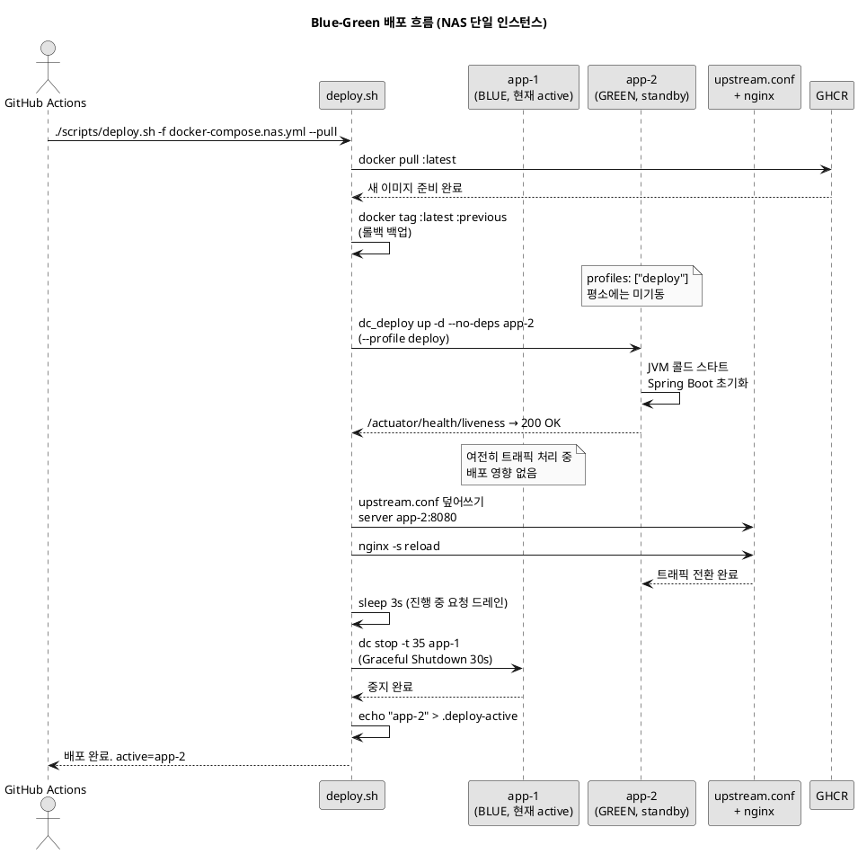
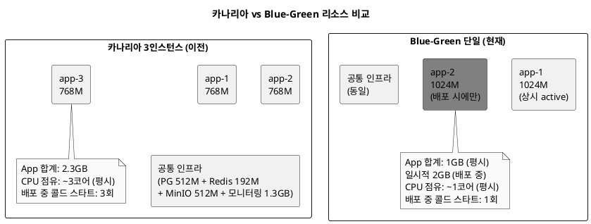

# 카나리아 3인스턴스에서 Blue-Green 단일 운영으로 — NAS CPU가 항복했다

> "배포 전략은 고정이 아니다. 하드웨어 앞에서는 교과서도 접어야 할 때가 있다."

[이전 글](blog-07-nas-auto-deployment.md)에서 카나리아 롤링 배포를 자랑스럽게 소개했다. app-1, app-2, app-3 세 인스턴스가 동시에 돌아가고, 배포 시엔 한 대씩 교체하며 에러율을 검증하는 구조. 그런데 얼마 지나지 않아 Grafana에서 불편한 숫자를 보게 됐다.

CPU 사용률이 배포 중에 100%에 닿았다.

이 글은 그 숫자를 보고 카나리아를 포기한 이야기다.

---

## CPU가 항복한 순간

### 하드웨어 환경

지금 Co-Talk이 돌아가는 곳은 Synology DS923+다. CPU는 **Celeron J4125, 4코어**. RAM은 **20GB**로 업그레이드했다. 클라우드 관점에서 보면 t3.small보다 조금 나은 수준이다. 서버라기보다 NAS에 가깝다.

이 위에 올라간 스택을 나열하면 이렇다.

| 서비스 | 메모리 제한 | 비고 |
|--------|------------|------|
| app-1 | 768M | JVM, Spring Boot |
| app-2 | 768M | JVM, Spring Boot |
| app-3 | 768M | JVM, Spring Boot |
| PostgreSQL 16 | 512M | |
| Redis 7 | 192M | |
| MinIO | 512M | |
| Prometheus | 256M | |
| Grafana | 256M | |
| Loki | 256M | |
| Promtail | 128M | |
| Zipkin | 256M | |
| Alertmanager | 128M | |
| nginx | - | |
| **합계** | **~4.7GB** | 20GB 대비 메모리는 여유 |

메모리는 충분했다. 문제는 CPU였다.

### 증상

평시에는 괜찮았다. CPU 사용률이 20~30% 수준으로 유지됐다. 그런데 배포가 시작되는 순간 그래프가 솟았다.

배포 스크립트가 하는 일을 떠올리면 당연한 결과였다.

1. GHCR에서 새 이미지를 pull한다 — 네트워크 I/O + 디스크 쓰기
2. app-1을 중지하고 새 이미지로 다시 띄운다 — JVM 콜드 스타트
3. Spring Boot가 뜨면서 Flyway 마이그레이션, DB 커넥션 풀 초기화, 빈 초기화가 한꺼번에 일어난다
4. 헬스체크가 통과하면 app-2도 같은 과정을 거친다
5. app-3도 마찬가지

JVM 콜드 스타트는 CPU를 집중적으로 쓴다. 특히 Java 25 + Virtual Threads 조합에서 초기 컴파일(JIT) 부하가 적지 않다. 인스턴스 하나가 뜨는 동안 나머지 두 인스턴스가 실제 트래픽을 처리하고 있으니, 콜드 스타트 부하와 서비스 부하가 Celeron J4125 4코어 위에서 경쟁했다.

결과적으로 배포 중 응답 지연이 눈에 띄었다. Grafana 대시보드에서 배포 타임라인과 레이턴시 급등 구간이 정확히 겹쳤다.

---

## Blue-Green 단일 운영으로 전환

전략을 바꿨다. **평소에는 app-1 하나만 운영**하고, **배포 시에만 app-2를 잠깐 기동**한다. 트래픽을 app-2로 전환하고, app-1을 중지한 뒤, 다음 배포까지 app-1은 멈춰 있는다.

카나리아와 비교하면 이렇다.

| 항목 | 카나리아 3인스턴스 | Blue-Green 단일 |
|------|-----------------|----------------|
| 평시 인스턴스 수 | 3 | 1 |
| 배포 시 인스턴스 수 | 3 (순차 교체) | 2 (일시적) |
| JVM 콜드 스타트 횟수/배포 | 3회 | 1회 |
| 평시 CPU 점유 | ~3코어 | ~1코어 |
| 배포 중 서비스 영향 | 콜드 스타트 중 CPU 경쟁 | 없음 (트래픽 전환 후 중지) |
| 점진적 롤아웃 | 가능 | 불가 |
| 평시 메모리 | 3 × 768M = 2.3GB | 1 × 1024M = 1GB |

사이드 프로젝트 규모에서 점진적 롤아웃을 포기하는 건 크게 아프지 않았다. 대신 배포 중 CPU 경쟁이 사라지고, 평시 메모리도 오히려 줄었다.

---

## 변경 내용

### docker-compose.nas.yml: profiles로 app-2 비활성화

가장 핵심적인 변경이다. **app-3은 완전히 제거**하고, **app-2에 `profiles: ["deploy"]`를 추가**했다.

`profiles`는 Docker Compose의 조건부 서비스 기동 기능이다. `--profile deploy` 플래그 없이 `docker compose up`을 하면 해당 서비스가 아예 기동되지 않는다.

**변경 전 (카나리아 3인스턴스):**

```yaml
# docker-compose.nas.yml (카나리아 시절)
  app-1:
    image: ghcr.io/${GITHUB_REPO}:latest
    deploy:
      resources:
        limits:
          memory: 768M

  app-2:
    image: ghcr.io/${GITHUB_REPO}:latest
    deploy:
      resources:
        limits:
          memory: 768M

  app-3:
    image: ghcr.io/${GITHUB_REPO}:latest
    deploy:
      resources:
        limits:
          memory: 768M
```

**변경 후 (Blue-Green 단일):**

```yaml
# docker-compose.nas.yml (현재)

  # ===========================================
  # 애플리케이션 (Instance 1) - 상시 활성
  # ===========================================
  app-1:
    image: ghcr.io/${GITHUB_REPO}:latest
    restart: unless-stopped
    stop_grace_period: 35s
    # ... 환경변수 생략 ...
    deploy:
      resources:
        limits:
          memory: 1024M  # 단일 인스턴스이므로 768M → 1024M으로 증가

  # ===========================================
  # 애플리케이션 (Instance 2 - Blue-Green Standby)
  # ===========================================
  # 평소에는 뜨지 않음. 배포 시 deploy.sh가 --profile deploy로 시작.
  # 맥미니 이전 후 3인스턴스 복구 시 profiles 제거하면 됨.
  app-2:
    image: ghcr.io/${GITHUB_REPO}:latest
    profiles: ["deploy"]          # <-- 핵심 변경
    restart: unless-stopped
    stop_grace_period: 35s
    # ... 환경변수 생략 ...
    deploy:
      resources:
        limits:
          memory: 1024M
```

app-3은 파일에서 완전히 사라졌다. app-2는 `profiles: ["deploy"]` 한 줄로 평시에는 존재하지 않는 서비스가 됐다.

메모리 제한도 768M에서 1024M으로 올렸다. 혼자 트래픽을 받는 인스턴스인데 이전과 같은 제한을 두면 메모리 압박이 커질 수 있다. 3인스턴스 합산(2.3GB)보다도 오히려 적다(1GB).

### deploy.sh: 카나리아 → Blue-Green 재작성

스크립트 헤더부터 달라졌다.

```bash
# ===========================================
# Co-Talk Blue-Green Deployment Script
# ===========================================
# Zero-downtime blue-green deployment for 1-instance NAS setup
# (Synology NAS Celeron J4125 4코어, 20GB RAM — CPU 경합 방지를 위해 단일 인스턴스 운영)
#
# 3인스턴스 복구:
#   맥미니 이전 후 docker-compose.nas.yml에서 app-2 profiles 제거,
#   upstream.conf에 3개 서버 복원, 이 스크립트를 canary 버전으로 원복
# ===========================================
```

주석에 복구 경로까지 남겨뒀다. 나중에 맥 미니로 이전하면 이 주석을 보고 원복하면 된다.

인스턴스 변수도 명시했다.

```bash
# Blue-Green instances
BLUE_INSTANCE="app-1"
GREEN_INSTANCE="app-2"
STATE_FILE="${PROJECT_ROOT}/.deploy-active"
UPSTREAM_CONF="${PROJECT_ROOT}/docker/nginx/upstream.conf"
```

배포 흐름은 이렇다.

```bash
# Phase 1: 현재 :latest → :previous 백업 + 새 이미지 pull/build
backup_current_image
dc pull "$active"   # 또는 dc build "$active"

# Phase 2: standby(GREEN) 기동 — --profile deploy 필수
dc_deploy stop -t 35 "$standby" 2>/dev/null || true
dc_deploy up -d --no-deps "$standby"
health_check "$standby"   # 최대 120초 대기

# Phase 3: upstream 전환 → nginx reload
switch_upstream "$standby"

# Phase 4: 기존 active(BLUE) 드레인 후 중지
sleep 3
dc stop -t 35 "$active"

# Phase 5: 상태 파일 업데이트, nginx 확인
echo "$standby" > "$STATE_FILE"
```

`switch_upstream()` 함수는 `upstream.conf`를 동적으로 덮어쓴다.

```bash
switch_upstream() {
    local target=$1
    cat > "$UPSTREAM_CONF" << EOF
# Auto-generated by deploy.sh - do not edit manually
# Active instance: ${target}

upstream cotalk-backend {
    server ${target}:8080 max_fails=10 fail_timeout=10s;
    keepalive 16;
}
EOF
    dc exec -T nginx nginx -s reload
    log_success "Upstream switched to ${target}"
}
```

매 배포마다 파일 내용이 완전히 교체된다. 수동으로 편집해봤자 다음 배포 때 덮어쓰인다. 주석에도 "do not edit manually"를 써뒀다.

`dc_deploy`는 `--profile deploy` 플래그를 포함한 래퍼 함수다.

```bash
# Docker compose with deploy profile (for starting standby instance)
dc_deploy() {
    docker compose -f "$COMPOSE_FILE" --profile deploy "$@"
}
```

이 함수를 통해 standby 인스턴스만 선택적으로 기동하고 헬스체크할 수 있다.

### upstream.conf: 평소에는 app-1 단독

```nginx
# docker/nginx/upstream.conf

# Blue-Green Deployment Upstream
# 평소: app-1만 활성 / 배포 시: deploy.sh가 동적으로 전환
# 3인스턴스 복구 시 이 파일과 deploy.sh를 원복하면 됨

upstream cotalk-backend {
    server app-1:8080 max_fails=10 fail_timeout=10s;
    keepalive 16;
}
```

파일 자체는 단순하다. 하지만 배포 중에는 `deploy.sh`의 `switch_upstream()` 함수가 이 파일을 덮어써서 app-2를 가리키게 된다.

```
배포 전:  upstream → app-1
배포 중:  upstream → app-2  (nginx reload)
배포 완료: 다음 배포까지 app-2가 활성
```

다음 배포가 돌면 상황이 반전된다. app-1이 standby로 새 이미지를 받고, upstream이 app-1으로 전환되고, app-2가 중지된다. 그래서 배포가 끝난 상태를 기준으로 active 인스턴스가 app-1과 app-2 사이를 번갈아 가리킨다.

---

## Blue-Green 배포 시퀀스



<!-- IMAGE: deploy.sh 실행 로그 — Phase 1~5 순서대로 INFO/SUCCESS 메시지가 출력되고, 마지막에 "Blue-Green Deployment Completed Successfully / Active instance: app-2" 가 찍힌 터미널 캡처 -->

---

## 리소스 비교



<!-- IMAGE: Grafana CPU 사용률 대시보드 — 카나리아 시절 배포 중 CPU 100% 급등 구간과, Blue-Green 전환 후 배포 중 CPU 사용률이 50~60% 수준으로 유지되는 두 구간이 한 화면에 비교되는 스크린샷 -->

실제로 전환 후 배포 중 CPU 그래프가 눈에 띄게 낮아졌다. JVM이 동시에 콜드 스타트를 3번 하지 않고 1번만 하니까 당연한 결과다.

---

## 아직 정리 못 한 것들

솔직히 말하면, 전략을 바꾸면서 연관 설정 파일들을 전부 업데이트하지는 못했다.

### prometheus.yml — app-2, app-3 스크래핑 실패 중

```yaml
# docker/prometheus/prometheus.yml (현재 — 불일치 상태)
- job_name: 'cotalk-app'
  metrics_path: '/actuator/prometheus'
  scrape_interval: 5s
  static_configs:
    - targets: ['app-1:8080', 'app-2:8080', 'app-3:8080']  # <-- 3개가 아직 남아있음
```

app-2와 app-3은 평시에 기동되지 않으니 Prometheus가 15초마다 스크래핑 실패를 기록한다. 지금 Grafana에서 `up{job="cotalk-app"}` 그래프를 보면 app-1만 1이고 app-2, app-3은 0이다.

동작에는 무해하다. 스크래핑 타임아웃이 나도 기존 메트릭이 사라지는 건 아니고, app-1 메트릭은 정상 수집된다. 다만 불필요한 에러 로그가 쌓이고 있다.

### alert-rules.yml — 3인스턴스 기준 알림 규칙

```yaml
# docker/prometheus/alert-rules.yml (현재 — 오경보 가능)

# 인스턴스 다운 알림 (3인스턴스 티어)
- alert: InstanceDown
  expr: up{job="cotalk-app"} == 0
  for: 30s
  annotations:
    description: "인스턴스 {{ $labels.instance }}가 30초 이상 응답하지 않습니다. 나머지 인스턴스가 트래픽을 처리 중입니다."

- alert: MultipleInstancesDown
  expr: count(up{job="cotalk-app"} == 0) >= 2
  for: 30s
  annotations:
    description: "3개 인스턴스 중 2개 이상이 다운되었습니다. 즉시 확인이 필요합니다."
```

`InstanceDown`은 app-2, app-3이 항상 0이니까 항상 발화하는 알림이다. 배포 직후부터 오경보가 계속 나오고 있다. `MultipleInstancesDown`은 더하다 — 2개 이상이 0이면 critical인데, 평시에 app-2와 app-3이 항상 0이니 조건이 상시 충족된다.

### promtail-config.yml — regex 불일치

```yaml
# docker/promtail/promtail-config.yml
# 파이프라인 필터에 app-(1|2|3) 패턴이 있지만 app-3은 이제 없음
```

이건 동작에 무해하다. app-3에 매칭되는 컨테이너가 없으면 해당 패턴은 그냥 아무것도 수집 안 할 뿐이다.

### 왜 아직 안 고쳤는가

두 가지 이유다.

첫째, **prometheus.yml과 alert-rules.yml 수정이 생각보다 신중하게 해야 한다.** 지금 app-1이 내려가도 알람이 오긴 한다(`ApplicationDown`이 발화한다). 알람 체계 전체를 다시 설계하는 건 별도 작업이다.

둘째, **어차피 맥 미니 이전 후 3인스턴스로 복구할 예정이다.** 그때 다시 원복하면 되는데 지금 Blue-Green 기준으로 맞춰봤자 다시 바꿔야 한다. 결국 부채를 감수하고 TODO 주석으로 남겨뒀다.

---

## 복구 계획

deploy.sh 상단에 주석으로 남겨뒀다.

```bash
# 3인스턴스 복구:
#   맥미니 이전 후 docker-compose.nas.yml에서 app-2 profiles 제거,
#   upstream.conf에 3개 서버 복원, 이 스크립트를 canary 버전으로 원복
```

세 가지 파일만 수정하면 원래대로 돌아간다.

1. `docker-compose.nas.yml` — app-2 `profiles` 제거, app-3 추가, 메모리 768M으로 변경
2. `docker/nginx/upstream.conf` — `server app-1:8080; server app-2:8080; server app-3:8080;` 복원
3. `scripts/deploy.sh` — 카나리아 버전으로 교체 (git history에 있다)

그때 prometheus.yml, alert-rules.yml, promtail-config.yml도 함께 정리할 예정이다.

---

## 교훈

**1. 인프라는 하드웨어 스펙에 맞춰야 한다.**

카나리아 롤링은 좋은 전략이다. 하지만 Celeron J4125 4코어 위에서 JVM 3개를 동시에 콜드 스타트시키면 CPU 경쟁이 생긴다. 교과서가 옳아도 하드웨어가 감당 못하면 소용없다. 사이드 프로젝트 인프라는 항상 실제 스펙 기준으로 설계해야 한다.

**2. Docker Compose `profiles`는 조건부 서비스 기동에 딱 맞는 도구다.**

`profiles: ["deploy"]` 한 줄로 서비스를 평시에 완전히 비활성화할 수 있다. 별도 compose 파일을 만들거나 수동으로 컨테이너를 관리할 필요 없다. 배포 스크립트에서 `--profile deploy`로 선택적으로 기동하는 패턴은 NAS 같은 제한된 환경에서 특히 유용하다.

**3. 배포 전략은 되돌릴 수 있다.**

카나리아에서 Blue-Green으로 내려갔다. 부끄럽지 않다. 하드웨어가 바뀌면 다시 카나리아로 올라갈 것이다. 배포 전략을 "진화"로 보면 한 방향만 있는 것 같지만, 실제로는 환경에 따라 앞뒤로 움직인다.

**4. 남긴 부채는 코드 주석으로 명시해라.**

prometheus.yml, alert-rules.yml의 불일치를 당장 못 고쳤다. 대신 deploy.sh에 복구 경로 주석을 남겼고, upstream.conf에도 "3인스턴스 복구 시 원복" 안내를 박아뒀다. 6개월 뒤에 이 코드를 다시 볼 때 주석이 없었다면 어디서부터 손대야 할지 막막했을 것이다.

**5. 카나리아가 항상 정답은 아니다.**

분산 시스템 교과서는 카나리아를 권장한다. 하지만 트래픽이 거의 없는 사이드 프로젝트에서 점진적 롤아웃은 필수가 아니다. 반면 배포 중 CPU 경쟁은 실제 사용자에게 영향을 준다. 무엇이 "더 나은 전략"인지는 이론이 아니라 지금 실행되는 하드웨어 위에서 판단해야 한다.

---

*[Co-Talk 시리즈 전체 목차](blog-index.md)*
